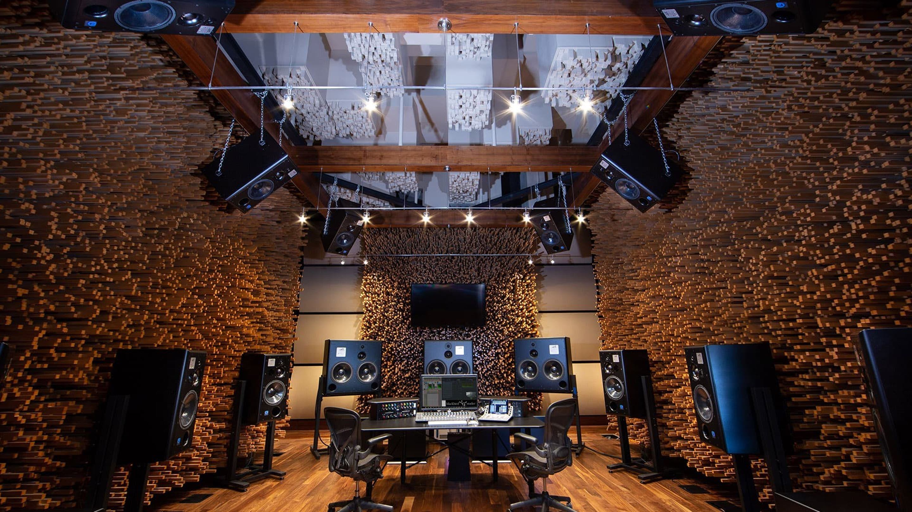

Builds upon Audio Production II; Instructs in advanced multi-track editing techniques, including advanced audio mixing, signal processing, and critical listening. Also covers business practices for the music industry and career preparation, including copyright law, resume building, and online music marketing and promotion.
