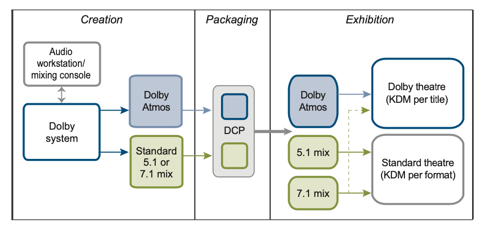

+++
title = "Atmos Movies"
outputs = ["Reveal"]
[reveal_hugo]
theme = "serif"
margin = 0.2
+++

# Dolby Atmos with films

## A somewhat critical take

{}
We skipped ahead a bit to talk about using atmos with music, but it was originally designed for mixing films.

The first film that used Atmos was a pixar short that played before Brave called "Leaf". Somehow this movie is not on IMDB, not sure why.

Source: https://web.archive.org/web/20130228051002/http://www.filmjournal.com/filmjournal/content_display/esearch/e3i6bc2381e4316e9773b5d74a8c3c72916

Development and Deployment: Launching into the Dolby Atmos
“This has been a real evolutionary process,” declares Stuart Bowling (senior technical marketing manager for cinema at Dolby), explaining that the genesis of the Dolby Atmos platform goes back as far as 2007. “We were approached by a major exhibitor who was looking to the future and saying, ‘We are going to start changing the way in which we design and build our auditoriums. With all the changes in imaging technology, something has to happen with audio. What would that look like?’ Dolby was already looking at that same question, but our ability to change the industry was partly held back because the footprint of digital was still relatively small at that time by comparison to where we are now.”
{}

---

<iframe src="https://player.vimeo.com/video/40658763?h=c6601dc8cc" width="640" height="360" frameborder="0" allow="autoplay; fullscreen; picture-in-picture" allowfullscreen></iframe>

<a href="https://vimeo.com/40658763">Dolby Perspective on Dolby Atmos</a> from <a href="https://vimeo.com/dolby">Dolby Laboratories</a> on <a href="https://vimeo.com">Vimeo</a>.

{}
So what was Dolby saying at the time Atmos was coming out about why this was an important and new invention?

More than a technical novelty or specialized exhibition format, the company’s long-term goal is to feature Atmos in “every movie and every theater” (Fuchs 2012). According to film historian Gianluca Sergi, Atmos represents Dolby Laboratories’ larger goal of recapturing “the prime position that it held in the cinema market, both internally to the company and externally in the industry” after more than two years of revenue decline in its digital cinema division (2013: 109).

Between 2010 and 2013, Dolby reached out to sound practitioners, directors, studios and major theater chains using financial incentives, complimentary training sessions and a barrage of trade advertisements to promote the format as the future of cinema sound production and exhibition. To accomplish this widespread adoption and implementation strategy, Atmos proposes a re-evaluation of Hollywood sound mixing conventions and practices, many of which are rooted in the professional identities, social organization and creative work of mixers themselves. **Despite Dolby’s claim that their new platform allows mixers to retain more artistic control over their work at different stages of production and exhibition, there is considerable evidence that Atmos actually limits a mixer’s creative role in authoring soundtracks.**

{}

---

## Implications

- technological
- occupational
- aesthetic

{}
We'll go into the large-scale _technological, occupational and aesthetic implications_ of the Atmos format on the art and craft of Hollywood sound mixing.

_Technological_

The first is based on what Dolby claims is the “intuitive” design of the format, which uses a digital rendering algorithm that is responsive to variations in theater room size and loudspeaker configuration. The backward-compatible system aims to simplify distribution with a Digital Cinema Package (DCP) that outputs to different digital sound configurations, including 5.1 and 7.1, in a process Dolby calls “Author Once, Optimize Everywhere.”

_Workflow_

a shift in creative workflow that requires mixers to adapt their professional style to the nuances of the Atmos system. In some cases, Dolby has offered training sessions at their San Francisco and Burbank offices to familiarize mixers with the format. While Dolby engineers and consultants claim not to place creative constraints on how film-makers use the system, some mixers have already expressed frustration with the automated algorithm that automatically down-mixes an Atmos pass to 5.1 and 7.1 configurations. In this way, mixers “capture their creative content” and then let the algorithm “generate” alternate versions in the box (Dolby Laboratories 2013a: 1, 14)

_Aesthetic_

Finally, the persistent strains of “realism” and the promise of “lifelike audio” continue to shape Dolby’s aims for Atmos and multichannel film sound in general. These discourses, which feature prominently in the Dolby Atmos White Paper, emphasize the format’s ability to place sounds around the auditorium with a greater level of screen accuracy, leading to what Dolby believes is a “heightened sense of realism without being obvious” (7). However, sound mixers often avoid “realism” in favor of dramatic “feel” and other aesthetic factors that push beyond accurate representations of sound/picture scale.

{}

---

See [this whitepaper](Dolby_Atmos_Next_Generation_Audio_for_Ci.pdf) for some interesting details of the system in 2013.

---

## The Channel Wars

- 2008
  - AMC Theaters asked Dolby Labs to find the next tech for multichannel audio for film
    - Dolby came back with 7.1 - premiered with Toy Story 3 (2010)
    - A precursor to Atmos
  - Tomlinson Holman (5.1 and THX) - created 10.2
  - Karlheinz Brandenburg - IOSONO
  - Barco - Auro - 11.1

{}
We are already familiar with the developments of sound for film up to Atmos.

In 2008, Dolby Labs was asked by AMC Theaters to brainstorm ideas on the next wave of multichannel audio for film. At that point, the migration from 35mm to all-digital delivery was already underway, and by 2010 there were nearly 16,000 digital cinema screens worldwide (Christie Digital Systems 2013: 5). With a single Digital Cinema Package capable of accommodating up to sixteen channels of digital audio, executives at AMC sought a premium digital format for their ETX auditoriums that could do for sound what digital 3D had done for picture: boost ticket sales.

Tomlinson Holman, who had previously coined the term “5.1” and created the THX sound standard for Lucasfilm, developed a 10.2 sound format with additional screen channels, two height channels positioned above the screen, and two subwoofers (Holman 2000).

In Germany, Karlheinz Brandenburg (one of the creators of the MP3 compression standard) developed IOSONO, as both a cinema audio process and live event format. Based on techniques developed in the Netherlands, IOSONO used 64 channels and 600 speakers to reproduce a “high-dimensional experience” (Taub 2009).

the technology company Barco obtained the license for Auro, a Belgian format developed by Galaxy Studios, which features an 11.1 process that adds multiple height channels to a traditional 5.1 array. though this is now defunct

Dolby responded to AMC’s challenge with a modest revision of its digital process called Dolby Surround 7.1. Still retaining the infra- structure of its existing loudspeaker configuration, Dolby split the rear array into four zones: left side, left back, right side, right back. The format, which premiered with Toy Story 3 (2010), was promoted as a means to improve panning and positioning of audio elements in the surround field. However, the development of 7.1 meant much more than surround zones: it represented a cautious entry point into digital cinema that, if successful, could provide the springboard for more audacious audio experiments. After two years of additional research and development, Dolby unveiled Atmos.
{}

---

{}
In a 7.1 environment, surround sound material is fed to four distinct zones, all of which contain the same audio information within each zone. That translates into clusters of loudspeakers along the side and back walls of a theater reproducing the same set of sounds.

By contrast, Dolby engineers argue that “in everyday life many sounds originate from randomly placed point sources” (Dolby Laboratories 2013a: 7).

**Dolby Rendering Mastering Unit**

Atmos features the Dolby Rendering and Mastering Unit (RMU), a fully automated component of its audio authoring system. After an Atmos mix is created, the RMU algorithm automatically generates 5.1 and 7.1 room configurations based on a theater’s loudspeaker layout.

According to Stuart Bowling:

> What this really means is, in essence, author once and render anywhere. That we’re taking and controlling the true intent of the mixer and now allowing that single, distributable package, our file, to play out in multiple different environments. So they’ll be able to play the 7.1 in the main screen, and as the movie plays down in size, they may have to provide another version of the movie in 5.1. So now the same film can play out during its lifespan inside that movie theater. (quoted in Dolby Laboratories 2012)

Bowling’s statement also attempts to assure mixers that their aesthetic intent would remain intact in different configurations. In this way, Atmos is a significant innovation in digital cinema storage and delivery. The format’s ability to produce multiple configurations of a sound mix represents a bold attempt to simplify the delivery system to major exhibitors and independents using a single DCP file package.

However, the format’s optimization technology, which automatically renders different sound configurations based on theater specifications, is a more problematic feature of the new process.
{}

---

{}
Consequently, the Atmos rendering tool, which automatically derives 5.1 and 7.1 versions from an original Atmos mix,** challenges the ways in which mixers author their work and maintain competitive artistic identities.** As film sound mixing has become more dependent on the specialized knowledge of digital formats and platforms, and as mixers have been tasked with consolidating and balancing more sound elements in novel ways, Dolby has conflated technical control with creative control.

Stuart Bowling maintains that Dolby’s rendering algorithm creates a duplicate copy of the mixer’s “true intent” and downsizes it for theaters with different loudspeaker configurations; hence the promotional tagline, “Author Once, Optimize Everywhere” (Dolby Laboratories 2012). In fact, the renderer reworks a mixer’s workflow to create a 5.1/7.1 output by “intelligently [using] the surround speakers in the theatre to their best effect” (Dolby Laboratories 2013a: 10). Its algorithm essentially finds a way to position audio objects according to the “speakers that are present, rather than necessarily being output to a physical channel” (8).

according to Dolby senior platform manager Nicolas Tsingos, the algorithm “basically selects the most appropriate set of speakers, and plays the sound from those speakers” (quoted in Dayal 2012). **But, given its automated “selection” process, the renderer has the potential to reduce a mixer’s ability to control how his or her work is translated from one format to another.**

{}

---

## The Sound of _Flight_

<iframe width="560" height="315" src="https://www.youtube.com/embed/HZzgvUcAtXc" title="YouTube video player" frameborder="0" allow="accelerometer; autoplay; clipboard-write; encrypted-media; gyroscope; picture-in-picture" allowfullscreen></iframe>

{}
Some details about how a film is typically mixed, the sound mix being the "final rewrite."
{}

---

## Chanel-based vs Atmos

- channel-based - baked in positional data
- Atmos - flexible with the render algorithm

{}
In a traditional channel-based system, mixers prepare sound and music “stems” that “bake” all the sounds and their positional data into 5.1 or 7.1 channel arrays. After the stems are prepared, it is virtually impossible to remove or “unbake” individual elements from the channel layout. In other words, the stems provide a concrete way for directors and mixers to control the scope and balance of the soundtrack. By contrast, Atmos “unbakes the cake” by keeping audio objects and sound elements flexible during the dubbing process so the rendering algorithm can create virtual 5.1 and 7.1 stems. There are ways to manually override the rendering unit to provide custom 5.1/7.1 channel outputs, but Dolby has promoted the algorithm to studios and film-makers as a time- and cost-saving technology designed to work in tandem with the creative demands of both mixers and film-makers.

> If the sound mix is the “final rewrite” of a film, as Robert Zemeckis describes it, then Dolby Atmos is potentially leaving the final word to be rewritten by a computer algorithm that approximates the location of individual sound elements.

> While the number of Atmos-ready theaters worldwide is relatively small (approximately 200 in late 2013), several mixers have already expressed skepticism toward the rendering unit, claiming that it has the potential to dramatically alter how their work is reinterpreted for different theaters; however, **the same mixers also admit that it is virtually impossible to control how any theater reproduces their work.** What matters most is their ability to retain a sense of creative autonomy from a technology that appears to impose a particular aesthetic arrangement on their workflow.

Though Dolby Digital 5.1 solved phasing problems with surround channel information, mixers have not altogether abandoned their conservative treatment of the rear channels. With Atmos, Dolby is asking mixers to rethink their relationship to rear channel information with the flexible audio objects that can be panned and positioned anywhere in the front or surround sound field, including sound elements that carry crucial narrative information (Dolby Laboratories 2013b: 1).

> Not unlike the problems of Dolby Stereo, contemporary mixers are largely hesitant to turn over their workflow to a technology that approximates the position of sound material within the sound field, no matter how precise the mathematical algorithm may be.

{}

---

## Realism in sound production - conventions

- 1920s - music recording vs. telephone industries

{}
At the heart of the debate were two different understandings of realism in sound representation.

1. The first camp, led by Bell Laboratories engineer Joseph P. Maxfield, recommended that sound recordings duplicate the original event with the audience, in Lastra’s words, “conceptually and practically a part of the space of representation” (2000: 163) . However, the idea of maintaining absolute fidelity was antithetical to the demands of film narration, which necessitated that separately recorded sound elements, including dialogue, music and effects, be re-recorded into a single track.
2. The second camp was led by engineers from AT&T and the telephony industry, which valued **intelligibility over fidelity** and stressed the importance of clear, unencumbered speech for their telephone technologies. From as early as 1930, film sounds were divided into separate, hierarchically ordered tracks, with dialogue taking a leading role. Rick Altman (1985) has noted that early studio engineers had one goal in mind, to maintain dialogue intelligibility. **In most cases, this led them to abandon accurate notions of sound and picture scale in favor of a hierarchized soundtrack that privileged narratively significant sound elements (Doane 1985).**

{}

---

> “Motion pictures are not reality. The best you can do is be sparing. If someone is walking down the street, I know I need traffic, but I don’t need a car effect for every one I see”
>
> -- Richard Portman

{}
As Richard Portman notes, “Motion pictures are not reality. The best you can do is be sparing. If someone is walking down the street, I know I need traffic, but I don’t need a car effect for every one I see” (quoted in Weaver 1995: 27).

In this way, mixing for realism often means making choices about what to feature against the picture. Film historian and theorist John Belton has argued that classical and contemporary sound editing and mixing conventions suggest **a “quest” for an “idealized reality,”** a soundtrack that is “carefully filtered to eliminate the sounds that fall outside of understanding or significance; every sound must signify” (1985: 66).
{}

---

## Clarity vs density

{}
Mixing for “feel” encompasses the artistic identities of contemporary mixers who must decide what is appropriate for a scene. Sometimes clarity is needed to convey a crucial plot point; at other times, density is needed to convey a sense of disorder and chaos.

Within this context of mixing practices, it is interesting that the Dolby Atmos White Paper should emphasize the format’s ability to render “lifelike” audio that “takes realism to a new level” (2013a: 7). It goes on to note that the system’s top loudspeaker channel mimics the activity of sound in the real world, where sound originates from all directions, including the upper hemisphere. Expanding the top and rear channels not only creates a more fluid passage of audio objects around the theater but, in Dolby’s view, prevents the audience from having to mentally create a phantom image of sound moving above and around the theater space.
{}

---

> The ability to precisely position sources anywhere in the surround zones also improves the audio/visual transition from screen to room. If a character on the screen looks inside the room toward a sound source, the mixer has the ability to precisely position the sound so that it matches the character’s line of sight, and the effect will be consistent throughout the audience.
>
> Whitepaper

{}
This is not dissimilar from early sound practices that attempted to match sound/picture scale with an aim toward preserving fidelity. Atmos attempts to preserve a strict correlation between sound/picture point sources on screen and in the theater space.

By literalizing the position between sound and picture, Atmos aims to place the audience within the three-dimensional space of the original sound event, even though no such event actually exists.
{}

---

> Consider the example of being in a restaurant. In addition to ambient music apparently being played from all around, subtle but discrete sounds originate from specific points: a person chatting from one point, the clatter of a knife on a plate from another. Being able to place such sounds discretely around the auditorium can add a heightened sense of realism without being obvious.
>
> (ibid.)

{}
At the same time, Dolby engineers have conceived of Atmos as a format that brings film-makers and audiences closer to how we experience sound events in everyday life:

To suggest that mixers can obtain a “heightened sense of realism” by panning sound to particular speakers at the expense of narrative transparency is at odds with Hollywood mixing conventions. This is largely due to the gap that exists between Atmos as a theoretical concept and as a practical mixing tool.
{}

---

## The sound of _Man Of Steel_

<iframe width="560" height="315" src="https://www.youtube.com/embed/ewKMOpelgQ0" title="YouTube video player" frameborder="0" allow="accelerometer; autoplay; clipboard-write; encrypted-media; gyroscope; picture-in-picture" allowfullscreen></iframe>

---

> My hope was that we could be subtle with it and not be like 3-D, even though we have the opportunity to do it. So what we ended up doing was taking music and using the whole room, so we have percussion and strings and brass up front. Long strings stay in the front, but short strings you can bring back to a quarter way back of the room. Choirs can play overhead. What you end up with is like a cathedral.
>
> Chris Jenkins (“The Sound of Man of Steel”)

{}
When re-recording mixers Chris Jenkins and Frank Montaño created their 9.1 Atmos mix for Man of Steel (2013), there was an opportunity to aggressively explore the multi-dimensional sound field with point-source panning, especially during the film’s many action sequences. Instead of filling the surround sound field with discrete sound effects, Jenkins and Montaño filled the room with composer Hans Zimmer’s percussive score.

Pushing music into the surround zones not only conforms to the historical practice of positioning ambiences in the surround field, but also undermines Dolby’s intention of bringing audio objects into the sound space.9 What Jenkins achieves is something more unique: the separation of Zimmer’s score into different audio zones with choir, synths, strings and brass assigned a specific position in the sound field.
{}

---

> Sometimes we get lost in the novelty of what we bring to the table. I’m always conscious of the first-time viewer. Are we getting the story? Are we clearing dialogue? We don’t want anybody to lean over and say, “What did they say?” So I always try to err on clarity. If that means sacrificing whatever is at your fingertips, so be it. You have to be sensitive to all the disciplines of dialogue, music, and sound effects. (“The Sound of Man of Steel”)

{}
As a practical tool, then, mixers like Jenkins and Montaño circumvent point-sourcing effects in favor of an approach that de-emphasizes off-screen audio objects. In pulling the musical score off the screen and into the surround zones, Jenkins opens up the front three screen channels for a roomier dialogue and effects track, which supports the ideology of intelligibility over greater realism. **Ultimately, these strategies forgo Dolby’s call for “lifelike” audio to better reflect the demands of the narrative and to satisfy their own professional tastes.**
{}

---

> “Sound people tend to be pigeonholed as technicians, which is a tragedy, because we’re artists first and foremost. I honestly don’t think adding more channels to a movie theater are [sic] going to improve movies significantly—5.1, 11.1, or 101.1”
>
> Randy Thom

{}
When asked about the technological demands of contemporary sound editing and mixing, Randy Thom expressed sincere disappointment with the industry’s focus on technical novelty over artistic practice

Given that it took Dolby Digital 5.1 nearly twenty years to become a ubiquitous feature of motion picture mixing and exhibition, it is far too early to predict the fate of Atmos and its place within the sound community and among theater owners worldwide. Even with endorsements from high-profile directors like Peter Jackson and Guillermo del Toro, Dolby executives admit that it is still too early to deem Atmos a commercial success as they continue to train mixers, convince exhibitors to install the costly system, and manage competitors.

Atmos proposes a re-evaluation of mixing ideology and practice among re-recording mixers that has not occurred since the introduction of four-channel Dolby Stereo in the 1970s.
{}

---

## Conclusion

- Challenging convention?

{}
With its digital rendering algorithm that automatically reconfigures a mix based on room size and format compatibility, Atmos challenges the creative and professional norms of Hollywood sound mixing. By virtue of its design, Atmos not only encourages mixers to treat sound elements in a way that is contrary to mixing ideology, but it also asks them to allow a piece of automated software to author different versions of their work. In large measure, Atmos reveals a great deal about the material conditions of sound mixing within Hollywood, not to mention the aesthetic contours that define the work of re-recording mixers. Dolby Atmos may be an instrument that requires a player to learn its design, but its function remains fitted to the constraints and possibilities of re-recording mixing conventions and the ideologies of practice that govern them.
{}
