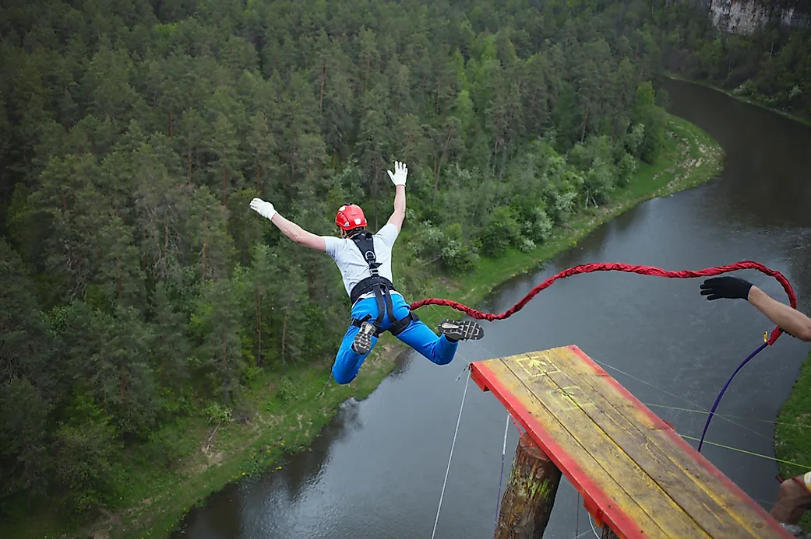
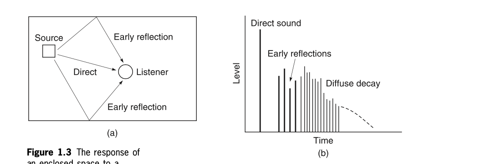

+++
title = "Introduction to Spatial Audio"
outputs = ["Reveal"]
[reveal_hugo]
theme = "moon"
margin = 0.2
+++

# Introduction to Spatial Audio

---

## The spatial dimension in natural sound

- width
- height
- depth

{}

Everyday life is full of three-dimensional sound experiences. The ability of humans to make sense of their environments and to interact with them depends strongly on spatial awareness and hearing plays a major part in this process. Natural sounds are perceived in terms of their location and, possibly less consciously, their size (most people rely more strongly on their visual sense for this information).

Because listeners don’t have eyes in the backs or tops of their heads, they tend to rely on vision more to perceive the scene in front of them, and on sound more to deal with things behind and above them.

{}

---

## Natural sound 'scene' outdoors

- many sources with their own location and attributes
- source blending

{}
In some cases the blending of cues and the diffuseness of sources leads to a general perception of space or ‘spaciousness’ without a strong notion of direction or ‘locatedness’ (as Blauert calls it) (Blauert, 1997).

A typical outdoor scene: wind noise, general background noise from distant roads and towns, punctuated with specific localisable sounds such as birds. This sense of ‘outdoorness’ is strongly spatial in character in that it is open rather than constricted, and is very much perceived as outside the listener’s head.

{}

---

## Indoor environments

- reflections strongly effect sound
- gives the size of the space

{}
Overall then, the spatial characteristics of natural sounds tend to split into ‘source’ and ‘environment’ categories, sources being relatively discrete, localisable entities, and environments often consisting of more general ‘ambient’ sound that is not easily localised and has a diffuse character.
{}

---

Guess the environment?

<audio src="cistern.wav" controls>

{}
Evil laughter, echoed.Primo EM172 capsules inside widscreens, FEL Microphone Amplifier BMA2, PCM-M10 recorder. Recorded inside an old cistern of the Regina Castle (Badajoz Province, S Spain)

source: https://freesound.org/people/dobroide/sounds/326131/
{}

---

Guess the environment?

<audio src="sea-cave.wav" controls>

{}
A recording of waves and water dripping in a cave on the Ayrshire coast.

source: https://freesound.org/people/Andy_Gardner/sounds/196713/
{}

---

Guess the environment?

<audio src="forest-birds.mp3" controls>

{}
wind in the deciduous forest with birds recorded with mixpre 6II and audio technica bp4025 stereo mic.

source: https://freesound.org/people/Garuda1982/sounds/636528/
{}

---

Guess the environment?

<audio src="bathroom-fan.wav" controls>

{}
Fan / Ventilator in a bathroom;
turned on - running - turned off;
recorded in stereo (ORTF)

source: https://freesound.org/people/aUREa/sounds/94296/
{}

---

Guess the environment?

<audio src="cricket.wav" controls>

{}
Close recording of a cricket in the Californian desert (in the Mojave Desert, close to Joshua Tree Park).

Sound recorded by a MS setup Schoeps CCM41+CCM8
Sound Devices 788T recorder with CL8
MS is encoded in STEREO Left-Right
recorded in september 2012

source: https://freesound.org/people/felix.blume/sounds/166176/
{}

---

# Sound sources in space

---

## Sound sources in a free field

{}
In acoustics, the free field is a term used to describe an environment in which there are no reflections. The closest most people might get to experiencing free field conditions is outdoors, possibly suspended a long way above the ground and some way from buildings (try bungee jumping or hang-gliding).

or an anachoic chamber
{}

---

{}
In the free field, all the sound generated by a source is radiated away from the source and none is reflected back. A consequence of this is that the sound level experienced by a listener drops off quite rapidly as they move away from the source (about 6 dB for every doubling in distance from the source) as shown in Figure 1.1.

Sounds are relatively easy to localise in free field environments as the confusing effect of reflections is not present.

Distance or depth judgement is not so straightforward in free field environments,
{}

---

{}
Not all sources radiate sound spherically or omnidirectionally, indeed most have a certain directivity characteristic that represents the deviation from omnidirectional radiation at different frequencies. This is sometimes expressed as a number of dB gain compared with the omnidirectional radiation at a certain frequency on a certain axis (usually the forward or 0° axis). This is best expressed fully as a polar pattern or directivity pattern, showing the directional characteristics of a source at all angles and a number of frequencies (see Figure 1.2). As a rule, sources tend to radiate more directionally as the frequency rises, whereas low frequency radiation is often quite omnidirectional
{}

---

## Sources in reflective spaces

{}
In enclosed spaces a proportion of the radiated sound energy from sources is absorbed by the surfaces and air within the space and a proportion is reflected back into the environment. The result of the reflected sound is to create, after a short period, an ‘ambient’ or ‘diffuse’ sound field that is the consequence of numerous reflections that have themselves been reflected. As shown in Figure 1.3, the response of a space to a short sound impulse is a series of relatively discrete early reflections from the first surfaces encountered, followed by a gradually more dense and diffuse reverberant ‘tail’ that decays to silence.
{}

---

## Introduction to effects of reflections and reverberation

---

# Introduction to the spatial dimension in reproduced sound

---

## What is the aim of sound reproduction?

---

## Spatial attributes in sound reproduction

---

# From mono to surround sound and 3D audio – a brief resumé

---

## Early sound reproducing equipment

---

## The first stereo transmission?

---

## Bell Labs in the 1930s

---

## Blumlein’s patent

---

## Early consumer stereo

---

## Binaural stereo

---

## Cinema stereo

---

## Ambiophony and similar techniques

---

## Quadraphonic sound

---

## Ambisonics

---

## The home cinema and ITU-standard surround sound

---

# Applications of spatial audio
