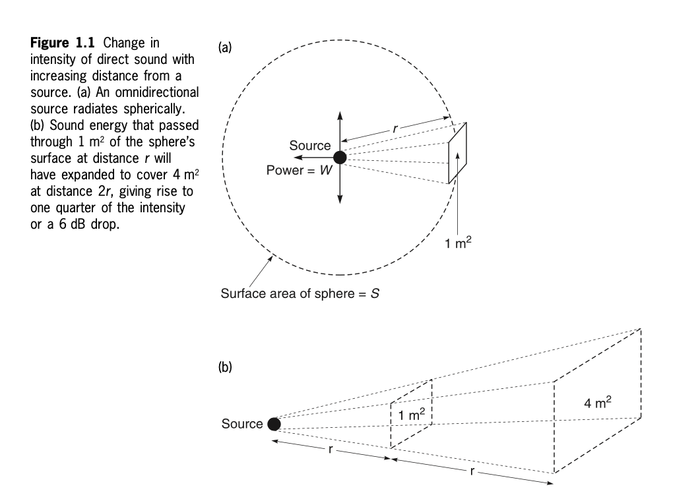
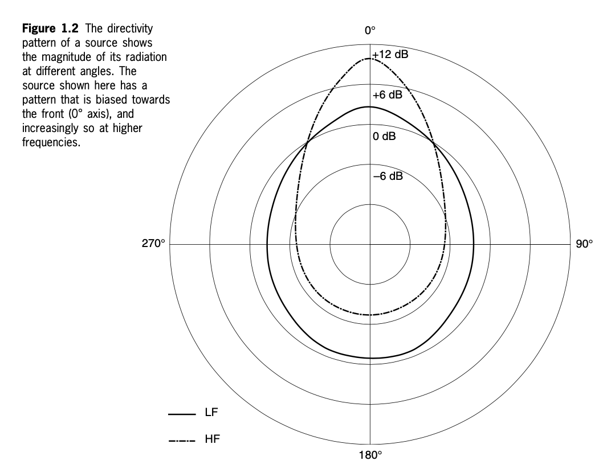
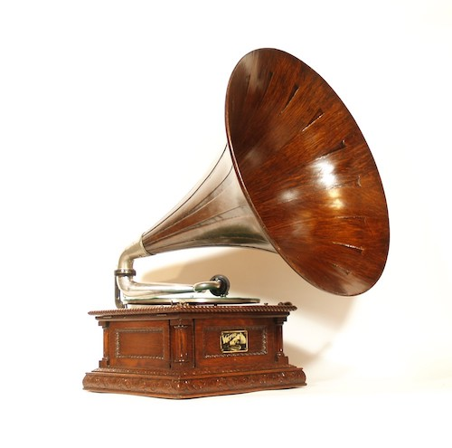
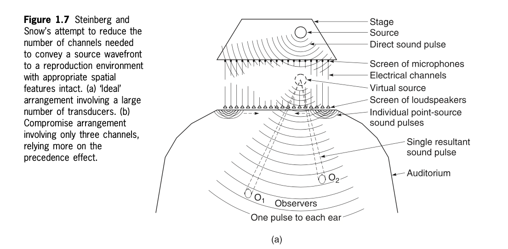
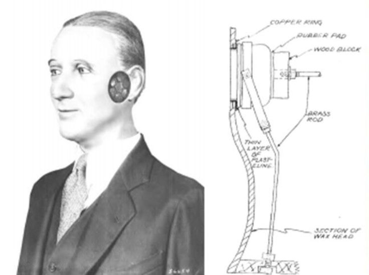
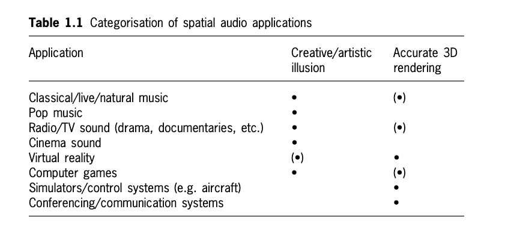

+++
title = "Introduction to Spatial Audio"
outputs = ["Reveal"]
[reveal_hugo]
theme = "moon"
margin = 0.2
+++

## Introduction to Spatial Audio

---

## The Spatial Dimension in Natural Sound

- Width
- Height
- Depth

{}

- Humans experience sound in three dimensions.
- Spatial awareness helps people make sense of their environment.
- Natural sounds are perceived based on:
  - Location
  - Size (though often less consciously than visual perception)
- Sound is often relied upon for things behind and above due to the limitations of vision.

{}

---

## Natural Sound in Outdoor Environments

- Many sound sources with distinct locations and attributes.
- Blending of sound sources occurs naturally.

{}

- Outdoor environments create a sense of spaciousness.
- Sounds blend into a diffuse soundscape, including:
  - Background noise (e.g., wind, distant roads).
  - Specific localizable sounds (e.g., birds).
- Creates an 'outdoor' perception, making the sound feel open and external.

{}

---

## Natural Sound in Indoor Environments

- Reflections strongly affect sound perception.
- Reflections provide clues about the size and shape of the space.

{}

- Indoor soundscapes are characterized by reflections from surfaces.
- Reflections provide spatial information about the room.
- The difference between direct sound and reflected sound is crucial for understanding indoor environments.

{}

---

## Guess the Environment?

<audio src="cistern.wav" controls></audio>

{}

- Recorded inside an old cistern.
- Echoes and reverberation suggest a closed, reflective space.

{}

---

## Guess the Environment?

<audio src="sea-cave.wav" controls></audio>

{}

- Recorded in a sea cave.
- Reverberations from waves and dripping water suggest an enclosed, natural space.

{}

---

## Guess the Environment?

<audio src="forest-birds.mp3" controls></audio>

{}

- Recorded in a forest with birds and wind.
- Open, natural sound with identifiable bird calls suggests an outdoor environment.

{}

---

## Guess the Environment?

<audio src="bathroom-fan.wav" controls></audio>

{}

- Recorded with a bathroom fan.
- The mechanical sound and enclosed reverberation suggest an indoor, small reflective space.

{}

---

## Guess the Environment?

<audio src="cricket.wav" controls></audio>

{}

- Recorded in the Californian desert, featuring a cricket.
- The clear, isolated sound suggests an open outdoor space with little environmental noise.

{}

---

## Sound Sources in a Free Field

- No reflections or obstacles.
- Sound radiates freely from the source.

{}

- A free-field environment has no reflections or obstacles.
- Sound dissipates naturally and drops off by 6 dB for every doubling of distance.
- Sound is easier to localize because of the absence of reflections, but depth perception is more challenging.

{}

---

## Free Field: Sound Localization

{}

Here’s the revised bullet-point description with your additional notes:

### Part (a):
- **Source**: The central point from which sound radiates.
- **Omnidirectional radiation**: Sound radiates spherically from the source in all directions.
- **Surface area of the sphere (S)**: Represents the area over which sound energy is spread as it radiates outward.
- **Distance (r)**: The radius from the source to the point where the intensity is being measured.
- **Power (W)**: Represents the sound power being emitted from the source.
- **1 m² reference area**: At a distance of r, sound energy passes through an area of 1 m² on the sphere’s surface.
- **Doubling distance**: At twice the distance (2r), the surface area over which the sound energy is spread increases to 4 m², resulting in a quarter of the original intensity and a 6 dB reduction in sound level.
- **Free-field conditions**: Allow for easier localization of sound, as there are no reflections. Listeners can focus solely on the direct sound, helping them pinpoint the source's direction more accurately.

### Part (b):
- **Source**: The sound originates from this point.
- **Distance (r)**: The distance from the source to the reference point (where the area is 1 m²).
- **Area expansion**: As the distance from the source increases from r to 2r, the area through which sound passes expands from 1 m² to 4 m².
- **6 dB reduction**: The increase in area results in a decrease in sound intensity by 6 dB with each doubling of distance.
- **No reflections**: Since free-field environments lack reflections, the sound is clearer and easier to localize based on direct sound without interference from reflections.

{}

---

## Sound Directivity

{}

- **Directivity Pattern**: Represents how sound is radiated from a source at different angles.
- **Axis Labels**: 
  - 0° represents the front of the sound source (directly ahead).
  - 90°, 180°, and 270° represent the side, back, and opposite side of the source, respectively.
- **Low Frequencies (LF)**: The solid line represents low frequencies. 
  - Sound radiation is more uniform, with smaller directivity changes.
  - There is still a bias towards the front (0°), but the difference between front and back is less pronounced.
  - Maximum magnitude is around +6 dB towards the front (0° axis).
- **High Frequencies (HF)**: The dashed line represents high frequencies.
  - High frequencies are more directional.
  - The pattern is more elongated towards the front, with a maximum magnitude of +12 dB at the 0° axis.
  - The sound drops off more quickly towards the back (180°), showing a stronger directional bias.
- **Magnitude in dB**: 
  - The concentric circles represent increasing or decreasing decibels (dB).
  - 0 dB represents equal intensity in all directions, while +12 dB indicates amplification in a particular direction (here, towards the front).
  - As you move to the back of the source (180°), the sound intensity decreases, reaching -6 dB or lower.

This figure shows how sound sources tend to radiate more directionally at higher frequencies, focusing sound towards the front. At lower frequencies, sound radiates more evenly in all directions.

{}

---

### Real-World Examples of Directivity Patterns

- **Loudspeakers**:
  - **High frequencies (HF)**: Tweeters radiate sound directionally, focusing sound towards the front (+12 dB). 
  - **Low frequencies (LF)**: Woofers and subwoofers radiate more evenly in all directions, similar to the solid line (+6 dB). Low-frequency sounds are heard more evenly in a room.

---

- **Musical Instruments**:
  - **Brass instruments** (e.g., trumpets, trombones):
    - High-frequency sounds radiate directionally towards the front, similar to HF in the diagram. The sound is loudest in front of the instrument.
  - **String instruments** (e.g., violins, cellos):
    - Low frequencies radiate more evenly, while higher harmonics are projected more directionally towards the front.

{}
- Real-world sources, such as loudspeakers and musical instruments, follow similar directivity patterns. High frequencies tend to radiate more directionally, while low frequencies spread more evenly.
- This pattern influences the way we experience sound in different environments.
{}

---

## Sources in Reflective Spaces

- Reflections alter sound in enclosed spaces.
- Reflections and reverberation create an 'ambient' sound field.

{}

- Reflective environments introduce sound reflections, which mix with direct sound.
- The result is an ambient sound field, with early discrete reflections followed by a reverberation tail.
- Reflections impact sound localization, making it harder to distinguish direction and distance.

{}

---

## Introduction to Spatial Reproduction of Sound

- Goals of sound reproduction:
  - Recreate natural environments.
  - Create virtual environments.

{}

- Sound reproduction can either:
  - Recreate natural soundscapes (e.g., concert hall acoustics).
  - Create imaginary or virtual environments (e.g., in film or games).
- Both approaches are valid and depend on the artistic or functional goal of the sound design.

{}

---

## From Mono to Surround Sound and 3D Audio

- Mono: Only distance and depth cues.
- Stereo: Adds width.
- Surround sound: Introduces immersive, directional cues.
- 3D audio: Provides full spatial immersion with height and depth.

{}

- The evolution of sound technology has progressed from mono, which had minimal spatial cues, to fully immersive 3D audio experiences.
- Surround sound adds directionality, while 3D audio introduces a complete 360° sphere of sound around the listener.

{}

---

## Early Sound Reproducing Equipment

{}

- Early sound reproduction was monophonic (one channel only).
- Only basic spatial cues, such as depth from reverberation, were present.
- The first gramophones and phonographs from the 1800s and early 1900s paved the way for later advancements in spatial audio.

{}

---

## The Théâtrophone: An Early Stereo Transmission

{}

- **Clement Ader’s 1881 Experiment**:
  - An early example of stereophonic sound transmission.
  - Telephone pickups were placed in the footlights of the Paris Opera and connected to receivers.
  - Visitors at the 1881 Paris Exhibition could listen to live opera performances with a sense of spatial realism.
  
- **Significance**:
  - Although commercial stereophonic reproduction didn’t emerge until much later, this experiment laid the groundwork for future audio transmission technology.
  - It demonstrated how sound could be spatially transmitted and experienced remotely, an early precursor to modern stereo and surround sound systems.
{}

---

## Bell Labs in the 1930s

{}

Steinberg and Snow’s attempt to reduce the number of channels in sound reproduction:

### Key Elements:
- **Stage**: Represents the physical source of sound (e.g., a performance on stage).
- **Source**: The original sound emitted from the stage.
- **Direct Sound Pulse**: The initial pulse of sound directly from the source, without any reflections.
- **Screen of Microphones**: A setup with many microphones capturing the sound from different angles.
- **Electrical Channels**: The signal is passed through electrical channels for reproduction.
- **Virtual Source**: Reconstructed sound field, projected as though the sound originates from a specific location.
- **Screen of Loudspeakers**: Many loudspeakers are used to reproduce sound in various directions, simulating the original sound environment.
- **Individual Point-Source Sound Pulses**: Each loudspeaker generates a separate point-source sound pulse.
- **Single Resultant Sound Pulse**: The combined output of all the speakers creates a coherent sound pulse that the listener perceives.
- **Observers (O₁, O₂)**: Two listeners seated in the auditorium, receiving sound pulses.
- **One Pulse to Each Ear**: Each observer receives a distinct sound pulse to each ear, recreating the spatial sound perception.
- **Auditorium**: The listening environment where sound is reproduced.

### Additional Notes:
- **'Ideal' Arrangement**: Involves a large number of transducers (speakers and microphones) to replicate spatial features with great accuracy.
- **Compromise Arrangement**: Uses only three channels and relies more heavily on the **precedence effect** (where the brain uses the first arriving sound to locate the source), simplifying the reproduction.

This diagram shows Steinberg and Snow’s effort to simulate spatial sound realistically while reducing the number of channels needed, exploring an optimal balance between complexity and perceived sound quality.

{}

---

## Binaural Recording

{}
- **What is Binaural Recording?**
  - Binaural stereo aims to recreate the experience of listening with two human ears.
  - Uses microphones positioned at ear-level to simulate natural human hearing.
  - When reproduced through headphones, binaural recordings create a highly realistic spatial experience.

- **Diagram Explanation**:
  - **Left Side**: Early model of a binaural head used for binaural recordings, designed to simulate how humans perceive sound directionally.
  - **Right Side**: Cross-section showing internal components:
    - **Copper Ring, Rubber Pad, Wood Block**: Elements that simulate the density and sound-blocking characteristics of the human head.
    - **Brass Rod and Thin Layer of Plastic**: Components that mimic sound transmission through the human ear.
    - **Wax Head**: Designed to replicate the acoustic properties of a real human head and ears, providing realistic spatial audio cues.

- **Key Concepts**:
  - Binaural recordings rely on the **subtle timing and amplitude differences** between the two "ears" to recreate spatial realism.
  - When played back through headphones, they provide a sense of directionality—front, back, above, below—similar to natural hearing.
  - This method is especially effective in applications such as **virtual reality (VR)**, **gaming**, and **immersive audio**.

### Historical Background:
- **Who Made It?**: This particular binaural head was pioneered by **Harvey Fletcher** and **Bell Laboratories** in the **1930s**.
- **When?**: The concept of binaural recording dates back to the **late 19th century**, but modern implementations, like this one, became more prominent in the 1930s. Fletcher’s work at Bell Labs greatly contributed to advancing this technique, allowing for the development of immersive 3D sound experiences.

{}

---

## Ambisonics

- **Developed in the 1970s**
- **360° Sound Field** (Including height)
- **Key Contributors**: Peter Fellgett & Michael Gerzon
- **Applications**: Virtual reality, immersive audio

For more, visit: [History of Ambisonics](https://intothesoundfield.music.ox.ac.uk/ambisonics)

{}

- Ambisonics was a revolutionary approach to surround sound, developed in the 1970s.
- Unlike quadraphonic systems, which had limitations, Ambisonics used a more sophisticated **psycho-acoustic approach** to deliver immersive sound.
- The **Soundfield microphone** was a key innovation, capturing sound from all directions to recreate an accurate 360° audio experience.
- This system set the groundwork for modern applications, including virtual reality and immersive audio environments.

{}

---

## The Home Cinema and ITU-Standard Surround Sound

{}

- Surround sound systems are now standard for home cinemas.
- Adding multiple channels allows for an immersive experience in everyday spaces.
- ITU-standard surround sound offers high-quality spatial reproduction for both film and music.

{}

---

## Applications of Spatial Audio

{}

- Applications for spatial audio include:
  - Film and game sound.
  - Music production and playback.
  - Virtual reality and immersive environments.
  - Teleconferencing and remote collaboration.
- Spatial audio is used both for recreating real environments and creating entirely new virtual spaces.

{}

---

- **Military Communication**: Enhances situational awareness in combat by spatializing voices, reducing cognitive overload.  
  Example: [Spatial Audio in Tactical Communication](https://www.armadainternational.com/2023/10/the-voices-in-my-head-spatial-audio-a-game-changer-in-tactical-communication/)
- **Teleconferencing**: Improves clarity and reduces fatigue in multi-participant remote meetings by spatializing voices.  
  Example: [Spatial Audio in Remote Conferencing](https://hear360.io/news/enhance-remote-conferencing)
- **Education**: Enhances learning experiences through spatial audio in immersive virtual environments.  
  Example: [Spatial Audio for Education](https://ericasouthgateonline.wordpress.com/2021/04/22/spatial-audio-for-education/)
- **Therapy and Stress Reduction**: Used to reduce stress and anxiety in clinical and non-clinical populations.  
  Example: [Spatial Audio for Stress Reduction](https://journals.sagepub.com/doi/pdf/10.1177/2059204321993992)

