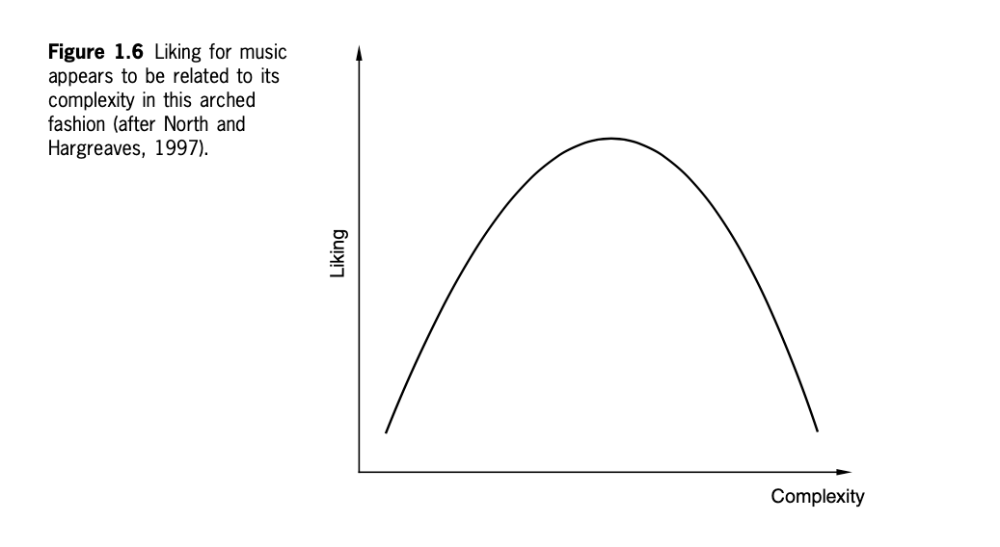
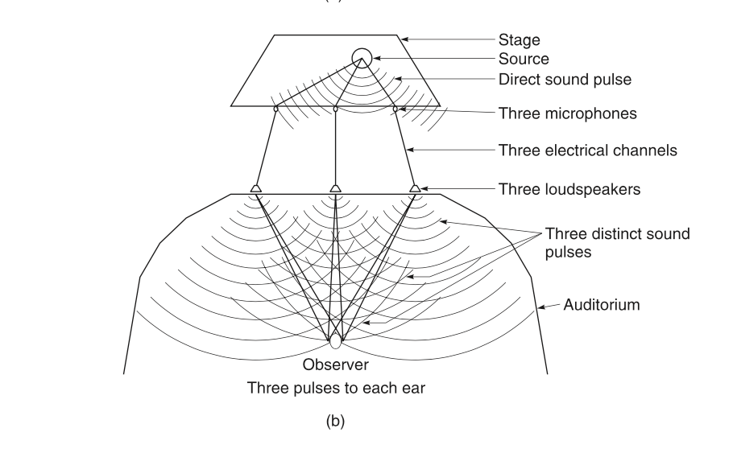
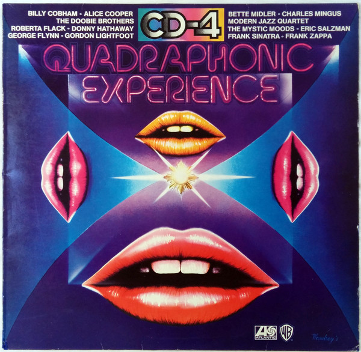

+++
title = "Introduction to Spatial Audio"
outputs = ["Reveal"]
[reveal_hugo]
theme = "moon"
margin = 0.2
+++

# Introduction to Spatial Audio

---

## The spatial dimension in natural sound

- width
- height
- depth

{}

Everyday life is full of three-dimensional sound experiences. The ability of humans to make sense of their environments and to interact with them depends strongly on spatial awareness and hearing plays a major part in this process. Natural sounds are perceived in terms of their location and, possibly less consciously, their size (most people rely more strongly on their visual sense for this information).

Because listeners don’t have eyes in the backs or tops of their heads, they tend to rely on vision more to perceive the scene in front of them, and on sound more to deal with things behind and above them.

{}

---

## Natural sound 'scene' outdoors

- many sources with their own location and attributes
- source blending

{}
In some cases the blending of cues and the diffuseness of sources leads to a general perception of space or ‘spaciousness’ without a strong notion of direction or ‘locatedness’ (as Blauert calls it) (Blauert, 1997).

A typical outdoor scene: wind noise, general background noise from distant roads and towns, punctuated with specific localisable sounds such as birds. This sense of ‘outdoorness’ is strongly spatial in character in that it is open rather than constricted, and is very much perceived as outside the listener’s head.

{}

---

## Indoor environments

- reflections strongly effect sound
- gives the size of the space

{}
Overall then, the spatial characteristics of natural sounds tend to split into ‘source’ and ‘environment’ categories, sources being relatively discrete, localisable entities, and environments often consisting of more general ‘ambient’ sound that is not easily localised and has a diffuse character.
{}

---

Guess the environment?

<audio src="cistern.wav" controls>

{}
Evil laughter, echoed.Primo EM172 capsules inside widscreens, FEL Microphone Amplifier BMA2, PCM-M10 recorder. Recorded inside an old cistern of the Regina Castle (Badajoz Province, S Spain)

source: https://freesound.org/people/dobroide/sounds/326131/
{}

---

Guess the environment?

<audio src="sea-cave.wav" controls>

{}
A recording of waves and water dripping in a cave on the Ayrshire coast.

source: https://freesound.org/people/Andy_Gardner/sounds/196713/
{}

---

Guess the environment?

<audio src="forest-birds.mp3" controls>

{}
wind in the deciduous forest with birds recorded with mixpre 6II and audio technica bp4025 stereo mic.

source: https://freesound.org/people/Garuda1982/sounds/636528/
{}

---

Guess the environment?

<audio src="bathroom-fan.wav" controls>

{}
Fan / Ventilator in a bathroom;
turned on - running - turned off;
recorded in stereo (ORTF)

source: https://freesound.org/people/aUREa/sounds/94296/
{}

---

Guess the environment?

<audio src="cricket.wav" controls>

{}
Close recording of a cricket in the Californian desert (in the Mojave Desert, close to Joshua Tree Park).

Sound recorded by a MS setup Schoeps CCM41+CCM8
Sound Devices 788T recorder with CL8
MS is encoded in STEREO Left-Right
recorded in september 2012

source: https://freesound.org/people/felix.blume/sounds/166176/
{}

---

# Sound sources in space

---

## Sound sources in a free field

{}
In acoustics, the free field is a term used to describe an environment in which there are no reflections. The closest most people might get to experiencing free field conditions is outdoors, possibly suspended a long way above the ground and some way from buildings (try bungee jumping or hang-gliding).

or an anachoic chamber
{}

---

{}
In the free field, all the sound generated by a source is radiated away from the source and none is reflected back. A consequence of this is that the sound level experienced by a listener drops off quite rapidly as they move away from the source (about 6 dB for every doubling in distance from the source) as shown in Figure 1.1.

Sounds are relatively easy to localise in free field environments as the confusing effect of reflections is not present.

Distance or depth judgement is not so straightforward in free field environments,
{}

---

{}
Not all sources radiate sound spherically or omnidirectionally, indeed most have a certain directivity characteristic that represents the deviation from omnidirectional radiation at different frequencies. This is sometimes expressed as a number of dB gain compared with the omnidirectional radiation at a certain frequency on a certain axis (usually the forward or 0° axis). This is best expressed fully as a polar pattern or directivity pattern, showing the directional characteristics of a source at all angles and a number of frequencies (see Figure 1.2). As a rule, sources tend to radiate more directionally as the frequency rises, whereas low frequency radiation is often quite omnidirectional
{}

---

## Sources in reflective spaces

{}
In enclosed spaces a proportion of the radiated sound energy from sources is absorbed by the surfaces and air within the space and a proportion is reflected back into the environment. The result of the reflected sound is to create, after a short period, an ‘ambient’ or ‘diffuse’ sound field that is the consequence of numerous reflections that have themselves been reflected. As shown in Figure 1.3, the response of a space to a short sound impulse is a series of relatively discrete early reflections from the first surfaces encountered, followed by a gradually more dense and diffuse reverberant ‘tail’ that decays to silence.
{}

---

# Introduction to the spatial dimension in reproduced sound

---

## What is the aim of sound reproduction?

{}
Is the point of sound recording and reproduction to represent the natural environment as believably as possible? Or to create a virtual environment that could never exist in another medium? Both have their place I think.

Do we want to place the listener in the concert hall environment or bring the musicians into the living room?

What if the music or film represents a non natural environment or artificial creation? What is the concept of spatial reproduction that should be taken up then?

How far from what is natural is it possible to go and still interest the listener?
{}

---

{}
he typical arched curve that comes from these studies, suggesting that beyond a certain point increased complexity in music results in a drop off in liking.
{}

---

# From mono to surround sound and 3D audio

{}
A short summary of some of the major developments in spatial audio systems is given here.
{}

---

## Early sound reproducing equipment

{}
The first gramophone and phonograph recording systems from the late 1800s and early 1900s were monophonic (one channel only).

The only ‘spatial’ cues possible in monophonic reproduction were hints at distance and depth provided by reverberation.
{}

---

## The first stereo transmission?

{}
Clement Ader’s early experiment at the Paris exhibition of 1881 is often documented as the first known example of a stereo- phonic transmission of music (Hertz, 1981). He placed telephone pickups (microphones) in the footlights at the Paris Opera (spaced across the stage) and relayed the outputs of these to pairs of telephone receiver earpieces at the exhibition, where delighted visitors could listen to the opera live and with some spatial realism. Unfortunately it was not until many years after- wards that stereophonic reproduction became a commercial reality.
{}

---

## Bell Labs in the 1930s

{}
Early work on directional reproduction at Bell Labs in the 1930s involved attempts to approximate the sound wavefront that would result from an infinite number of microphone/ loudspeaker channels by using a smaller number of channels, as shown in Figure 1.7. Spaced pressure (omnidirectional) microphones were used, each connected by a single amplifier to the appropriate loudspeaker in a listening room. Snow (1934) found that three channels gave quite convincing results, and that when reducing the number of channels from three to two, central sources appeared to recede towards the rear of the stage and that the width of the reproduced sound stage appeared to be increased.

{}

---

{}
Steinberg and Snow’s work was principally intended for large auditorium sound reproduction with wide screen pictures, rather than small rooms or consumer equipment. It is interest- ing to note that three front channels, although not used much in consumer reproduction until recently, are the norm in cinema sound reproduction, partly because of the wide range of seating positions and size of the image. The centre channel has the effect of stabilising the important central image for off-centre listeners, and has been used increasingly since the Disney film Fantasia in 1939 (Fantasia used a special control track to automate the panning of three sound tracks to a number of loudspeakers, including some rear channels).
{}

---

## Early consumer stereo

<iframe width="560" height="315" src="https://www.youtube.com/embed/VtXl8xAPAtA" title="YouTube video player" frameborder="0" allow="accelerometer; autoplay; clipboard-write; encrypted-media; gyroscope; picture-in-picture" allowfullscreen></iframe>

{}
Methods for cutting two channel stereo sound onto vinyl disks, in a manner similar to that proposed by Blumlein, were introduced commercially in the late 1950s, and stereo records became widely available to the public in the 1960s

The Beatles’ album, Sergeant Pepper, from the mid ’60s, was the first multitrack pop recording (four track!) and was issued in both stereo and mono versions (the stereo being the more common, but some say the poorer mix).
{}

---

## Binaural stereo

{}
It could well be argued that all sound reproduction is ultimately binaural because it is auditioned by the two ears of a listener. Nonetheless the term binaural stereo is usually reserved for signals that have been recorded or processed to represent the amplitude and timing characteristics of the sound pressures present at two human ears

Documented examples of interest in this approach go back over much of the twentieth century. When reproduced over headphones such recordings can recreate a remarkable sense of realism, including height cues and front–back discrimination. Unfortunately the variables in such signal chains, particularly the differences between the recording head/ears and the listener’s, the headphone response and coupling to the ears, and any distortions in the signal path, can easily destroy the subtle spectral and timing cues required for success.
{}

---

## Cinema stereo

{}
Everything we covered last class
{}

---

## Quadraphonic sound

{}
Quadraphonic sound is remembered with mixed feelings by many in the industry, as it represents a failed attempt to intro- duce surround sound to the consumer.

Unlike Dolby Stereo, quadraphonic sound used no centre channel, but was normally configured for a square arrangement of loudspeakers, two at the front and two behind the listener. The 90° angle of the front loudspeakers proved problematic because of lack of compatibility with ideal two channel reproduction, and gave poor front images, often with a hole in the middle.
{}

---

## Ambisonics

[History](https://intothesoundfield.music.ox.ac.uk/ambisonics)

{}
Ambisonic sound was developed in the 1970s by a number of people including Gerzon, Fellgett and Barton, and many others influenced its development both in the early days and since. Much of the work was supported by the NRDC (National Research and Development Council) and the intellectual property was subsequently managed by the British Technology Group (this was eventually transferred to the British record company, Nimbus). It was intended as a comprehensive approach to directional sound reproduction, involving any number of reproduction channels, based partly on an extension of the Blumlein principle to a larger number of channels. The system can be adapted for a wide variety of loudspeaker arrangements, including (more recently) the ITU-standard five- channel configuration. Enabling fully three-dimensional sound fields to be represented in an efficient form, including a height component, it remains an elegant technical toolbox for the sound engineer who believes that accurate localisation vector recon- struction at the listening position is the key to high quality spatial sound reproduction.
{}

---

## The home cinema and ITU-standard surround sound

{}
Where music reproduction alone appeared to be insufficient justification for reconfiguring the furniture in the living room, movie watching is regarded as an enjoyable experience for all the family, removing some of the traditional barriers to the installation of hi-fi equipment.
{}

---

# Applications of spatial audio

{}
A number of potential applications of spatial audio have been implied or stated above. In Table 1.1 applications are categorised in terms of the primary aim or purpose of spatial sound repro- duction – in other words whether the application requires accurate rendering of sound sources and reflections over a 360° sphere, or whether the aim is primarily to deal in artistic/creative illusion. Sometimes the distinction is not completely clear, and in such cases both have been shown.
{}
