+++
title = "Stereo microphone techniques"
outputs = ["Reveal"]
[reveal_hugo]
theme = "moon"
margin = 0.2
+++

# Stereo microphone techniques

---

## Microphone arrays

- minimalist - same number of mics as loudspeaker channels
- use matched microphones
- use a ruler and protractor for optimum results

---

## Review

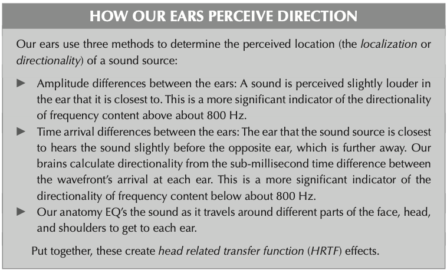

---

# Coincident Techniques

{}
In coincident arrangements, the microphone capsules are usually aligned on top of each other along a vertical axis, while including a certain ‘opening angle’ in the horizontal axis. The signal differences between the two channels of the stereo signal are caused by the volume differences that occur due to the directional characteristics of the capsules. The usual patterns are subcardioid, cardioid, hyper-cardioid and figure-of-eight.

{}

---

See [Visualization of all stereo microphone systems with two microphones](http://www.sengpielaudio.com/HejiaE.htm)

---

## XY Coincident Pair Techniques

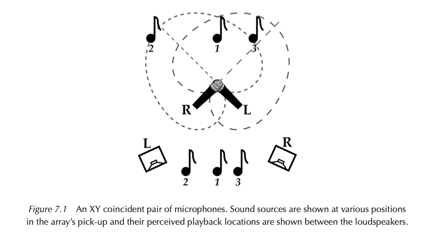

{}
uses two cardioid or hyper-cardioid microphones positioned so their capsules are as close together as possible. The mics are angled between 90° to 130° apart, with their pick-up patterns crossing in front,

The array as a whole is aimed at the center of the sound source, putting each mic 45° to 65° off-axis from pointing directly forwards.

**Sound source 1** comes from the center of the source, and is equally off-axis and equi- distant to both microphones. This means that both mics pick up identical sound at the same time. When the mics are panned hard left and hard right on a stereo loudspeaker system, both loudspeakers reproduce the same sound at the same time. Identical direct sound and inter-aural crosstalk arrive at each of the listener’s ears creating a phantom center image directly in-between the loudspeakers.

etc for the other sources
{}

---

## XY Characteristics

Q: Why does the diagram show that the reproduced image is slightly narrower than the original sound source?

{}

A: This is because XY techniques capture and present directional information only as amplitude differences between the two mics and loudspeakers. Time arrival differences are powerful indicators of directionality, but this technique doesn’t capture any, because the microphone capsules are as close together as possible.

- General characteristics of xy:
  - Narrow, compact images due to the lack of time arrival cues, and a lot of overlap of each mic’s pick-up.
  - Potential for muddy sound due to the significant amount of each mic’s off-axis pick-up – no mic is actually pointed towards the center of the sound source. Cheaper directional mics, with their inferior off-axis colorations exaggerate this problem. The increased price of better directional mics is justified by their improved off-axis frequency response in this context.
  - **Good mono compatibility!** With no time arrival differences between the capsules there is no phase cancellation or comb fltering when they are summed together for mono playback.
  - **The perceived stereo image can be widened** by increasing the angle of incidence between the mics – however, this puts each mic further off-axis from the center of the sound source. This makes the center of the image muddier – particularly if the mics have poor off-axis response.
  - Using hyper-cardioid mics instead of cardioid mics decreases the overlap of the pick- up patterns and unclutters the center of the image, making it wider. However, sounds coming from the center of the source are now effectively more off-axis to each hyper- cardioid mic’s more directional pick-up – so they are picked up with greater off-axis coloration and slightly less amplitude.

To summarize: use this if mono compatibility is of concern, or if you don't need a very wide image.

{}

---

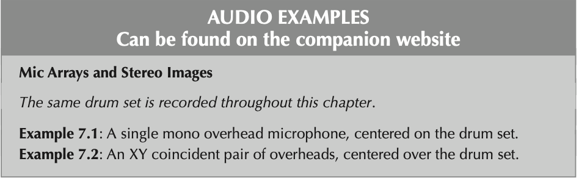

{}
Where do you hear each part of the set in both recordings?
{}

---

## Blumlein Pair Technique

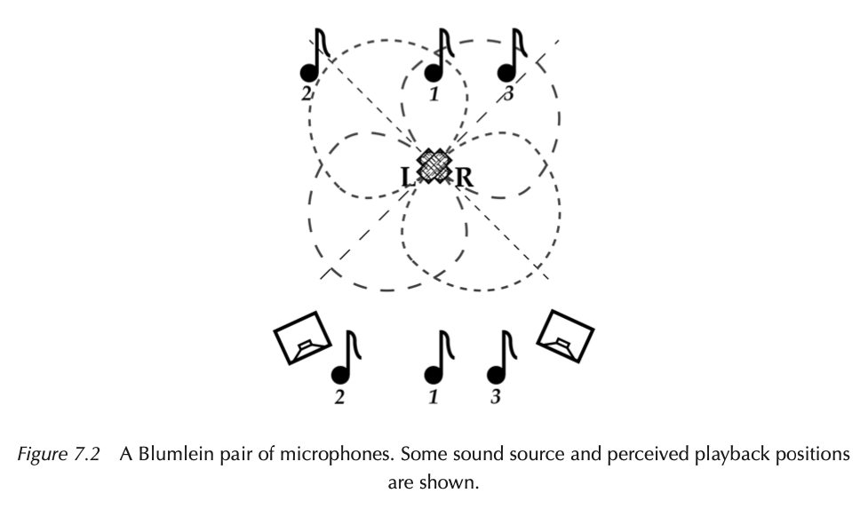

{}
A Blumlein pair is a coincident array of bidirectional microphones crossed at 90°. Each mic is displaced 45° from the center of the sound source,

This array works in a similar way to an XY coincident pair – it is a coincident pair. There are no time arrival differences between the coincident capsules, so as with XY coincident pair techniques, **only amplitude difference information is recorded and reproduced on playback.**

The side rejection of bidirectional mic patterns causes less common pickup between the mics. This can create natural, realistic images that are wider and more spacious than XY.

The sound picked up from behind the microphone can also add naturalness because of the room reflections it picks up.
{}

---

## Blumlein Listening

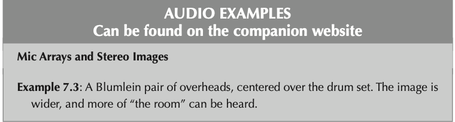

---

## Near-Coincident Pair Techniques

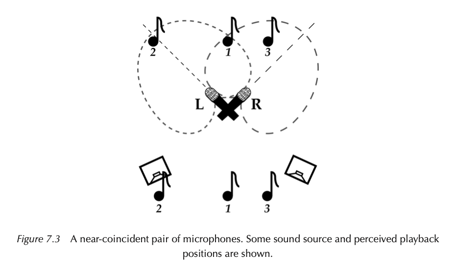

{}
A near-coincident array uses two directional microphones with the capsules positioned a small distance apart. The mics face away from each other, resulting in slightly less overlap of their pick-up patterns than an XY coincident array. The angle of incidence between the mics is usually between 90° to 110°

Types of near-coincident pairs include the famous ORTF, NOS, and DIN

Q: How does this configuration create a stereo image?

- General characteristics
  - A wider, clearer stereo image than XY coincident techniques – often more closely matching the original sound source.
  - A less muddy and confused sound.
  - Sources in the center of the image might still be slightly muddy due to their off-axis
    position – no mic is pointed directly at the center of the sound source.
  - A slight decrease in mono compatibility because of the small time arrival differences
    between each capsule.
  - The perceived image can be made wider or narrower by increasing or decreasing the
    angle of incidence between the mics. But as with an XY coincident array, increasing this angle puts each mic further off-axis with the center of the source, further muddying the center image sound, particularly if the mics have poor off-axis response.
  - The perceived image width can be increased by increasing the distance between the mic capsules (to a point), or decreased by moving them closer together. Mono compat- ibility decreases dramatically as the distance between the two capsules increases.
  - Using hyper-cardioid mics instead of cardioid mics will widen the image, however any sound coming from the center of the source will be more off-axis to each mic and consequently picked up with increased off-axis coloration and slightly less amplitude.
  - It may be possible to decrease the angle of incidence when using hyper-cardioid mics and maintain a similar image width to using cardioid mics – with the advantage of the hyper-cardioid mics being less off-axis to the center of the sound source.

Drawbacks: worse mono compatibility, try to listen in mono before recording to hear how much sound disappears.

{}

---

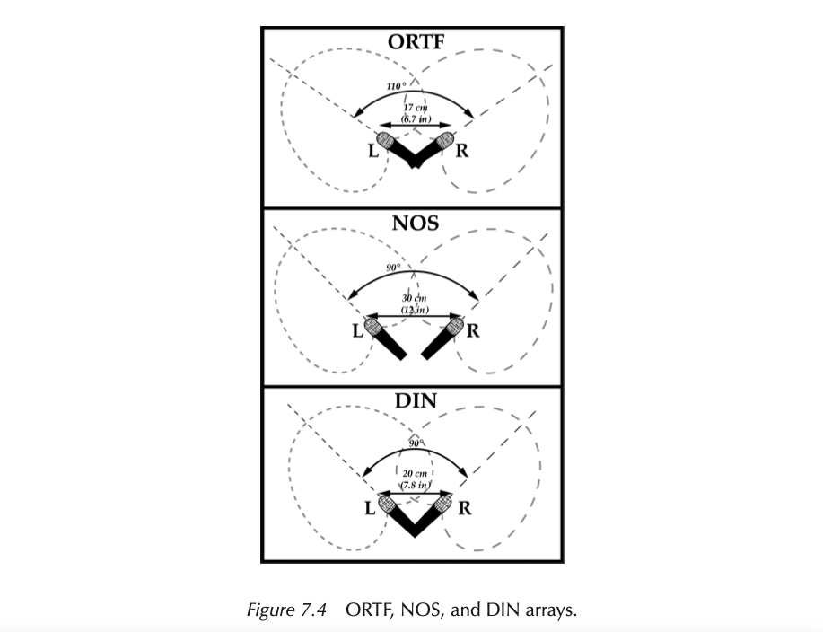

{}
ORTF
Developed by the Offce de Radiodiffusion-Télevision Français, the ORTF technique uses two cardioid mics set at an angle of 110°, with the capsules spaced 17 cm (6.7 in) apart. With capsule spacing similar to the ears on your head, this technique produces a satisfying, transparent stereo image, with relatively good mono compatibility.

NOS
Developed by Netherlands Radio, the NOS technique uses two cardioid mics set at 90° to each other, with the capsules 30 cm (12 in) apart. Due to this wider spacing, mono compatibility is not as assured as with an ORTF array, but due to the narrower angle of incidence between the mics, they are less off-axis to the center of the sound source. The increased phase differences introduced by the wider spacing result in a slightly bigger and more immersive image than a typical ORTF image.

DIN
Standardized by the German Deutches Institut Für Normung organization, the DIN technique positions two cardioid mics 20 cm (7.8 in) apart, angled at 90°. The mics are not as off-axis as in an ORTF array, but are spaced slightly further apart. The spacing is signifcantly less than in a NOS array. This results in a good balance of time arrival and amplitude differences that is particularly effective at shorter distances.
{}

---

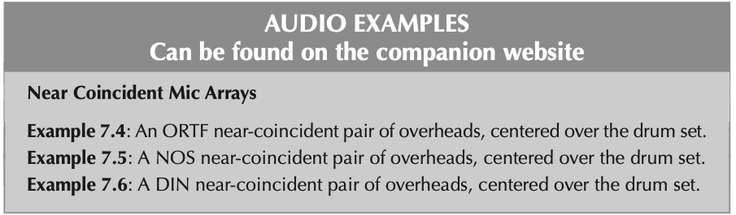

---

## Spaced Pair (AB) Techniques

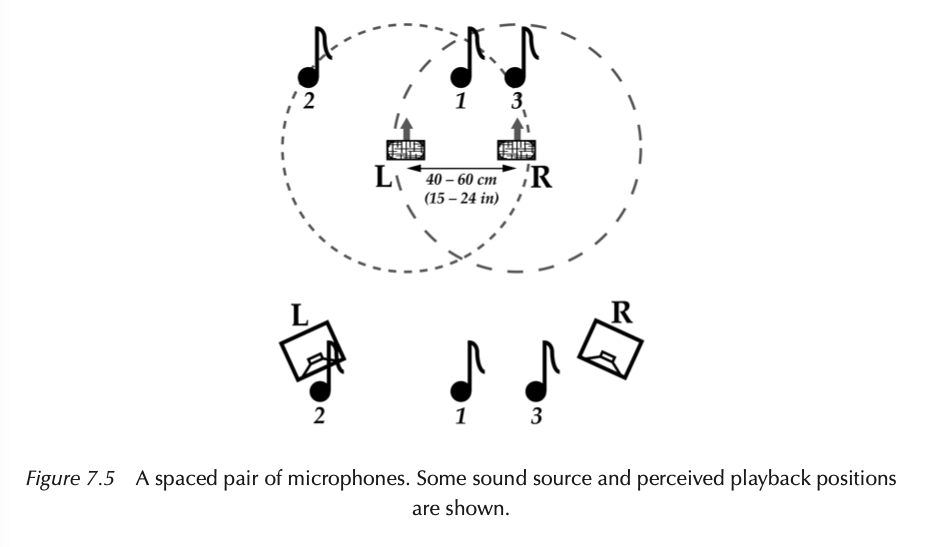

{}
In spaced pair or AB techniques, two microphones face directly forwards, with their cap- sules 40 to 60 cm apart (15 to 24 in), as shown in Figure 7.5. Omnidirectional microphones are generally used for spaced pair techniques – but there are many applications, such as drum overheads, when spaced directional mics can be used.

Time arrival information is the primary indicator of directionality in spaced mic tech- niques. Mic spacing of 50 cm (20 in) creates a maximum time arrival difference of approxi- mately 1.5 ms between the mics – which produces a natural listening experience for a listener in the sweet-spot of a stereo pair of loudspeakers.

General Characteristics:

- wide, expansive stereo image created predominantly by time arrival information. The image is not necessarily the most focused or precise, but it is the most enveloping.
- If the mic spacing is too wide, sources in the center can lack definition and focus.
- As the spacing between the mics is widened, longer than natural time arrival differences are generated – the image becomes weaker, made up of “ghostly” separated left/ right components with a “hole” in the center where nothing can really be localized.
- The relatively large time arrival differences between the mics make this **the least mono compatible stereo technique.** It is vitally important to check for phasing and comb filtering before recording, and to adjust the array spacing to minimize any problems – although it will probably be impossible to remove all mono compatibility issues.
- The perceived image width can be increased or narrowed by increasing or decreasing the spacing between the mics – but don’t go too wide on a close sound source (the image will have a hole in the middle), or too narrow when the mics are further away (the image will become too mono).
- Using directional mics instead of omnidirectional mics decreases common overlap, widening the stereo image – but it also positions centrally located sound sources more off-axis to each mic, subjecting them to off-axis coloration. Directional mics will, however, minimize the pick-up of undesirable room sound and sources of spill to the rear of the mic array.

{}

---

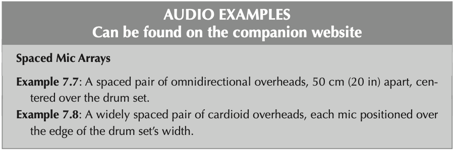

---

## MS (Middle-Side) Techniques

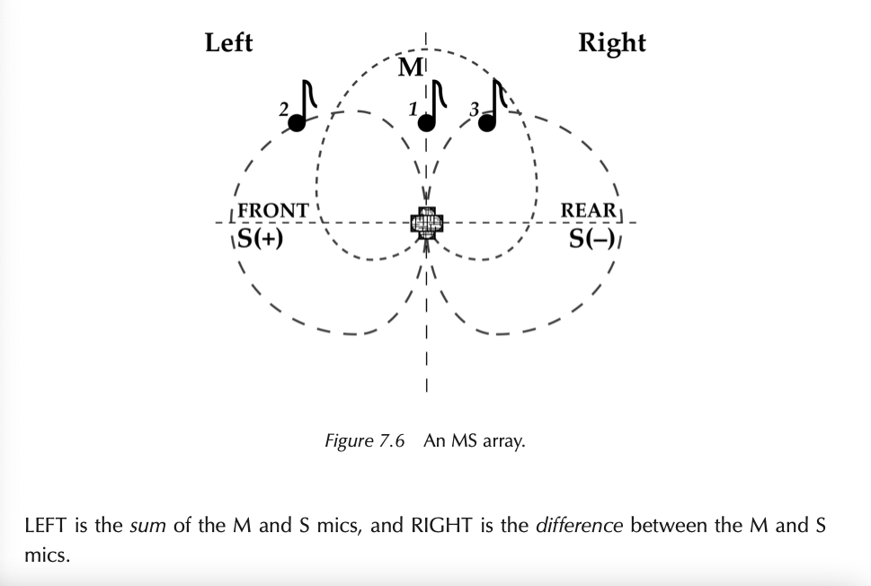

{}
In all of the stereo techniques previously discussed, left and right microphones were present – and each were routed discretely to their respective loudspeaker (for a full width stereo image). An MS array, as shown in Figure 7.6, is significantly different. It doesn’t pick up left/right information. Instead, MS techniques use a forward facing microphone (most commonly a cardioid mic, but it could be any polar pattern) to pick up the center or middle (M) information, and a bidirectional microphone turned sideways at 90° to pick up side (S) information (which is a combination of the sounds coming from the left and right sides of the array). The S mic is a single mic capsule which outputs the sum of the sound waves hit- ting its front and rear – there is not a separate left and right capsule or output
{}

---

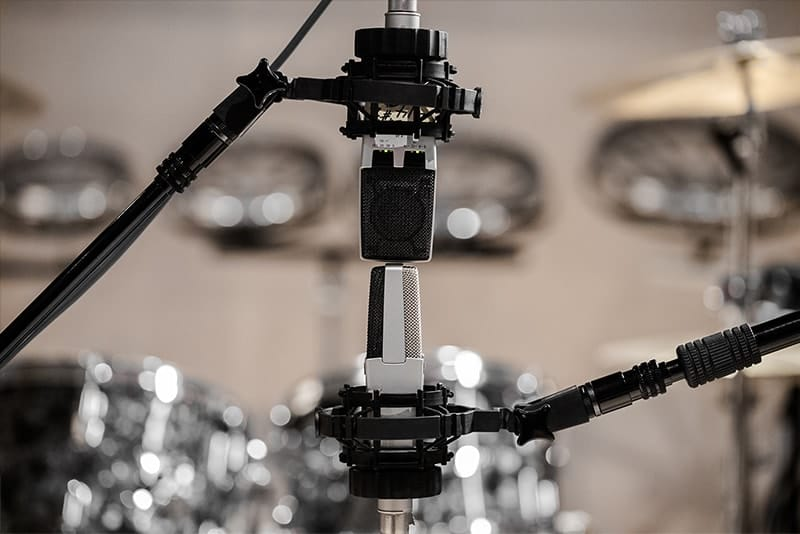

---

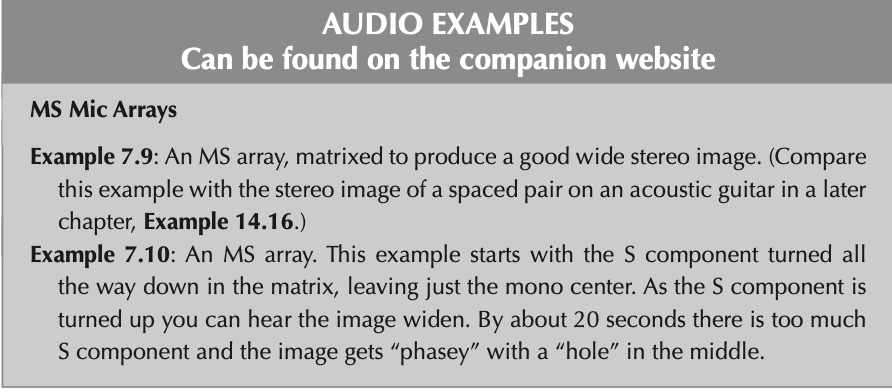

---

## Decca Tree

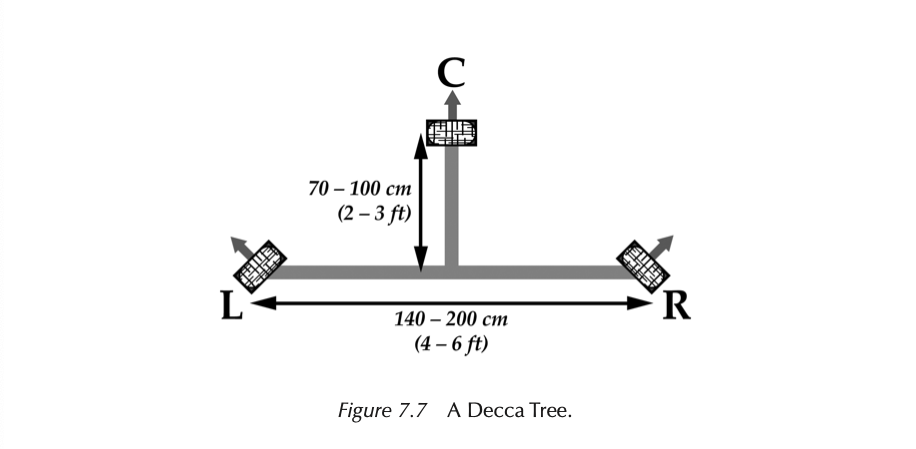

{}

The Decca Tree was originally developed by the Decca record label for orchestral record- ing, and can be heard on countless records and flm soundtracks. It consists of three omni- directional microphones, traditionally large diaphragm condensers, which are set up in a triangle as shown in Figure 7.7. The L mic is panned left, the R mic panned right, and the C mic panned to the center. The gains of the three mics should be set equally, although adjusting the C mic up or down can narrow or widen the perceived image.

{}

---

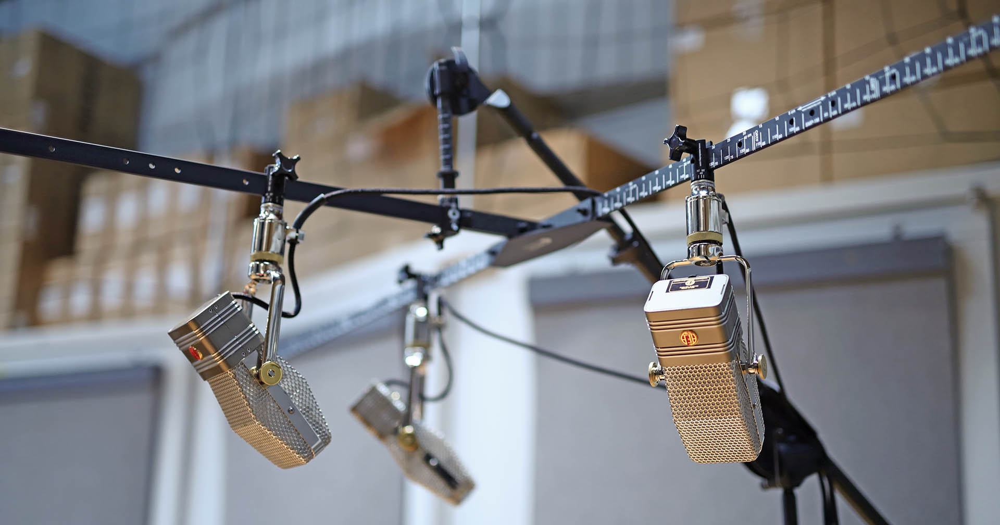
