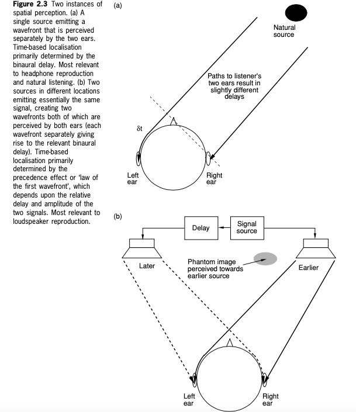
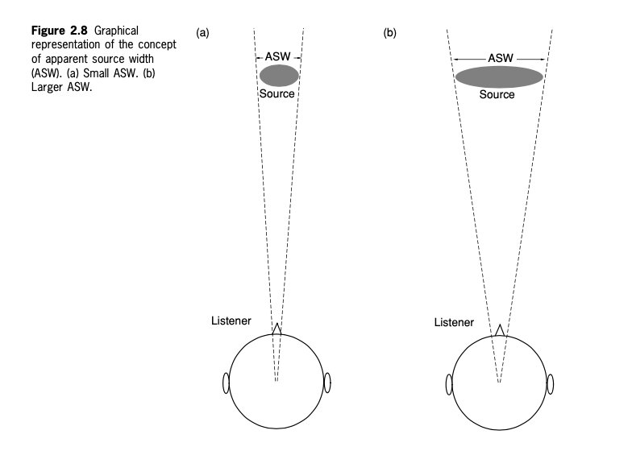

+++
title = "Spatial audio psychoacoustics"
outputs = ["Reveal"]
[reveal_hugo]
theme = "moon"
margin = 0.2
+++

# Spatial audio psychoacoustics

{}
We'll learn about the perception and cognition of spatial sound as it relates to sound recording and reproduction. We'll summarize those psychoacoustic phenomena that appear most relevant to the design and implementation of audio systems.
{}

---

## Sound source localization

{}

How do we perceive what direction a sound is coming from?

Broadly, these are:
* (1 - ITD) the detection of timing or phase differences between the ears, and of 
* (2 - IAD) amplitude or spectral differences between the ears.

Most spatial perception depends on the listener having two ears and discerning the differences between the signals received by those two ears.

{}

---

{}
Any sound source not directly in front of a listener will create a time difference between sounds arriving at the ears. This difference is related to the angle of incidence.

 **binaural delay** - The maximum time delay between the ears is 650 μs or 0.65 ms

Humans can resolve direction down to a few degrees with this method. But, we can't distinguish between front and rear or tell elevation with ITD.
{}

---

Try the [Interaural Time Differences](https://isle.hanover.edu/isle2/Ch11AudBrainLoc/Ch11InterTime.html) example 

---

### ILD - Amplitude and spectral cues

{}
Second method of spatial perception.

The head’s size makes it a palpable barrier to sound at high frequencies but not at low frequencies. Furthermore, the unusual shape of the pinna (the visible part of the outer ear) gives rise to reflections and resonances that change the spectrum of the sound at the eardrum depending on the angle of incidence of a sound wave.

Typically, sources to the rear give rise to a reduced high-frequency response compared to those at the front, owing to the pinna's slightly forward-facing shape.
{}

---

## Listening Experiment

[Interaural Level Differences](https://isle.hanover.edu/Ch11AudBrainLoc/Ch11InterLoud.html)

---

## Experiment 2 

> Find an environment with a fairly steady high frequency component in the soundscape, e.g. a hiss or broadband sound from a motor or fan, or perhaps a light that is buzzing. Move your head around and you will easily hear the high frequencies getting louder and quieter in each ear. Note that something similar will not and cannot happen for low frequencies.

<audio src="HighHum.wav" controls>

---

low frequencies are localized by ITD **(interaural time differences)**

high frequencies are localized by IAD **(interaural amplitude differences)**

---

- Localization with only ITD, interaural time differences. Source: IPO73
  - <audio src="IPO73-BinauralArrivalTime.wav" controls>
- The same effect in smaller steps with percussive sounds
  - <audio src="Binaural_demo.wav" controls>
- Switching interaural phase differences of 45° for 500 Hz and 2 kHz tones. Source: IPO72
  - <audio src="IPO72-BInauralPhase.wav" controls>

{}
The last example refers to a phase difference, but keep in mind that a phase difference is simply a minimal time difference on the order of magnitude of a fraction of the period of the wave. For the lower frequency (500 Hz), you can hear a spatial shift with these phase switches, but for 2 kHz, you cannot. This is because at high frequencies, a phase shift is tiny and not unique, in the sense that it could be 1/2 wavelength, or 3/2, or anything similar, and besides, these tones would not diffract around the head.
{}

---

{}
A study of a few human pinnae will quickly show that, rather like fingerprints, they are not identical. They vary quite widely in shape and size.

HRTF - a response that characterizes how an ear receives a sound from a point in space. As sound strikes the listener, the size and shape of the head, ears, ear canal, density of the head, size and shape of nasal and oral cavities, all transform the sound and affect how it is perceived, boosting some frequencies and attenuating other

HRTFs are used now to simulate spatial cues, though difficulties arise if the HRTF used is different from yours.
{}

---

---

#### Listening Experiment - same sound different HRTFS

- <audio src="HRTF/IRC_1002_P345.wav" controls>
- <audio src="HRTF/IRC_1003_P345.wav" controls>
- <audio src="HRTF/IRC_1004_P345.wav" controls>
- <audio src="HRTF/IRC_1006_P345.wav" controls>
- <audio src="HRTF/IRC_1008_P345.wav" controls>
- <audio src="HRTF/IRC_1012_P345.wav" controls>

source: http://recherche.ircam.fr/equipes/salles/listen/sounds.html

---

[PHRTF - Dolby Professional](https://professional.dolby.com/phrtf)

---

{}
**Precedence effect**

There is a distinct difference between the spatial perception that arises when two ears detect a single wavefront (i.e. from a single source) and when two arrivals of a similar sound come from different directions and are detected by both ears (as shown in Figure 2.3).

The former gives rise to spatial perceptions based primarily on what is known as the ‘binaural delay’ (essentially the time-of-arrival difference that arises between the ears for the particular angle of incidence), and the latter gives rise to spatial perceptions based primarily on various forms of ‘precedence effect’ (or ‘law of the first wavefront’).

In loudspeaker listening, the precedence effect is more relevant, as a rule.
{}

---

### Cocktail party effect

- Same voice with mixed texts, mono then stereo
  - <audio src="Cocktail_Party_Effect.wav" controls>
- Two texts, one at a time, then mixed; source: Duda
  - <audio src="Duda13-CocktailPartyEffect.wav" controls>

{}
Cocktail party effect refers to our ability to identify and focus on a specific source amid other sources. The implied example is of a crowded social space where many voices are simultaneously speaking, and our ability to focus on one or two of them. 

First, we need to identify what sounds “belong” to each speech stream, and the most important cue to do that is the direction and location where they come from. Sounds coming from the same direction and location (i.e. distance) are assumed to be from the same source.
{}

---

{}
Some spatial cues are context-dependent and may be strongly influenced by the information presented by other senses, particularly vision. Learned experience leads the brain to expect certain cues to imply certain spatial conditions, and confusion may arise if this is contradicted. For example, it is unusual to experience the sound of a plane flying along beneath one, but the situation can occasionally arise when climbing mountains. Generally, one expects planes to fly above, and most people will look up or duck when played loud binaural recordings of planes flying over, even if the spectral cues do not imply this direction.
{}

---

# Distance and depth perception

{}
Apart from the lateralization of sound sources, the ability to perceive the distance and depth of sound images is crucial to our subjective appreciation of sound quality.

**Distance** is a term specifically related to how far away an individual source appears to be, whereas **depth** can describe the overall front-back distance of a scene and the sense of perspective created. Individual sources may also appear to have depth.
{}

---

## Distance perception

1. Quieter (extra distance traveled).
2. Less high-frequency content (air absorption).
3. More reverberant (in a reflective environment).
4. There is less difference between time of direct sound and first-floor reflection.
5. Attenuated ground reflection.

{}

A sound that is far away.

Numerous studies have shown that absolute distance perception, using the auditory sense alone, is very unreliable in **non- reflective environments**,

In **reflective environments,** on the other hand, substantial additional information is available to the brain. The ratio of direct to reverberant sound is directly related to source distance, the reverberation time and the early reflection timing tell the brain a lot about the size of the space and the distance to the surfaces, thereby giving it boundaries beyond which sources could not reasonably be expected to lie.
{}

---

### Apparent source width

{}
The subjective phenomenon of apparent or auditory source width (ASW) has been studied for several years, mainly by psychoacousticians interested in the acoustics of concert halls. (For a useful review of this topic, see Beranek (1997): Concert and Opera Halls: How They Sound). ASW relates to the issue of **how large a space a source appears to occupy from a sonic point of view** (ignoring vision for the moment), as shown in Figure 2.8, and is best described as a **‘source spaciousness’ phenomenon**.

For concert halls generally experiments show that larger ASW is better but the optimum width is unknown.

We think this phenomenon is related to image blur
{}

---

Envelopment and spaciousness

Source - DALL-E

{} 

How **enveloping or spacious** is the listener's perceived environment? This is hard to pin down.

Spaciousness refers to the perceived size of the acoustic space in which the sound is heard. Spaciousness is often used to describe the sense of open space or ‘room’ in which the subject is located, usually due to some sound sources such as musical instruments playing in that space. It is also related to the sense of ‘externalisation’ perceived – whether the sound appears outside the head rather than constrained to a region close to or inside it.

Envelopment refers to the degree to which the sound field surrounds the listener and provides a sense of being enveloped by sound. **Envelopment** is a similar term used to describe the sense of immersivity and involvement in a (reverberant) soundfield, with that sound coming from all around. It is regarded as a positive quality that is experienced in good concert halls.

{}

---

# Naturalness

{}
This is one of the goals of spatial sound reproduction. It doesn't have an easily defined meaning.
{}

---

### Subjective attributes of spatial impression

