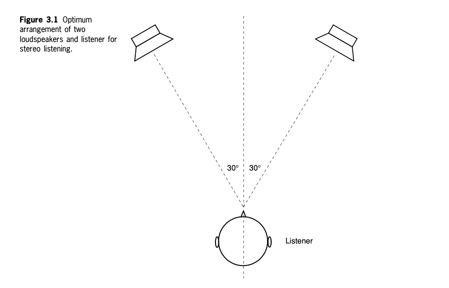
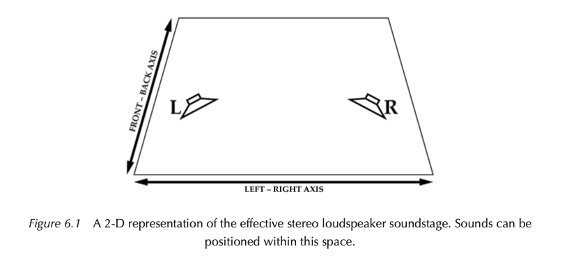
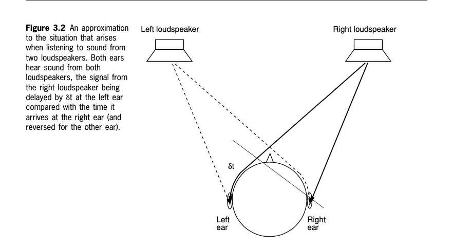
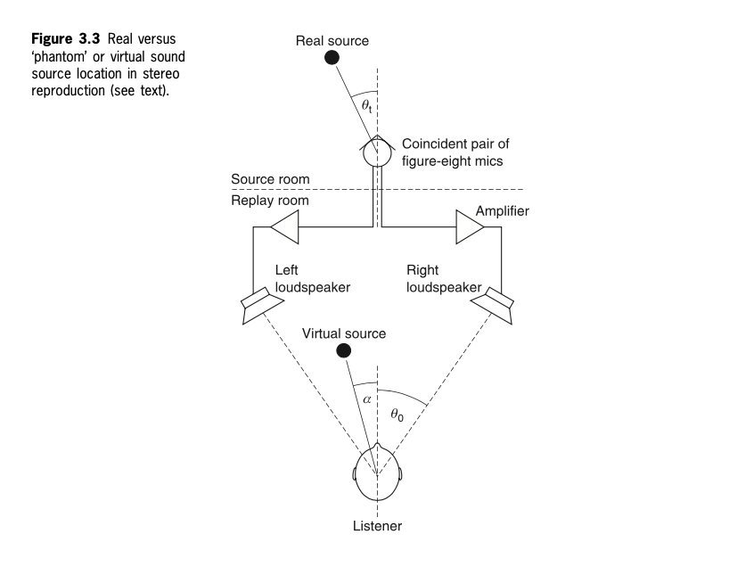
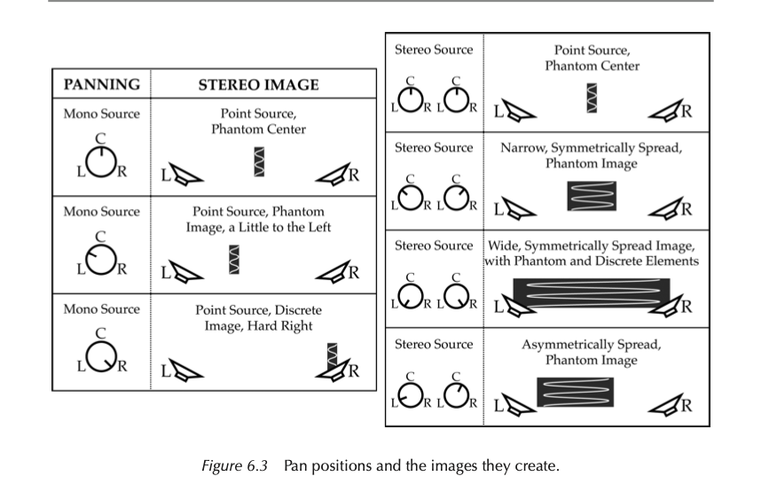
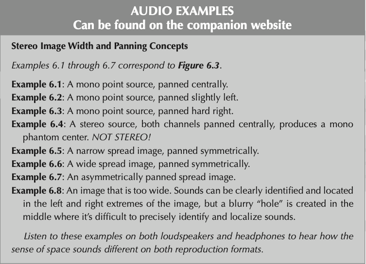
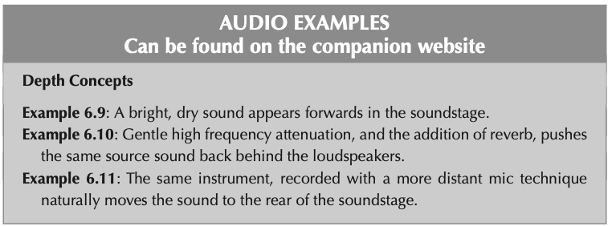
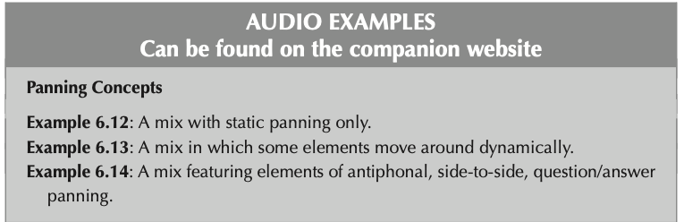
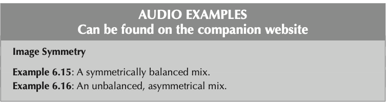
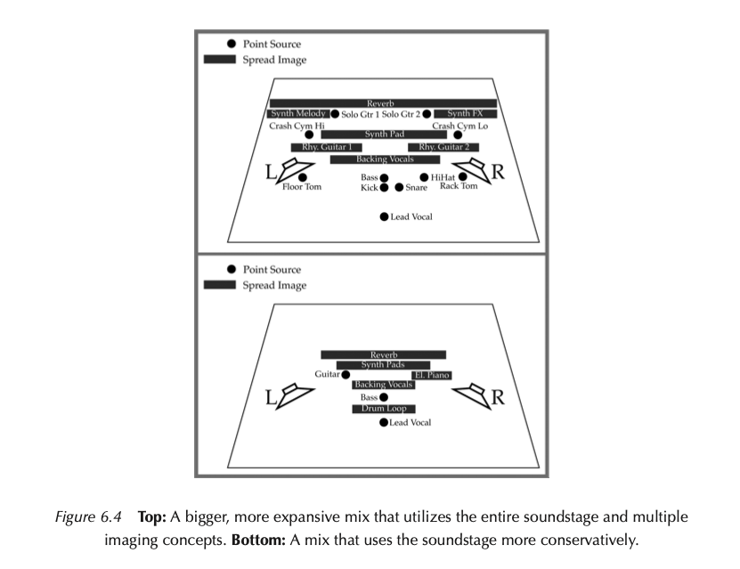

+++
title = "Stereo reproduction and microphone techniques"
outputs = ["Reveal"]
[reveal_hugo]
theme = "moon"
margin = 0.2
+++

# Stereo reproduction and microphone techniques

{} 

I'll cover the principles of conventional two-channel stereo related to loudspeaker and headphone reproduction.

{}

---

### Two-channel (2-0) stereo

<iframe width="560" height="315" src="https://www.youtube.com/embed/vzN3qO-qc8U" title="YouTube video player" frameborder="0" allow="accelerometer; autoplay; clipboard-write; encrypted-media; gyroscope; picture-in-picture" allowfullscreen></iframe>

stereo [source](https://filmandfurniture.com/product/harman-kardon-stereo-music-system-in-american-psycho/)

{}

Two-channel stereophonic reproduction (in international standard terms, ‘2-0 stereo’, meaning two front channels and no surround channels) or ‘stereo’ is the most common way that most people know of conveying some spatial content in sound recording and reproduction.

Stereophony - any sound system that conveys three-dimensional sound images, so it is used more generically in this book and includes surround sound.

The terminology is international: ‘n-m stereo’ where n is the number of front channels, and m is the number of rear or side channels (the latter only being encountered in surround systems).
{}

---

## ‘Blumlein stereo’

{}

The diagram shows the optimum arrangement for two loudspeaker stereo - the equilateral triangle. 

The idea of stereo is to create a phantom image - the apparent locations of sound sources in between the loudspeakers

If the listener is at a different point than shown in this diagram, phantom images will become less stable.

Of course, there are limits to this configuration due to the lack of rear speakers.

- If you sit too far forward, the stereo image will appear too wide, and tend to have a hole in the center of some stereo sounds. You will compensate for this by not panning aggressively enough, and the result will be a mix that is too narrow.
- The stereo image will appear too narrow if you sit too far away from the loudspeakers. You will compensate and create a mix that is too wide with too much extreme panning.
- If you sit off-center, the law of the first wavefront dictates that the image will steer towards the loudspeaker closest to you and appear asymmetrically balanced and too heavy on that side. When listened to correctly, your mix will be too heavy on the opposite loudspeaker.
  
{}

---

## Stereo Soundstage

{}
An effective stereo soundstage will position sounds within this space. Listeners will perceive the sounds from behind the speakers, between them, and in front of them.

Remember, this concept only exists when sitting in the sweet spot listening to loudspeakers, not headphones.
{}

---

## Summing localization

{}
important! - The so-called ‘summing localisation’ model of stereo reproduction
  - The best illusion of phantom sources is when the sound signals present at the two ears are as similar as possible to those perceived in natural listening, or at least that several non-contradictory natural localization cues are available.

It is possible to create this illusion for sources in the angle between the loudspeakers using only amplitude differences between the loudspeakers, where the time difference between the signals is very small («1 ms).

This diagram shows stereo listening on speakers, which is different from headphones because we're hearing the copied signal with both ears simultaneously.

The result of this is that the loudspeaker listener seated in a centre seat (see Figure 3.2) receives at his left ear the signal from the left speaker, first followed by that from the right speaker, and at his right ear the signal from the right speaker first followed by that from the left speaker. The time t is when the sound travels the extra distance from the more distant speaker.

Suppose the amplitudes of the two channels are correctly controlled. In that case, it is possible to produce resultant phase and amplitude differences for continuous sounds very close to those experienced with natural sources, thus giving the impression of virtual or ‘phantom’ images anywhere between the left and right loudspeakers.

the sound from each speaker also arrives at the far ear and does so slightly later, while being quieter and having less high frequencies (Figure 13.2b). This late arrival confuses our brain and slightly smears the perceived sound image.
This smearing effect can be demonstrated in every surround studio by comparing the sound emitted solely from the center speaker (real center) and that emitted at equal levels from both the left and right speakers (phantom center). How unfocused the latter might be can be quite surprising, especially in poorly tuned surround studios.
{}

---

{}
There's some math that I don't understand but you can see here that the phantom image seeks to recreate the angle of a real source recorded with a stereo microphone technique.
{}

---

### Phantom and Discrete Images

- Discrete speaker images
  - clearer
  - more focused
  - more precise
  - tighter
  - timbrally more assertive
  - arguably "smaller"
- Phantom images
  - slightly "larger"
  - less focused
  - slightly weaker sounding

{}
What are the properties of this phantom image, this perceived location between the speakers?

- A combination of speakers creates comb filtering and phase cancellation that can make mixing interesting

Discrete speaker images happen when a sound is panned hard left or right. It can also occur with a center speaker. With discrete speaker images, there is no ITD or IAD between the speakers. This gives the sound a particular effect different from a phantom image.

special panning circuits can create phantom images that extend a little beyond the loudspeakers, essentially limited to reproducing both sources and reverberation from an angle of about 60°.

This is a fine restriction for most purposes, and this has not limited most music producers. We'll typically be facing forward when listening to music or watching TV.

Phantom images are also subject to some tonal coloration as they are panned across the sound stage, owing to the way that the signals from two loudspeakers sum at the ears of the listener. A phantom central image will have a certain amount of mid-range colouration compared with that of an actual loudspeaker in that position

{}

---

### Image width

- Mono point-sources
  - centered
a little off-center
  - almost to one side or the other
  - all the way to one side or the other
- Spread images
  - Narrow – only a little wider than a point-source mono image.
  - Wide – taking up nearly or all of the space between the loudspeakers.
  - Symmetrically panned
  - Asymmetrically panned

{}
A mono microphone source creates a narrow and focused image that can be panned in the sound stage in the ways stated above. They have little width alone, but multiple mono sources can be added to the sound stage to give a perception of a wide stereo image.

Spread images are produced by stereo mic arrays, synthesizers and keyboards with stereo outputs, and stereo reverb and effects units. A spread image takes up left/right space – sound comes from throughout its width. A spread image can be:

- Narrow – only a little wider than a point-source mono image.
- Wide – taking up nearly, or all of the space between the loudspeakers.
- Symmetrically panned – the pan controls are equal but opposite from the center position.
- Asymmetrically panned. For example, the L channel of a stereo synth sound panned
  hard left, and the R channel panned center.

{}

---

{}
A few examples of mono and stereo sources and the images they can create.

Notice how the stereo width shown here recreates the apparent source width of our psychoacoustics lesson.

{}

---

### Listening exercise

[Companion website](https://routledgetextbooks.com/textbooks/9780367470364/audio_files.php)

---

## Beyond the loudspeakers

- context
- out of phase content

{}

- Context: A widely panned stereo source may appear to be super-wide depending upon what else is going on at the same time, and what other imaging concepts it is being contrasted with.
- Out of phase content: A wide stereo sound source that has a signifcant amount of decorrelated information in each channel can appear to extend beyond the physical position of the loudspeakers. Some synth pads, and big room/hall reverbs are examples of this.

{}

---

## Depth Concepts

- high frequency attenuation
- reverb
- amplitude balance

{}
Besides left to right images we can create the illusion of depth or front to back perspective.

This can be created through the following techniques (based on acoustics and psychoacoustics):

- High frequency attenuation: As sound sources get naturally further away from the listener, the air the sound is traveling through absorbs some high frequency content. Rather than emulating this with EQ, mic it so it sounds that way! Conversely, the brighter and crispier a sound is, the more “up front” and “in-your-face” it usually appears.
- Reverb: In a natural acoustic environment (a room, concert hall, etc.) we hear a sound source close to us as mainly direct, dry sound, with only a small amount of wet, reveberant content. A far away sound source is experienced as predominantly wet, reverberant content. The addition of reverb (with a short pre-delay) can create the illusion that a sound is pushed behind the loudspeakers. The effect can be magnifed by adding a little high frequency attenuation to the source sound. Or it can be miked so it sounds that way to begin with.
- Amplitude balance: A contextually quieter sound can also be interpreted as being further away. But, it is possible to have a very quiet sound appear forwards in the mix if it is bright and dry.
- Sound can appear to be forward of the loudspeakers because it is bright and relatively dry. Longer reverb pre-delays can be used to “detach” the reverb from the dry sound, keeping the dry sound up front. The “up-front-and-in-your-face” factor can also be increased with good volume automation and compression, to make the sound more consistent.

These techniques are all about context, too much reverb and everything seems distant.

{}

---

## Depth listening examples

[website](https://routledgetextbooks.com/textbooks/9780367470364/audio_files.php)

---

## Static and Dynamic Panning

- static
  - when the panning doesn't change through a mix
- Panning that changes with automation
  - fly-bys
  - auto-panning
  - ping-pong panning

{}
a lack of panning diversity results in:

- A possible lack of clarity due to too many sound sources with overlapping frequency content competing for the same physical space.
- It is boring and uninteresting to listen to! The stereo soundstage exists to be used – it makes the sonic experience more expansive and keeps listeners returning for another listen to see what else they can notice.

- Dynamic panning
  -Fly-bys: Sounds heard moving smoothly through the stereo image. Used too much, or inappropriately, moving pans can be distracting, but a swishy sound or a percussion effect heard moving from the left to the right, the measure before a chorus can create a spectacular lead in to the next section of the song!
  - Auto-panning: An auto-panner is a device or plug-in that automatically moves a sound through the space between a left and right location, at a speed and movement style set by the engineer. It is easy to over-use, but continuous auto-panning has been used very effectively on solos and sound effects on countless rock and pop records.
  - Ping-pong panning: A musical “question” phrase panned centrally, followed by a musical “answer” that alternates between being panned left and right. Or two parts that fairly rapidly bounce left then right. There is no smooth movement from one pan position to the other, just a bounce, or ping-pong between them. If a recording has musical material conducive to this effect, it can really expand the width of a mix and be interest- ing ear candy to draw listeners into the mix.

What are your favorite panning plugins? I'm going to assume that this class knows how to do each of these already.
{}

---

## Listening

---

## Image Symmetry

- guitar panned left, balanced with something else right
- percussion panned through the stereo field
- others?

---

### Possible stereo image

{}
so we should use as much of the soundstage as possible with our mixes. Avoid holes in your mix by having a variety of wide and narrow sources.
{}
