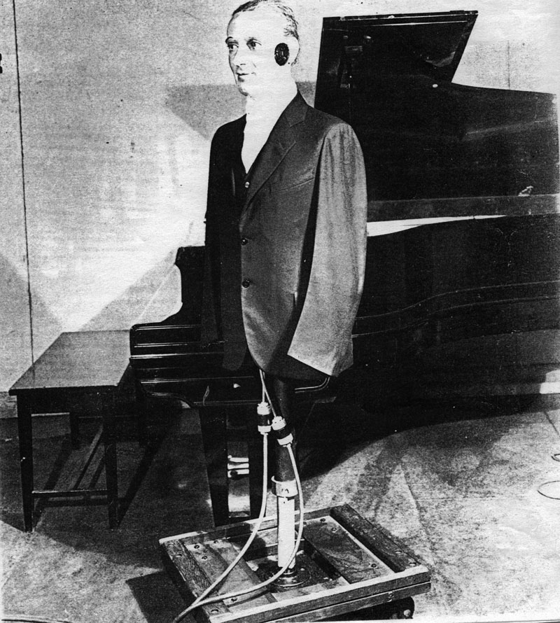
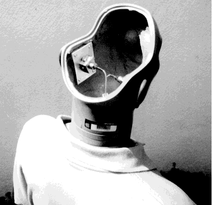

+++
title = "Binaural Audio"
outputs = ["Reveal"]
[reveal_hugo]
theme = "moon"
margin = 0.2
+++

# Binaural Audio

{}
- Drawbacks to typical stereo recording practices:
  - Standard microphone recording formats lack binaural cues.
  - Interaural time differences (ITD) are absent unless microphones are spaced like ears.
  - Interaural amplitude differences (IAD) for high frequencies are missing due to microphone size.
  - Pinna coloration is completely absent.
  - Effects from the head and torso are missing.

- Binaural audio's limited popularity is due to its compatibility primarily with headphones.

- Binaural technology is gaining commercial attention for:
  - Creating 3D directional sound cues.
  - Synthesizing accurate virtual environment acoustics using digital signal processors (DSP).
  - Applications in flight simulators, computer games, virtual reality, and architectural auralization.
  - Synthesizing 'loudspeakers' in virtual home theatre systems.
    - [Virtual Home Theater Video Player on Steam](https://store.steampowered.com/app/989060/Virtual_Home_Theater_Video_Player/)
  
{}

---

<iframe width="560" height="315" src="https://www.youtube.com/embed/Yd5i7TlpzCk" title="YouTube video player" frameborder="0" allow="accelerometer; autoplay; clipboard-write; encrypted-media; gyroscope; picture-in-picture" allowfullscreen></iframe>

---

<iframe src="https://apps.voxmedia.com/graphics/theverge-binaural-recording/?initialWidth=1023&childId=binaural-recording__graphic"  width="600" height="600"></iframe>

---

### Problems with binaural systems

- People’s HRTFs are different (to varying degrees). However, some standard features make it difficult to generalize the HRTFs that should be used for commercial systems that serve many people.
- Head movements that help to resolve directional confusion in natural listening are challenging to incorporate in reproduction situations.

---

- Visual cues are often missing during binaural reproduction, and these usually have a substantial effect on perception.
- Headphones differ in their equalization and method of mounting, leading to distortions in the perceived HRTFs on reproduction.
- Distortions such as the signal chain's phase and frequency response errors can affect the subtle cues required.

---

## Oscar

{}
- The first example of binaural audio experimentation may have been a mannequin named "Oscar" at Bell Labs.
- Oscar had microphones instead of ears, but they had rudimentary pinnae (ear structures).
- Early experiments involved having someone listen via headphones while sounds were made close to the microphones to observe their reactions.
- However, during that time, there was no medium for stereo recording or broadcast, which limited the progress of these experiments.
- As a result, these early binaural audio experiments did not lead to significant developments due to the lack of suitable stereo recording and broadcasting technology.

{}

---

## Neuman Head

 
<audio src="Kunstkopf.wav" controls>

{}
- In the 1960s, the Neumann microphone company in Germany conducted experiments with a kunstkopf device, which translates to "artificial head" or a "dummy head."
- This artificial head was designed to model the pinnae (external ear structures) with a high degree of accuracy.
- Microphones were strategically placed at the location of the eardrums inside the ear canals of the artificial head.
- Listening to recordings made with this artificial head required headphones, not speakers, to eliminate the influence of the listener's pinnae, ensuring a more accurate representation of sound.
- This approach aimed to capture and reproduce audio that closely mimicked human auditory perception, leading to the development of binaural recording techniques.

{}

---

## Above the head

Left to right trajectory around an artificial head, then front centre to above the head. Source: Cook 26

<audio src="Cook-Elevation.wav" controls>

{}
- Neumann researchers conducted experiments involving the addition of a torso to their binaural recording setup.
- Including a torso contributed some subtle nuances to the realism of the recordings, enhancing the accuracy of sound reproduction.
- However, attempts to add hair to the artificial head were unsuccessful and predictable failures, as they did not improve the recording quality.
- One of the primary challenges in binaural recording was achieving a well-defined frontal sound image that required precise pinna colorations to be captured accurately.
- When a trajectory path was suggested in a recording, listeners often perceive the sound as passing in front of them, possibly with a slight elevation in the middle of the trajectory.
- Maintaining a consistent audio image when sounds traveled over the listener's head was also challenging, with variations in perception from left to right (usually quite good) and from the center to above the head (a bit more problematic).
{}

---

## Duda recordings

{}
Some of the best binaural recordings are those made by Richard Duda at San Jose State University in California, in his lab equipped with a Kemar artificial head. The Kemar includes a modelled torso and accurate pinnae.

{}

---

- Moving from a reverberant room to an anechoic chamber
  - <audio src="Duda14-Anechoic.wav" controls>
- Binaural cues in the frontal plane (left, above, right, below)
  - <audio src="Duda47-Vertical plane.wav" controls>

---

- Music in 3 examples: Left track mono; Right track mono; binaural
  Check out the clarinet over your right shoulder!
  - <audio src="Duda4-LRBin.wav" controls>
- Passing jet in 3 examples: Normal stereo; Low-bandwidth binaural; High-bandwidth binaural; Which gives the best impression of the jet being overhead? Source: Duda
  - <audio src="Duda6-Jet.wav" controls>

---

## With HRTF

- The original chainsaw, heard first, was recorded in a stationary position, then using HRTF processing it appears to fly around you (try not to duck!)
  (Source: Pierce 39 & 40)
  - <audio src="Kendall-ChainSaw.wav" controls>
- The footsteps are recorded moving in place, and then processed as if they were first in a dry, then a reverberant stairwell. Do the steps go up or down? Does your contextual knowledge of stairwells help the vertical localization?
  - <audio src="Kendall-Footsteps.wav" controls>

---

- Fireworks display in Vancouver. Source: WSP VFile 2, take 11
  - <audio src="Fireworks.wav" controls>
- The Virtual Haircut
  - <audio src="Virtual Haircut.wav" controls>

{}
- Binaural microphones in modern times are often designed to be worn in the recordist's ears, offering a less intrusive and more portable recording solution.
- However, this design introduces challenges related to head movement on the part of the recordist and how it will be perceived by a listener whose head is assumed to be stationary.
- There can be variations in how listeners perceive the sound image's location outside the head due to the tradition of headphone listening, which tends to produce an in-head localization effect.

- Two examples illustrate binaural recording applications:
  1. A fireworks recording made using an artificial head demonstrates the use of binaural technology in capturing real-world events.
  2. "Virtual Haircut" is a well-known and highly entertaining binaural audio drama showcasing immersive and spatial qualities of binaural audio recording techniques.
{}

---

## Binaural Albums

<!-- - [The Best Albums Recorded in Binaural Audio - Hooke Audio](https://hookeaudio.com/blog/music/best-binaural-albums/)
- [(484) PigPen Theatre Co. "Shailene" : Hooke Live Sessions - Mobile Binaural 3D Audio - YouTube](https://www.youtube.com/watch?v=0PjI5zdunO4&list=PLYp6w6tSgroG5F4GWK6nEIimmZbl0CTai)
- [AWESOME BINAURAL ALBUMS! | Headphone Reviews and Discussion - Head-Fi.org](https://www.head-fi.org/threads/awesome-binaural-albums.511850/)
- [10 Binaural Albums That Will Blow Your Mind – Meteorite Sound](https://meteoritesound.com/10-binaural-albums-that-will-blow-your-mind/) -->

<iframe width="560" height="100" src="https://www.youtube.com/embed/lQkQi4hBcr8?si=CfeKaEC4cIa_cd5U" title="YouTube video player" frameborder="0" allow="accelerometer; autoplay; clipboard-write; encrypted-media; gyroscope; picture-in-picture; web-share" referrerpolicy="strict-origin-when-cross-origin" allowfullscreen></iframe>

<iframe width="560" height="100" src="https://www.youtube.com/embed/jNWF50faO0s?si=iKzLBRL0ml9VUT1d" title="YouTube video player" frameborder="0" allow="accelerometer; autoplay; clipboard-write; encrypted-media; gyroscope; picture-in-picture; web-share" referrerpolicy="strict-origin-when-cross-origin" allowfullscreen></iframe>

<iframe width="560" height="100" src="https://www.youtube.com/embed/T7SzMnLYPzw?si=RVlKzy9PkmPoFb5x" title="YouTube video player" frameborder="0" allow="accelerometer; autoplay; clipboard-write; encrypted-media; gyroscope; picture-in-picture; web-share" referrerpolicy="strict-origin-when-cross-origin" allowfullscreen></iframe>

<iframe width="560" height="100" src="https://www.youtube.com/embed/KwSWJrKWuP4?si=lSTA4R9NGPxRNIsZ" title="YouTube video player" frameborder="0" allow="accelerometer; autoplay; clipboard-write; encrypted-media; gyroscope; picture-in-picture; web-share" referrerpolicy="strict-origin-when-cross-origin" allowfullscreen></iframe>

- [Various classical recordings](https://www.binaural.no/)