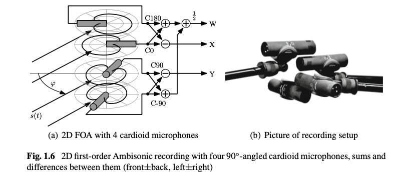
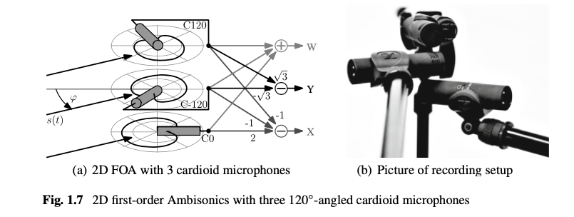
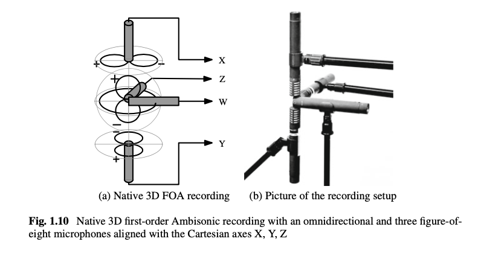
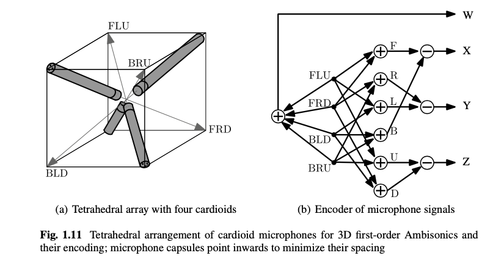
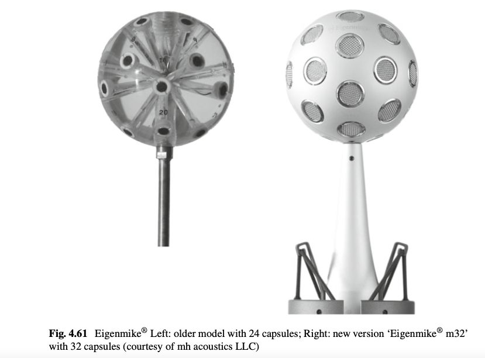

+++
title = "Ambisonics Recording"
outputs = ["Reveal"]
[reveal_hugo]
theme = "moon"
margin = 0.2
+++

# First-Order Ambisonics (FOA)

{}
Essentially based on similar considerations as MS, one can define first-order Ambisonic recording. For 2D recordings, a Double-MS microphone arrangement is suitable and only requires one more microphone than MS recording: a front-back oriented figure-of-eight microphone. The scheme is extended to 3D first-order Ambisonics by a third figure-of-eight microphone of up-down aiming.
{}

---

### 2D First-Order Ambisonic Recording and Playback

{}
The first-order Ambisonic format in 2D consists of one signal corresponding to an omnidirectional pickup pattern (called W), and two signals corresponding to the figure-of-eight pickup patterns aligned with the Cartesian axes (X and Y).
{}

---

### Native 2D Ambisonic recording (Double-MS)

{}
To record the Ambisonic channels W, X, Y, one can use a Double-MS arrangement
{}

---

### 2D Ambisonic recording with four 90◦-angled cardioids

---

### 2D Ambisonic recording with three 120◦-angled cardioids

---

### Native 3D Ambisonic recording (Triple-MS)

---

### 3D Ambisonic recording with a tetrahedral arrangement of cardioids

---

# Higher-Order Ambisonics (HOA)

---

### Eigenmike®

[Sound Demos](https://mhacoustics.com/demos) - listen with headphones, we'll listen to some in studio B later.

{}
This microphone can create higher order ambisonics signals from its 32 microphones. able to achieve **fourth-order Ambisonics**.
{}

---

[Sound Demos](https://mhacoustics.com/demos) - listen with headphones, we'll listen to some in studio B later.

---

### Octomic

[Octomic](https://www.core-sound.com/products/octomic)

{}
In 2018 US-company Core Sound, which also produces the ‘TetraMic,’ has come up with the first commercially available ‘Second-Order Ambisonic’ (SOA) microphone: the ‘OctoMic’ is made up of 8 capsules with cardioid characteristics, which apparently allows not only for a broad range of first- and second-order microphone patterns but also delivers more accurate spatial impression and localization due to better signal separation between the capsules.
{}

---

### Zylia

[ZM-1](https://www.zylia.co/zylia-zm-1-microphone.html)

{}
Around the same time, Polish company Zylia has released their third-order Ambisonics (TOA) microphone ‘ZM-1,’ based on 19 omni-directional capsules. Accompanying software enables beamforming and the creation of useful microphone patterns for 2D and 3D Audio use, including binaural signal generation.
{}
