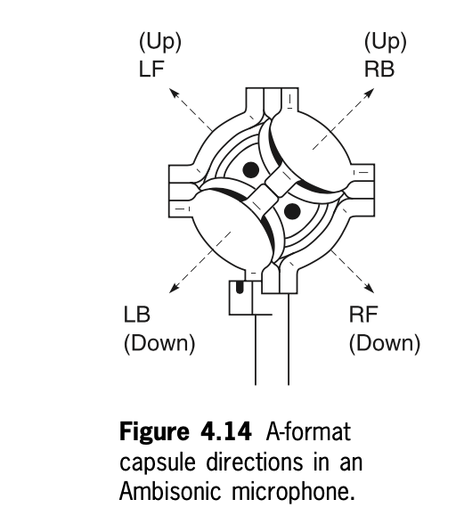
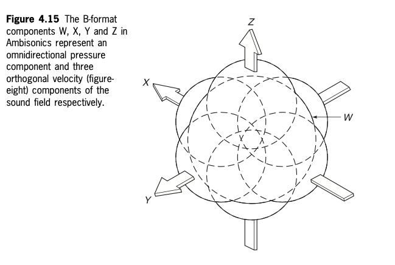
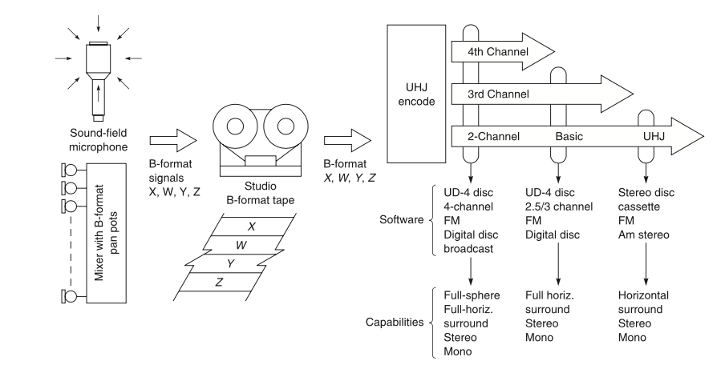

+++
title = "Ambisonics Introduction"
outputs = ["Reveal"]
[reveal_hugo]
theme = "moon"
margin = 0.2
+++

# Listen to some Ambisonics field recordings 

---

### Introduction to Ambisonics

- Ambisonics was introduced as a solution to the issues with quadraphonic sound systems.
- Michael Gerzon criticized quadraphonics for failing to deliver reliable spatial sound localization.
- Ambisonics, also called a "kernel system," was supported by the National Research and Development Corporation (NRDC) and Professor Peter Fellgett.
- The system aimed to provide a continuous, accurate sound field around the listener using psycho-acoustic principles rather than matrix-based transformations.

{}
Ambisonics was developed to overcome the limitations of quadraphonic systems, which were unable to provide consistent sound localization. The psycho-acoustic approach of Ambisonics aimed to recreate sound fields that align with the human ear’s natural mechanisms for detecting spatial sound, making it more immersive.
{}

---

### Ambisonic Soundfield Microphone

- The **Soundfield microphone** was co-invented by Michael Gerzon and Peter Craven, designed to capture true 3D sound fields.
- Originally conceptualized as a spherical array of microphones, it evolved into a tetrahedral array that could capture an accurate sound field.
- This microphone became a key component of the Ambisonic system and allowed the recording and reproduction of natural sound fields in any direction.

{}
The **Soundfield microphone** captures a sound field in a spherical manner, making it a central element of the Ambisonic system. It uses four microphones in a tetrahedral arrangement to record the entire 3D sound space, later allowing the sound field to be manipulated and played back accurately.
{}

---

### Ambisonic Recording & Playback

- The first Ambisonic recording using the Soundfield microphone occurred in 1975, featuring the Schola Cantorum of Oxford.
- Ambisonic playback setups required a multi-speaker array, typically in a square layout for horizontal surround sound.
- The flexibility of the Ambisonic system allowed it to adapt to different loudspeaker layouts without significant loss of audio quality or spatial precision.

{}
Ambisonic recordings can be played back on various speaker layouts, preserving the integrity of the sound field. This flexibility made Ambisonics more practical than traditional quadraphonic systems, as it could adjust to the listener’s environment without losing spatial accuracy.
{}

---

<iframe width="560" height="315" src="https://www.youtube.com/embed/X23hZNoSkUs" title="YouTube video player" frameborder="0" allow="accelerometer; autoplay; clipboard-write; encrypted-media; gyroscope; picture-in-picture" allowfullscreen></iframe>

---

### BBC R&D Ambisonics Intro

[Ambisonics and Periphony](https://www.bbc.co.uk/rd/blog/2010-03-ambisonics-periphony-audio-sound)

{}
- Ambisonics allows for more flexible sound field recording and playback compared to traditional 5.1 systems.
- 5.1 surround sound requires specific speaker positioning, while Ambisonics does not, offering flexibility for listeners with different setups.
- BBC R&D is exploring Ambisonics to reduce complexity in multi-channel sound formats.
- Ambisonics could also provide a more efficient way to archive sound recordings since it adapts to future playback systems without needing new mixes for every format.
{}

---

## Principles

- Gerzon, Barton, Fellgett - main theoretical basis
- hierarchical approach to directional sound recording
- formats
  - A-format: raw microphone recording
  - B-format: studio equipment and processing
  - C-format: consumer friendly, two-channel
  - D-format: decoding and reproduction - rarely used now
  - UHJ - good for mono/stereo compatibility

{}

- Ambisonics is a hierarchical approach to sound pickup, storage, transmission, and reproduction. This means that it can be used to create audio for any number of channels, from mono to stereo to surround sound with height information.
- The more channels used, the greater number of dimensions can be reproduced during playback.
- Ambisonics can be used to create surround sound recordings, which can then be played back on any speaker configuration, including 7.1, quad, or 5.1.

- **A-Format (from ambisonic.info):** A-format represents the signals from the four capsules of a tetrahedral soundfield microphone. The exact meaning of the A-format signals can vary between different microphone designs. Each microphone system has a specific process for converting A-format to B-format for further processing.
- **B-Format (from ambisonic.info):** B-format is the core format used for storing and manipulating Ambisonics. For first-order Ambisonics, B-format consists of four signals: W (omnidirectional) and X, Y, Z (three orthogonal figure-eight microphones). It is used for speaker decoding, sound field rotation, and other transformations with minimal mathematical complexity.
- **C-Format (from ambisonic.info):** C-format, also known as UHJ, is a consumer-friendly distribution format. It reduces the four-channel B-format into a stereo-compatible two-channel system (L and R), while still being capable of transmitting a mono signal. Additional channels (T and Q) can add back full surround and height information.
- **D-Format (from ambisonic.info):** D-format refers to an ambisonic signal that has been decoded for a specific speaker configuration. However, the term is rarely used. It is sometimes replaced by G-format, which refers to speaker feeds decoded for systems like 5.1 surround sound.
{}

---

### Differences from stereo/quad

- Quad
  - is fixed to four speakers
  - Uses phantom images between two speakers
  - worse with off center listening
  - common "hole in the middle" problem
- Ambisonics
  - encodes from all directions, decodes to your loudspeaker setup

{}

- Ambisonics encodes sounds from all directions in terms of pressure and velocity components.
- Ambisonics decodes these signals to a number of loudspeakers.
- Ambisonics uses psychoacoustically optimized shelf filtering above 700 Hz to correct for the shadowing effects of the head.
- Ambisonics uses an amplitude matrix to determine the correct levels for each speaker for the layout chosen.

{}

---

### Ambisonic Microphones and Virtual Sources

- **Ambisonic Microphones**:
    - [Sennheiser AMBEO VR Microphone](https://en-us.sennheiser.com/microphone-3d-audio-ambeo-vr-mic)
    - [RØDE NT-SF1](https://rode.com/en-us/microphones/360-ambisonic/nt-sf1)
    - [NEVATON VR](https://nevaton.eu/product/nevaton-vr-ambisonic-microphone/?v=fa868488740a)
    - [Zoom H3-VR](https://zoomcorp.com/en/us/handheld-recorders/handheld-recorders/h3-vr-360-audio-recorder/)
    - [Soundfield SPS200](https://www.soundfield.com/#/products/sps200)
- **Virtual Source**:
    - Ambisonic signals can also be created by panning a mono signal to place it in a specific position within a 3D sound field, useful in **VR/AR** and **game audio**.

{}

- Ambisonic signals are captured with specialized microphones like the [Calrec Soundfield](https://calrec.com/soundfield/).
- Virtual sources are generated by panning mono signals across Ambisonic channels (W, X, Y, Z) to position sound in 3D space.

{}

---

### Signal formats - A format

{}

The A-format consists of four signals from a microphone with four sub-cardioid capsules arranged as shown in **Figure 4.14**. These capsules are mounted on the four faces of a tetrahedron and oriented to capture sound from different directions:

- **LF (Left-Front)**: Points upward and forward, capturing sound from the left and front.
- **RF (Right-Front)**: Points downward and forward, capturing sound from the right and front.
- **LB (Left-Back)**: Points downward and backward, capturing sound from the left and rear.
- **RB (Right-Back)**: Points upward and backward, capturing sound from the right and rear.

This arrangement allows the microphone to record sound from all directions, creating the raw **A-format** signals. These signals are later converted into **B-format** for further manipulation and playback in Ambisonic systems. The tetrahedral layout, where two capsules point upwards and two point downwards, ensures comprehensive sound capture across the horizontal and vertical planes, which is essential for creating a 3D sound field in Ambisonics.

{}

---

### B format

{}

This diagram (**Figure 4.15**) illustrates the **B-format** components used in Ambisonics, which consist of four signals: **W**, **X**, **Y**, and **Z**.

- **W**: Omnidirectional pressure component, capturing sound uniformly from all directions.
- **X**, **Y**, and **Z**: Figure-eight components representing sound directionality:
  - **X**: Captures sound along the forward-backward axis (front-facing figure-eight).
  - **Y**: Captures sound along the left-right axis (sideways-facing figure-eight).
  - **Z**: Captures sound along the up-down axis (upward-facing figure-eight).

These components provide full 3D spatial sound representation, with **W**, **X**, and **Y** focusing on horizontal spatial information and **Z** adding vertical spatial detail.

### **Key Points**:

- **B-format consists of four signals**:
  - **W**: Omnidirectional (pressure) component.
  - **X, Y, Z**: Figure-eight components for capturing directional sound.
- **Spatial Information**:
  - **W, X, Y** provide horizontal spatial details.
  - **Z** provides vertical spatial information.
- **Comparison to MS Stereo**:
  - **X** is analogous to the **M (mid)** signal.
  - **Y** is analogous to the **S (side)** signal.
- **Recording Options**:
  - Record directly to B-format using FuMa or AmbiX encoding.
  - Alternatively, record in A-format and convert to B-format later.

### **Additional Information**:
- **FuMa encoding** is a more efficient method for storing and transmitting B-format audio compared to AmbiX.
- Encoding is not required if you are recording directly in FuMa format.

{}

---

| Feature    | A-format                                    | B-format                                                |
| ---------- | ------------------------------------------- | ------------------------------------------------------- |
| channels   | 4                                           | 4                                                       |
| Signal rep | Raw output of ambisonic microphone capsules | Derived from A-format using mathematical transformation |
| Efficiency | Less efficient                              | More efficient                                          |
| Ease?      | More difficult to work with                 | Easier to work with                                     |

{}
A-format and B-format are two ways of representing ambisonic audio signals.

A-format is the raw output of an ambisonic microphone. It is a set of four channels, each of which contains the signal from one of the microphone capsules.

B-format is a derived format that is more efficient and easier to work with than A-format. It is a set of four channels, but the signals in these channels are not the same as the signals in the A-format channels. The B-format channels are derived from the A-format channels using a mathematical transformation.

B-format is the preferred format for storing, transmitting, and processing ambisonic audio signals. It is also the format that is used by most ambisonic software and hardware.

Here is a table that summarizes the key differences between A-format and B-format ambisonics:

{}

---

### A to B Conversion

- **X** = 0.5((LF – LB) + (RF – RB))  
- **Y** = 0.5((LF – RB) – (RF – LB))  
- **Z** = 0.5((LF – LB) + (RB – RF))  
- **W** = 0.5(LF + LB + RF + RB)

{}

**A-to-B conversion** is the process of transforming the raw signals from an Ambisonic microphone (A-format) into a more practical format (B-format) for further processing and manipulation.

The conversion combines the four signals from the A-format (Left-Front, Right-Front, Left-Back, Right-Back) into four new signals in the B-format, which represent the sound field more efficiently:

- **W (omnidirectional)**: The sum of all A-format signals, capturing sound pressure from all directions.
- **X (forward-facing figure-eight)**: The difference between the left and right signals, representing front-back directionality.
- **Y (sideways-facing figure-eight)**: The difference between front and back signals, representing left-right directionality.
- **Z (upward-facing figure-eight)**: The difference between upward and downward signals, representing vertical information.

The conversion is typically done in software but can also be done with hardware.

### Why Use B-format?
- **More Efficient**: B-format uses less data, making it easier to store and transmit.
- **Easier to Manipulate**: B-format simplifies the representation of the sound field, making post-production tasks more intuitive.
- **Wider Compatibility**: B-format works with most Ambisonic software and hardware.

{}

---

### C format - aka UHJ

{}

### **C-format Ambisonics & UHJ Format**

**C-Format Ambisonics:**
- Consists of four signals:  
  - **L**: Left  
  - **R**: Right  
  - **T**: Top  
  - **Q**: Quad
- **C-format** conforms to the UHJ (Universal HJ) hierarchy, a system designed for **mono** and **stereo-compatible** ambisonic transmission.
- Allows for Ambisonic playback on stereo speakers while preserving spatial information. Can be decoded with UHJ decoders like the **ATK**.

**UHJ Format Overview:**
- **B-Format**, commonly used for Ambisonic recordings, is **not stereo-compatible**. UHJ was developed to make Ambisonics more accessible by allowing stereo and mono compatibility.
- UHJ can carry increasing amounts of spatial information based on the number of channels:
  - **2-channel (L, R)**: Stereo-compatible, can recover three B-format signals (W, X, Y) with some loss.
  - **3-channel (L, R, T)**: Horizontal soundfield with more detail.
  - **4-channel (L, R, T, Q)**: Full-sphere, first-order soundfield reproduction.

**Encoding & Decoding UHJ:**
- UHJ encoding transforms **B-format signals (W, X, Y, Z)** into UHJ channels. Conversion requires **90-degree phase shifting**, typically done using digital convolution filters.
  
- **Encoding (B-Format to UHJ)**:  
  - For 2-channel UHJ, formulas use combinations of W, X, and Y to derive Left and Right channels.
  
- **Decoding (UHJ to B-Format)**:  
  - The process allows conversion back to B-format, with greater accuracy in 3- or 4-channel UHJ. However, some spatial information is lost when recovering B-format from 2-channel UHJ.

**Limitations of UHJ:**
- UHJ is restricted to **first-order soundfields** (horizontal or full-sphere) and cannot handle higher-order Ambisonics.
- Three- and four-channel UHJ recordings were never commercially released, though many 2-channel UHJ LPs and CDs exist.
- Converting B-format to UHJ and vice versa is possible without significant loss, but the recovery of full B-format from 2-channel UHJ does involve some compromise.
  
**Practical Use of UHJ:**
- **Stereo Compatibility**: UHJ allows Ambisonic files to be played on regular stereo systems. The T and Q channels are used for adding spatial information but can be discarded for simple stereo playback.
- **File Format Limitations**: The ".uhj" format is based on WAVE or WAVE-EX files and maintains stereo compatibility by adding a UHJ chunk. However, it is limited to 2-channel UHJ, and Microsoft’s guidelines prevent proper stereo compatibility with 3- or 4-channel UHJ files.

{}

---

### D format - reproduction

- Speaker numbers
  - Four speakers give adequate surround sound
  - six provide better immunity against the drawing of transient and sibilant signals towards a particular speaker
  - eight may be used for full periphony with height.

{}
**D-format Ambisonics**

* A format for decoding ambisonic audio signals for a specific speaker configuration.
* Not a separate ambisonics format, but rather a way of representing ambisonic audio in a way that is optimized for playback on a particular set of speakers.
* Example: Using a D-format decoder to decode an ambisonic recording into seven channels for a 7.1 surround sound system.
* Less commonly used than other ambisonics formats, such as B-format, but useful for applications where you need to decode ambisonic audio for a specific speaker configuration.
* Used in some virtual reality and augmented reality headsets, as well as in some home theater systems.
 

**Benefits:**
* Allows you to decode ambisonic audio for a specific speaker configuration, which can improve the immersive sound experience.
* Relatively efficient, so it can be used to transmit and store ambisonic audio without using too much bandwidth or storage space.

**Conclusion:**
D-format ambisonics is a practical and efficient format that can allow you to enjoy the full immersive sound experience of your ambisonic recording, especially if you need to decode it for a specific speaker configuration.
{}

---

### Higher order Ambisonics

{}
Here’s the combined explanation of the image and your notes:

---

### **Higher-Order Ambisonics and Spherical Harmonics**

The image depicts **spherical harmonics** used in **higher-order ambisonics** (HOA), with the shapes visually representing the **sound field components** up to the third order. Each shape corresponds to a different spherical harmonic function used in HOA.

- **First row**: Represents the **0th order**, which is an **omnidirectional** polar pattern (W component). This captures sound equally from all directions.
- **Second row**: Shows the **1st order** components (**X, Y, Z**), which are **figure-eight** patterns that represent directional sound (front-back, left-right, up-down).
- **Subsequent rows**: Depict **higher-order harmonics** used in HOA. These patterns represent more complex spatial information, enabling a finer level of directionality and detail in the sound field.

### **Summary of Higher-Order Ambisonics (HOA)**:
- **Greater Accuracy**: HOA uses these higher-order spherical harmonics to capture and reproduce sound fields with higher precision than traditional first-order Ambisonics.
- **Complex Sound Fields**: The more complex polar patterns in higher orders allow for better spatial resolution and sound localization.

### **Challenges of Higher-Order Ambisonics**:
- **Computational Complexity**: More spherical harmonics mean more calculations, which increases the processing power required.
- **Storage Requirements**: The additional spherical harmonics require more data to store the sound field accurately.
- **Playback Support**: Not all playback systems or software support higher-order ambisonics, limiting its practical use.

{}

---

## Current Developments

- Open Source Output format - [Opus 1.3](https://jmvalin.ca/opus/opus-1.3/)
- Corporate interest
  - Google - [Spatial Audio RPC](https://github.com/google/spatial-media/blob/master/docs/spatial-audio-rfc.md)
  - Youtube - [180 or 360 degree videos](https://support.google.com/youtube/answer/6178631?hl=en-GB) with [spatial audio](https://support.google.com/youtube/answer/6395969)
  - [Occulus audio](https://developer.oculus.com/documentation/native/audio-intro/)
  - Microphones - [Sennheiser Ambeo VR Mic](https://en-us.sennheiser.com/microphone-3d-audio-ambeo-vr-mic), [Zoom H3-VR](https://zoomcorp.com/en/us/handheld-recorders/handheld-recorders/h3-vr-360-audio-recorder/)
  - BBC Research on [ambisonics](https://www.bbc.co.uk/rd/search?query=Ambisonics&Type=All&=2020)

{}

- Opus 1.3 provides an open-source, high-quality audio codec supporting ambisonics, making spatial audio more accessible for developers and content creators.
- Google, YouTube, and Oculus are driving the corporate interest in ambisonics, applying it to VR and 360-degree content for immersive audio experiences.
- Ambisonic microphones like the Sennheiser Ambeo VR and Zoom H3-VR are becoming more widely used in professional audio recording, especially for 360° and VR environments.
- BBC's research underscores ambisonics' growing relevance in media production, particularly for creating immersive and engaging experiences for audiences.

{}

---

### Gaming

- [Unity](https://docs.unity3d.com/Manual/AmbisonicAudio.html), [Unreal](https://docs.unrealengine.com/5.0/en-US/native-soundfield-ambisonics-rendering-in-unreal-engine/)
- [Resonance Audio](https://resonance-audio.github.io/resonance-audio/discover/overview.html)
- [Steam Audio](https://valvesoftware.github.io/steam-audio/#learn-more)
- Battlefield 1 & Battlefield V - [Dev Talks video](https://www.youtube.com/watch?v=84EDwVHY2BY)

{}
- **Game Engines**: Unity and Unreal Engine both support native ambisonic audio, allowing developers to seamlessly incorporate spatial sound into interactive experiences. This helps enhance immersion in virtual environments, especially in VR and AR gaming.  
- **Spatial Audio Tools**: Resonance Audio and Steam Audio are widely used plugins for spatial audio in game development. These tools enable sound designers to create realistic, immersive audio environments by using ambisonic rendering.
- **Battlefield Series**: Battlefield 1 and V are notable examples of how ambisonics can be used to create a more immersive and strategic gaming experience by allowing players to detect audio cues from their 3D environment.

{}