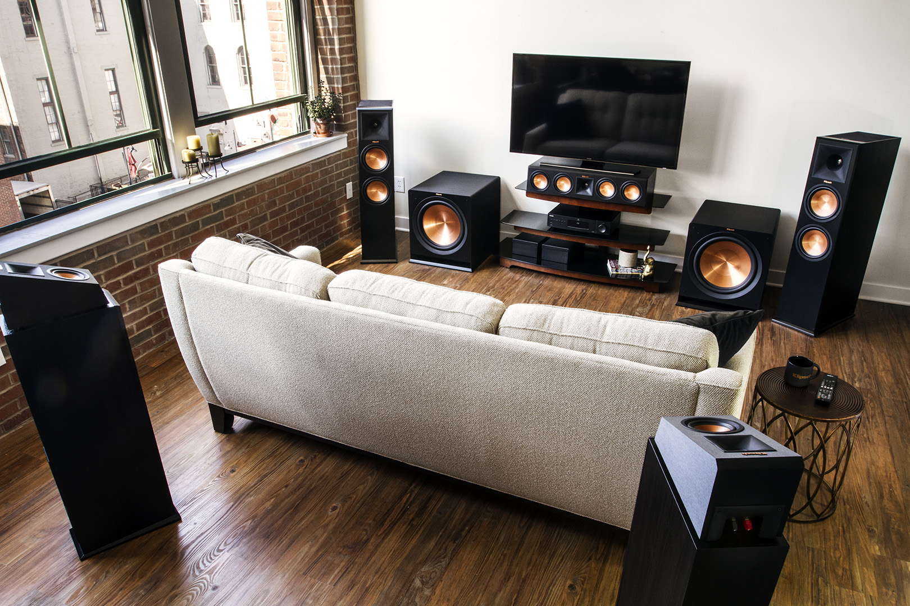
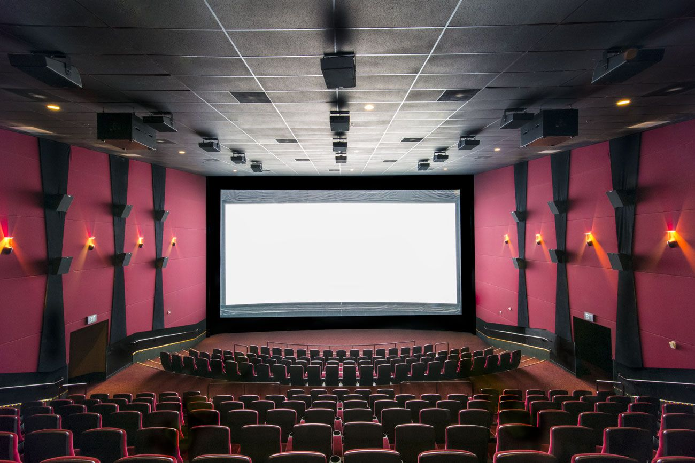

+++
title = "Cinema's Hidden Multi-Channel History and the Origins of Digital Surround"
outputs = ["Reveal"]
[reveal_hugo]
theme = "serif"
margin = 0.2
custom_css = "hugo.css"
+++

> It was at the 1987 October SMPTE meeting. People were saying, “How many channels should there be [in the digital sound standard for cinema]?” And people said two . . . people said four . . . one said eight. And I put my hand up and said, “five point one.” Everybody went, “What is he talking about?”
>
> -- <cite>Tomlinson Holman, audio engineer and inventor of THX</cite>

---

## Cinema's Hidden Multi-Channel History and the Origins of Digital Surround

{}
Ramifications of the decision to go with 5.1 instead of alternatives:

* **5.1 surround sound has become the standard for cinematic audio.** It is used in theaters around the world, and it is also the standard for home theater systems.
* **5.1 surround sound has improved the overall cinematic experience.** It provides a more immersive and realistic soundstage, which can help to draw viewers into the film.
* **5.1 surround sound has also had a positive impact on the film industry.** It has made it possible for filmmakers to create more complex and nuanced soundtracks.
* **However, 5.1 surround sound also has some limitations.** It is not as immersive as newer audio formats, such as Dolby Atmos. It also has difficulty reproducing certain types of sound effects, such as overhead effects.

Overall, the decision to go with 5.1 surround sound was a positive one. It has had a lasting impact on the film industry and has improved the overall cinematic experience. However, it is important to note that 5.1 surround sound is not without its limitations.

{}

---

## The Origins of Multi-channel

* Advancements in technology
* Aesthetic practices
* Economics of the film industry
* Audience/consumer expectations
* Growth of the home market

{}
* **Advancements in technology:**
    * The development of new microphones and speakers allowed for more precise and realistic sound reproduction.
    * Advances in recording and mixing technology made it possible to create more complex and immersive soundtracks.
    * The development of digital audio technology made it possible to distribute and reproduce surround sound more efficiently.
* **Aesthetic practices:**
    * Filmmakers began to experiment with surround sound in the early 1950s, using it to create more immersive and realistic soundtracks.
    * The development of new genres, such as science fiction and action, led to a greater demand for surround sound.
* **Economics of the film industry:**
    * The introduction of new sound technologies was often driven by the desire to attract audiences and increase revenue.
    * However, the high cost of developing and implementing new sound technologies could also be a barrier to progress.
* **Audience/consumer expectations:**
    * As audiences became more familiar with surround sound, they began to expect it in films.
    * The growing popularity of home theater systems also led to increased demand for surround sound in films.
* **Growth of the home market:**
    * The development of affordable home theater systems made surround sound more accessible to consumers.
    * This increased demand for surround sound in films.

The development of surround sound in cinema was not a linear process. It was influenced by a variety of factors, including technological advances, aesthetic practices, economic considerations, and audience expectations. The growth of the home market also played a significant role, as it made surround sound more accessible to consumers and increased demand for it in films.

The decision to go with 5.1 surround sound instead of one of the alternatives was a compromise that took into account all of these factors. 5.1 surround sound was a technologically feasible and affordable option that could provide a good immersive sound experience for both theatrical and home audiences.
{}

---

## Multi-track history

- 1879: Graham Bell
- 1927: _The Jazz Singer_
- 1928: Bell Labs
- 1932: Bell Labs - first "stereo" recording
- 1933: Bell Labs - three-channel orchestral mix LCR
- 1937: first documented presentation of multi-channel audio synched to film
- 1940: Fantasia - first true multi-channel sound film

{}
Here is a bullet point summary of the early development of multi-channel sound in cinema, based on the information you provided:

* **1879:** Alexander Graham Bell experiments with two-channel sound over telephones.
* **1927:** First multi-track recordings for cinema, used in the film _The Jazz Singer_.
* **1928:** Bell Labs records an orchestra onto a disk using two separate tracks, splitting the signal from one microphone to improve sound quality.
* **1932:** Bell Labs makes another two-track recording, this time using two distinct audio channels, creating the first known true "stereo" recording.
* **1933:** Bell Labs researchers conclude that a three-channel frontal sound system is a practical approach to representing an infinite number of front loudspeaker channels.
* **1937:** Bell Labs presents the first documented presentation of multi-channel audio synched to film, using three frontal channels to create three different sound effects.
* **1940:** Fantasia is released, using three speakers behind the screen and a surround channel with ninety-six speakers around and behind the audience to create a more immersive and realistic soundstage.

These early developments in multi-channel sound laid the foundation for the surround sound systems that we use today.
{}

---

{}
* The film's multi-channel mix was a hybrid of two approaches:
    * **"Correct" spatial reproduction of the orchestral recordings:** This approach used binaural recording techniques to create a realistic soundstage that matched the positions of the instruments in the orchestra.
    * **"Spectacular" approach:** This approach moved sounds out of their orchestral configuration to create a more engaging and immersive listening experience for the audience.
* The finished movie featured four tracks on one strip of 35mm film:
    * Three channels of optical sound for the left, center, and right speakers.
    * One control track for synchronizing the two projectors.
{}

---

### Advances in cinema technology

	
<!-- 

  
  
Westrex Loudspeaker System with Acoustic Lens (1958)

  
  
Magnetophon

 -->

  

    
    
  

{}
- Two advances in technology would further the cause of multi-channel sound: 
  - better loudspeakers utilizing permanent magnets (developed as part of the war effort) 
  - magnetic audio recording tape (a German invention obtained by the Allies during their offensive into Germany)
- Various experiments in multi-channel sound would happen during this time but none would catch on. 
- After the demise of multi-channel in mainstream 35mm presentation, monophonic optical sound once again dominated, and theatrical sound systems would remain unchanged through the 1960s and most of the 1970s.
{}

---

## Dolby Standardizes Surround

{}
Cinema sound quality diminished during the 1960s-70s causing a decrease in audience attendance. This coincided with an improvement with an increase in the quality of home audio systems. IN the beginning of the 70s movies studios began to try to draw audiences back by improving audio quality.
{}

---

## Earthquake (1974)

<iframe width="560" height="315" src="https://www.youtube.com/embed/xJlnv-5QId8" title="YouTube video player" frameborder="0" allow="accelerometer; autoplay; clipboard-write; encrypted-media; gyroscope; picture-in-picture" allowfullscreen></iframe>

{}
**Sensurround**

* **Concept:** A surround sound system that used powerful ultra-low-frequency rumbles to shake audiences and theaters in concert with on-screen stimuli.
* **Debut:** 1974, with the film Earthquake.
* **Limitations:** Proprietary Universal Studios equipment, limited to a few dozen theaters worldwide.

**Significance:**

* Sensurround was the first surround sound system to use a discrete low-frequency-only channel. This idea would resurface a decade later as part of the digital surround sound specifications, including Dolby Digital and DTS.
* Sensurround was also notable for its use of a control track to steer other sounds to the Sensurround speakers. This created a more enveloping sense of sound and helped to enhance the realism of the on-screen action.

Despite its limitations, Sensurround was a groundbreaking system that helped to set the stage for the development of digital surround sound. It also provided audiences with a unique and thrilling cinematic experience.
{}

---

* **Concept:** A four-channel surround sound system that used matrixing to encode the four channels (three front, one surround) into two.
* **Debut:** 1975, with the film Listztomania.
* **Channels:** Four (three front, one surround), encoded into two.
* **Technology:** Matrixing, noise reduction.

{}
**Dolby Stereo**
* **Concept:** A four-channel surround sound system that used matrixing to encode the four channels (three front, one surround) into two.
* **Debut:** 1975, with the film [Lisztomania](https://en.wikipedia.org/wiki/Lisztomania_(film)).
* **Channels:** Four (three front, one surround), encoded into two.
* **Technology:** Matrixing, noise reduction.

**Drawbacks:**

* Limited mixing possibilities compared to later surround sound formats.
* Most sounds were encoded in the front center channel, with the surround channel used for limited effects.
* No sounds crucial to a film could be encoded in the surround channel, to ensure backward compatibility with monophonic theaters.

**Success:**

* Driven by sound-intensive films such as Star Wars and Close Encounters of the Third Kind.
* Helped to popularize surround sound in cinemas.

**Additional bullet points:**

* Dolby Stereo was the first surround sound system to be widely adopted by cinemas.
* It was also the first surround sound system to be available on home video formats such as VHS and Betamax.
* Dolby Stereo remained the standard surround sound format for cinemas and home video until the introduction of Dolby Digital in the early 1990s.

**Legacy:**

* Dolby Stereo helped to set the stage for the development of modern surround sound systems.
* Its use of matrixing and noise reduction technologies is still used in many modern surround sound formats.

The fact that Dolby Stereo was driven by the success of sound-intensive films is a good example of how technology and culture can influence each other. The development of Dolby Stereo made it possible for filmmakers to create more immersive and realistic soundtracks for their films. This, in turn, led to the production of more films that featured sound as a key element of the cinematic experience.
{}

---

### The problem of dolby stereo

{}
- Dolby Stereo's introduction marked a significant shift from monophonic optical sound in theaters, offering improved dynamic and frequency ranges, as well as cleaner sound quality.
- The 1980s saw further enhancements with Dolby SR (Spectral Recording), incorporating advanced noise reduction techniques into the Dolby Stereo matrix.
- While not flawless, Dolby Stereo became a successful industry standard.

**Notable Films that Circumvented the Standard**

- Close Encounters of the Third Kind (1977)
- Superman (1978)
- Apocalypse Now (1979)
- Stanley Kubrick opted for mono sound in his films due to unpredictable playback issues with matrixed sound during Dolby Stereo's dominance era.he chose to continue making his films in mono throughout the era of Dolby Stereo’s dominance
{}

---

> [Quad can] create the illusion of a sound moving in all four quadrants of the room. Mono surround, 35mm Dolby optical, pretty much ties you to the idea of some mixture of front and back. Since quadraphonics gives you a left back and a right back, you can steer that sound through 360 degrees.
>
> -- Walter Murch

---

> of the “emergence” of a new sound aesthetic in the use of [Dolby Stereo] ambience hides the fact that no other aesthetic could possibly have emerged simply because of the system’s design. The screen centrality and the lack of divergence inherent in Dolby Stereo ensured that all dialogue and main sound effects would be channeled to the screen speakers and not the surrounds.
>
> -- Jay Beck

{}
- The introduction of the surround channel in cinema sound systems allowed for the placement of sounds around the audience.
- However, instead of expanding the possibilities of true surround sound, the Dolby Stereo system reinforced and formalized the traditional norms of monophonic, screen-centric cinema.
- Dolby's concept of multi-channel sound design was rooted in monophonic principles, limiting the creative potential of full-fledged surround sound.
- The technical constraints of the Dolby Stereo matrix, rather than filmmakers' preferences, continued to shape sound design practices in the film industry from the 1980s through the early 1990s.
{}

---

## Digital Surround's Pre-history

---

## SMPTE Digital Sound Standard (1987)

1. any digital multi-channel system should use fully discrete channels rather than matrix encoding to avoid encountering Dolby Stereo’s problems with sounds not playing back in the correct channels.
2. the new digital system should have at least CD-quality sound so that cinematic systems could catch up with home audio.

{}
**Development of 5.1 surround sound**

* In the late 1980s, SMPTE began to work on a digital sound standard for film with two objectives in mind:
    * Fully discrete channels rather than matrix encoding
    * CD-quality sound
* The number of channels required for the new standard was a matter of debate.
* Tom Holman, a sound designer and engineer, proposed a 5.1-channel configuration.
* The `.1` refers to the low-frequency effects (LFE) channel, which has a narrower frequency range than the other channels.

**Advantages of 5.1 surround sound over Dolby Stereo**

* **Fully discrete channels:** This means that each channel is independent of the others, which allows for more precise sound placement and mixing.
* **CD-quality sound:** 5.1 surround sound offers a wider frequency response and higher dynamic range than Dolby Stereo, resulting in a more realistic and immersive soundstage.

**Why 5.1 surround sound became the standard**

* 5.1 surround sound offered a significant improvement in sound quality over Dolby Stereo.
* It was also a practical solution, as it could be implemented using existing theater infrastructure.
* Additionally, 5.1 surround sound was compatible with home theater systems, which was becoming increasingly popular at the time.
{}

---

### LFE Channel

<iframe width="560" height="315" src="https://www.youtube.com/embed/hm4XMF1apD4?si=vLqD8XF8IaAkN-LZ" title="YouTube video player" frameborder="0" allow="accelerometer; autoplay; clipboard-write; encrypted-media; gyroscope; picture-in-picture; web-share" allowfullscreen></iframe>

{}
**Why a dedicated LFE channel is important in 5.1 surround sound**

* **To provide the same range of volumes to low-frequency sounds as they do to higher-frequency ones.**
* **To create an enveloping bass sound and to give added emphasis to localized sounds coming from any of the full-range channels.**

Low-frequency sounds require more energy to produce and are more difficult to localize than higher-frequency sounds. By dedicating an entire channel to low frequencies, 5.1 surround sound systems can provide a more realistic and immersive listening experience.

Here are some examples of how the LFE channel is used in films:

* In the explosion scene in the film Independence Day, the LFE channel is used to reproduce the deep rumble of the alien spaceships.
* In the film Titanic, the LFE channel is used to reproduce the deep creaking and groaning of the ship as it breaks in half.
* In the film Jurassic Park, the LFE channel is used to reproduce the deep roar of the dinosaurs.
{}

---

- Criteria for success of a new standard
  - it would have to be as robust and manageable as the system it replaced.
  - it would have to be backward compatible with existing analog sound systems.
  - it would have to be cost effective

{}
This last criterion was particularly critical: a major reason Dolby Stereo was so successful despite its matrix encoding scheme was that it had no economically viable competition, as no one had been able to devise a non-matrixed method for fitting more than two channels onto 35mm film without using (expensive) magnetic striping.
{}

---

### Cinema Digital Sound (CDS)

{}
**Failure of Cinema Digital Sound (CDS)**

* **CDS was the first digital sound system to be used on a major release**, with the 1990 film Dick Tracy.
* **CDS failed to meet the three practical requirements for a successful digital surround sound system:**
    * **It was not affordable.** CDS equipment was much more expensive than Dolby's equipment.
    * **It was not compatible with existing theater infrastructure.** Theaters would have to purchase new equipment to use CDS.
    * **It was not reliable.** The CDS processor used to decode the soundtrack overheated and started a fire in the projection room at the Hollywood premiere of Days of Thunder.

As a result of these failures, CDS was not widely adopted by the film industry.

**Lessons learned from the failure of CDS**

* **Affordability, compatibility, and reliability are essential for the success of any new technology.**
* **It is important to test new technologies thoroughly before releasing them to the public.**
{}

---

### Digital Sound arrives in Triplicate

* Dolby SR-D (Spectral Recording - Digital), DTS  (Digital Theater Systems):, and SDDS (Sony Dynamic Digital Sound)
  *  **They were affordable.** Dolby SR-D, DTS, and SDDS were all less expensive than CDS.
  * **They were compatible with existing theater infrastructure.** Theaters could use their existing Dolby Stereo equipment to play back digital soundtracks.
  * **They were reliable.** Dolby SR-D, DTS, and SDDS had fewer reliability problems than CDS.

{}
**Success of Dolby SR-D, DTS, and SDDS**

* **These systems were successful in large part because they met the three practical requirements for a successful digital surround sound system:**
    * **They were affordable.** Dolby SR-D, DTS, and SDDS were all less expensive than CDS.
    * **They were compatible with existing theater infrastructure.** Theaters could use their existing Dolby Stereo equipment to play back digital soundtracks.
    * **They were reliable.** Dolby SR-D, DTS, and SDDS had fewer reliability problems than CDS.

**Robustness, backward compatibility, and economic viability**

* **Robustness:** Dolby SR-D, DTS, and SDDS were all designed to be robust systems. In the event of a problem with the digital soundtrack, playback would simply revert to the Dolby Stereo track. This ensured that audiences would always be able to hear the sound of the film.
* **Backward compatibility:** Dolby SR-D, DTS, and SDDS were all backward compatible with Dolby Stereo. This meant that theaters did not have to maintain dual print inventories.
* **Economic viability:** Dolby SR-D, DTS, and SDDS were all economically viable systems. They were affordable to purchase and maintain.
{}

---

### Dolby SR-D (1992)

{}
**Why Dolby SR-D was not as successful as DTS or SDDS**

* **High cost:** Retrofitting an existing theater with SR-D cost around $20,000 at the time.
* **Backward compatibility:** SR-D-encoded prints were backward compatible with analog systems, so most theaters chose to use the Dolby Stereo soundtrack rather than pay for the new system.
* **Lack of awareness:** The public was not aware of the new sound system. Even the ads for Batman Returns mentioned nothing about SR-D.

In contrast, DTS and SDDS were more affordable and easier to retrofit into existing theaters. They were also marketed more effectively. As a result, DTS and SDDS became the more popular digital surround sound systems in cinemas.

**Additional factors that may have contributed to the failure of Dolby SR-D:**

* **Competition from DTS and SDDS:** DTS and SDDS were also vying for market share, and they were both more aggressive in their marketing and sales efforts.
* **Lack of support from Hollywood studios:** The major Hollywood studios were initially hesitant to support Dolby SR-D. This was likely due to the fact that Dolby was already the dominant player in the surround sound market, and the studios did not want to give them too much power.
* **Timing:** Dolby SR-D was released in 1992, just as the home theater market was starting to take off. Consumers were more interested in purchasing home theater systems than in going to the movies.

{}

---

### DTS (1993)

{}
**Why DTS was more successful than Dolby SR-D**

* **Affordability:** Exhibitors could purchase DTS's system for about $4,000, a mere fifth the cost of adopting Dolby's SR-D.
* **Support from Hollywood:** DTS already had the weight of an entire studio (Universal Pictures) and one of the most successful directors of all time (Steven Spielberg) behind it.

In contrast, Dolby SR-D was more expensive and did not have the support of a major Hollywood studio.

**Additional factors that may have contributed to the success of DTS:**

* **Effective marketing:** DTS marketed its system more effectively than Dolby marketed SR-D.
* **First-mover advantage:** DTS was the first digital surround sound system to be used in a major Hollywood film (Jurassic Park).
{}

---

### SDSS (1993)

{}
**Sony Dynamic Digital Sound (SDDS)**

* **Release date:** 1993
* **Channels:** 7.1 (five front channels and two surrounds)
* **Differences from other digital surround sound formats:**
    * Added two more full-range channels behind the screen
    * Recorded on both edges of the 35mm film print

**Advantages of SDDS**

* **More immersive soundstage:** The additional two channels allowed for more precise sound placement and mixing, resulting in a more immersive soundstage.
* **Better sound quality:** SDDS used digital recording technology, which resulted in better sound quality than other digital surround sound formats that used analog recording technology.

**Disadvantages of SDDS**

* **More expensive:** SDDS equipment was more expensive than equipment for other digital surround sound formats.
* **Less widely adopted:** SDDS was not as widely adopted as other digital surround sound formats, such as Dolby Digital and DTS.

**Overall, SDDS was a technically advanced digital surround sound format that offered a more immersive and realistic soundstage than other digital surround sound formats. However, it was more expensive and less widely adopted.**
{}

---

### Success of DSS

> The word “digital” is to this decade as “transistor” was to the Fifties and Sixties, with implications and resonances that reach beyond the specific technology it names. It gleams with the promise of a cleansed, transformed future, of something new under the sun and better on the horizon.
>
> Stereo Review - 1992

{}
**Marketing digital surround sound systems**

* **Dolby SR-D:** The original name of Dolby SR-D was "Dolby SR-D," which was intended to exploit the industry's familiarity with Dolby SR. However, this name was later changed to "Dolby Digital" to emphasize the fact that it was a digital sound system.
* **DTS:** DTS adopted a logo that featured a shiny disc with "the digital experience" (emphasis in original) emblazoned across it. This marketing image allied DTS not just with the buzzword "digital" but also with the compact disc, the hot consumer technology of the day.

**Why is marketing important for digital surround sound systems?**

* **To raise awareness of the new technology:** Many people were not aware of the existence of digital surround sound systems in the early 1990s. Marketing campaigns helped to raise awareness of these systems and generate interest among consumers and exhibitors.
* **To differentiate digital surround sound systems from analog systems:** Digital surround sound systems offered a number of advantages over analog systems, such as better sound quality and more immersive soundstages. Marketing campaigns helped to communicate these advantages to consumers and exhibitors.
* **To build a brand identity:** Digital surround sound systems were a new technology, and it was important for companies to build a strong brand identity for their products. Marketing campaigns helped to create awareness of the different brands of digital surround sound systems and to associate them with quality and performance.

**Conclusion**

Marketing was essential for the success of digital surround sound systems in the early 1990s. By raising awareness of the new technology, differentiating digital surround sound systems from analog systems, and building a brand identity, marketing campaigns helped to drive adoption of digital surround sound systems in cinemas and homes.
{}

---

**Surround Sound Moves to the Home**

{}
**Digital surround sound in the early 2000s**

* By the early 2000s, digital surround sound had become the norm in cinemas. The vast majority of indoor screens in the United States had either SDSS, DTS, or Dolby Digital.
* However, home viewing was also becoming increasingly popular. Sound mixers had to reckon with the fact that more people would view their movies in a home environment than at the theater.
* Filmmakers could use digital surround sound to place sounds very specifically, but they could not make it crucial to know that a particular sound came from a particular speaker, as home viewers might not have a surround sound system.
* For filmmakers to freely exploit all the capabilities of digital surround sound, 5.1 sound systems would have to spread from theaters into the home.

**The importance of home surround sound systems**

Home surround sound systems allow viewers to experience the full potential of digital surround sound. With a home surround sound system, viewers can hear sounds coming from all around them, which creates a more immersive and realistic listening experience.

Home surround sound systems also allow filmmakers to create more complex and nuanced soundtracks. For example, filmmakers can use home surround sound systems to place sounds behind the viewer or to create a sense of envelopment.

**The future of digital surround sound**

Digital surround sound continues to evolve. Today, there are a number of different digital surround sound formats available, including Dolby Atmos and DTS:X. These formats offer even more immersive and realistic soundstages than previous digital surround sound formats.

Digital surround sound is also becoming increasingly popular in the home. Many new televisions and home theater systems come with built-in surround sound support.

Overall, digital surround sound is a powerful tool that can be used to create a truly immersive and realistic listening experience. As home surround sound systems become more affordable and more widely adopted, more and more people will be able to experience the full potential of digital surround sound.
{}

---

### History of home surround

- **late 1970s - early 1980s** - consumers create stereo system using existing music systems
- **1982** - Dolby Surround decoding
- **1987** - Dolby Pro Logic
- **Mid 1990s** - 5.1: DTS and Dolby Digital

{}
**Bringing surround sound into the home**

* **1982:** Dolby introduced Dolby Surround decoding, which allowed consumers to watch their video cassettes in a simplified version (L/R/S) of Dolby Stereo. This was possible because film studios had been dumping their existing Dolby Stereo soundtracks into the two audio tracks available on hi-fi VHS and laserdisc. Dolby Surround offered the technology to decode these soundtracks, resulting in a significant improvement in sound quality for home viewers.
* **1987:** Dolby introduced Dolby Pro Logic, which added the center channel and steering effects of theatrical Dolby Stereo to the Dolby Surround format. This allowed home viewers to experience sound that was even closer to that of their local theater.
* **Early 1990s:** DTS and Dolby introduced home versions of their digital surround sound systems, DTS and Dolby Digital, respectively. These systems offered even better sound quality and more immersive soundstaging than previous surround sound formats.
{}

---

### Laserdics

<iframe width="560" height="315" src="https://www.youtube.com/embed/xrbhZDwXC1Y" title="YouTube video player" frameborder="0" allow="accelerometer; autoplay; clipboard-write; encrypted-media; gyroscope; picture-in-picture" allowfullscreen></iframe>

{}
Not a format that ever achieved wide success but is an important precursor to DVD.
{}

---

### DVD (1997)

<iframe width="560" height="315" src="https://www.youtube.com/embed/Z8-xjTFVlC4" title="YouTube video player" frameborder="0" allow="accelerometer; autoplay; clipboard-write; encrypted-media; gyroscope; picture-in-picture" allowfullscreen></iframe>

{}
**The impact of DVD on surround sound in the home**

The introduction of DVD in 1997 had a major impact on surround sound in the home. DVD players were much more affordable than laserdisc players, and they quickly became the most quickly adopted home electronics product ever.

As more and more people adopted DVD, demand for home theater products increased. This led to a massive increase in sales of receivers and speakers, as home cinephiles endeavored to take full advantage of the 5.1 soundtracks on their DVDs.

Between 2000 and the end of 2005, the number of American homes with home theater systems went up by over 70%.

**Why was DVD so successful?**

DVD was successful for a number of reasons:

* It was more affordable than laserdisc.
* It offered better video quality than VHS.
* It had more features than VHS, such as interactive menus and multiple audio tracks.
* It was supported by the major Hollywood studios.

**The impact of DVD on the home theater industry**

DVD had a major impact on the home theater industry. It drove demand for home theater products such as receivers, speakers, and subwoofers. It also led to the development of new home theater technologies, such as Dolby Digital 5.1 and DTS 5.1.

**Conclusion**

DVD played a major role in making surround sound in the home mainstream. It made surround sound more affordable and accessible to a wider range of consumers. It also drove demand for home theater products and led to the development of new home theater technologies.

Today, surround sound is a standard feature in most homes. It is an essential part of the home theater experience, and it allows people to enjoy movies and TV in a way that was not possible before.
{}

---

### Variations in 5.1 Configurations

{}
**Differences between home and movie theater surround sound configurations:**

**Movie theaters:**

* The three front channels of a 5.1-channel configuration are spread behind the screen.
* An array of surround speakers is used, with multiple speakers placed along the side walls and back of the theater.

**Home theaters:**

* The left and right front speakers are generally placed some distance outside the width of the screen.
* Two point source surround speakers are used, one for each rear channel.

**Other differences:**

* Home theaters generally need to sound good only from a few listening positions, while for a large theater it is important to have acceptable sound from several hundred positions.
* Movie theaters need to have a wider range of “acceptable” seating than home theaters.

**Why do studios remix some or all of their films for DVD release?**

Studios remix some or all of their films for DVD release to account for the differences between home and movie theater surround sound configurations. For example, in a home theater setting, a sound originating from an onscreen source near the left edge of the frame may be perceived as coming from offscreen if it is mixed to the left front channel. To avoid this problem, studios may remix the sound to play from both the left and center front speakers.

Studios may also remix films for DVD release to improve the overall sound quality for home viewers. For example, studios may increase the volume of the surround channels or add new surround effects.

Overall, the goal of remixing films for DVD release is to create a more immersive and enjoyable listening experience for home viewers.
{}
