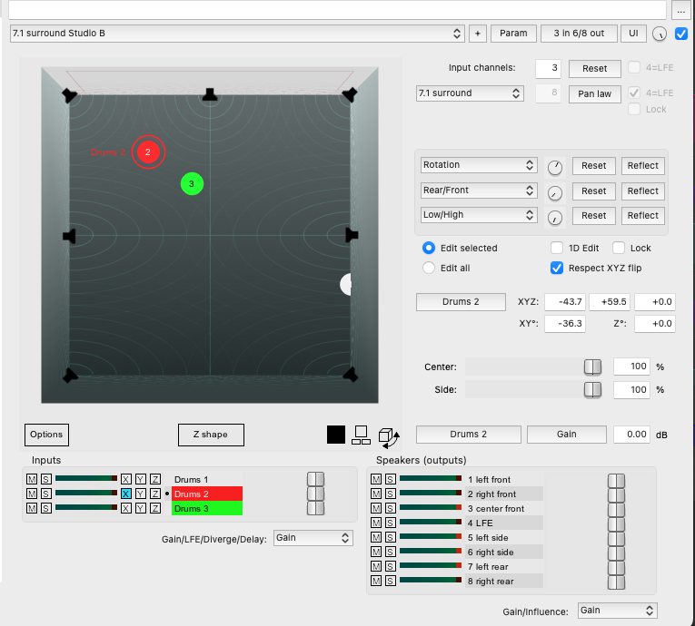

## Distributed Sources

The simples thing you can do with surround mixing in Reaper is to send a mono or stereo track to all speakers. To do this we have to make sure our track and master track are using 8 track channels. Make sure your outputs are set to multi-channel output like so:

Try this with any mono or stereo track.

I'll now add a multi-channel track and map its channels to specific speakers. We can send it only to the side speaker by only selecting channels 7 and 8.

**Sound Particles**

Sound Particles is a really great too for producing audio files that have spatial data encoded in them. I can use this recording of a cat growl to make it move around the room.

I have also created an immersive fire soundscape with a recording of fire and the immersive fire preset in sound particles.

## Extending channel mapping with user mix and automation items

This simple idea can be expanded using the user mix feature of the channel mapper and Reaper's automation items. Take the track that you would like to automate and duplicate it until it numbers the outputs you want to use. I'm using a stereo loop, so I duplicated the track once.

Now create a send track then add the channel mapper to it. Send the tracks you want to pan into that new track. Make sure to send each new track into a different track channel. Think of this as a temporary way of creating a multi track media item.

Now you can automate the user mix volumes of the send track. I do this with automation items because they allow for easy copying and also modulations

To find the correct parameter to automate, move the volume of the user mix then param -> select "show in track envelope". Do this for the other volumes that you want to automate.

Right click where you want to add an automation item and Automation item -> insert new automation item. Double click on the item to open its properties. You can now set an lfo shape. Copy this shape to the other volumes and change the phase slightly.

Once you get the hang of it experiment with different lfo shapes, amp skew, pulse width, cycles etc.

## Point Source

We can create point sources and pan mono, stereo, or multi track files to different speakers with ReaSurroundPan. You should use the 5.1 studio b or 7.1 studio b presets to make sure the sounds are going to the correct speakers. If you don't you need to remap the outputs yourself.

You can see the speakers in the arrangement they are in the room. The 1 and 2 pucks represent the channels of your sound source. These can move independently or together. To edit independently have _edit selected_ highlighted and move your selected puck. With this setting you can shift select other pucks to edit them. You can also select the _edit all_ option to move all input channels at the same time.

There are four settings for each input:

- Gain: the level to play back in each speaker
- LFE: how much to send to the sub
- Diverge: Spread the sound between the speakers touched by the divergence circle. It makes the source a little less directional.
- Delay: add delay to the source

## Recording automation

Find the automation of the inputs, 1 and 2, x and y. Arm these parameters and then set the automation mode to write. Now play through whatever you want to automate. When you move the parameters you will write automation. Be sure to take the automation mode out of write when you're done.

This section provides preset pan moves:

For example _to left front_ will move both pucks to the left front speaker when turned up from where they were before. This is a helpful way to only have to automate one parameter.

Check out Z shapes if you have height channels.

## Panning multiple point sources

Try the trick from earlier and send multiple sources to one track, making sure to send each one to a different track channel. You can now automate and pan these sources around as if they were part of the same multichannel track. You can also rename these tracks in ReaSurroundPan to keep things organized.

## Rendering video

Choose options -> Channels -> 6.

Any of the formats in Reaper are OK as long as they give you 6 tracks of audio. I tried AVI and it did not take very long.
