+++
title = "What is Dolby Atmos?"
outputs = ["Reveal"]
[reveal_hugo]
theme = "serif"
margin = 0.2
+++

<!-- Source: MixingInDolbyAtmos-#1HowItWorks(2021-0928) -->

# What is Dolby Atmos?

{}
What was the point of this new standard? What problems did it try to solve?

We'll review some of the history we have already learned through the semester to answer this question, then delve deeply into the technical workings of atmos.
{}

---

Mono -> Stereo -> Surround -> Immersive

{}
Mono - 1D Spot

In the early attempts back in 1876 by Alexander Graham Bell, audio/music/sound was (re-)produced by only a single speaker, a cone without electrical amplification. It played back a single audio source, a single audio channel.

Stereo - 1D Line

The invention of stereophonic recording and reproduction via two (amplified) speakers (credited to Alan Blumlein in 1930) made it possible to create a 1- dimensional sound field so the listener could locate a signal between (and outside) the two speakers via the known phenomena, Phantom Source.

Surround - 2D

Although Ray Dolby is often credited as the inventor of the surround sound in the 1970s, there were earlier implementation like the 1940s Disney movie "Fantasia". The idea was to have sound not only coming from the front of the listener, but also from the side and the back. Although it means that the listener is "surrounded" by sound, it is still a 2-dimensional sound field.

Immersive - 3D

The big difference with Immersive Sound is that it adds a third dimension to the sound field. This way, sound is also coming from speakers above the listeners in addition to the surround speakers on their ear-level. Because the listener is "immersed" in a 3-dimensional sound field, "Immersive Audio" is also referred to as 3D Audio.
{}

---

## Gray Area

- Mono vs. Stereo
- Speaker vs. Channel
- Surround vs. Immersive
- Immersive Audio
- Ambisonics

{}

Mono vs. Stereo

While Stereo often implies two speakers and Mono just one speaker, a stereo speaker playback is considered mono if both channels are fully correlated (playing the same signal).

Speaker vs. Channel

The existence of multiple speakers placed around the listener doesn't mean that you are listening to "Surround Sound", it only means that you are "surrounded" by speakers. If 20 speakers around you all playback the same signal, then you are technically listening to a Mono signal (1 audio channel) coming from multiple speakers, also referred to "Super-Mono". All those individual speakers have to be able to play back individual (different) channels to get the actual surround experience.

Surround vs. Immersive

These two terms can also lead to some miscommunication when their understanding is different (and it often is). Technically, when you listen to Immersive Audio, you are "surrounded" by sound but you are not listening to "Surround Sound" which is used to describe configurations where all speakers are on ear-level plus the sub woofer (i.e. 5.1 or 7.1). That creates only a 2-dimensional sound.

Immersive Audio

The term Immersive Audio can be confusing all by itself, because there are many different technologies with different meanings that could describe the same or similar experience. The most-often used terms are Immersive Audio and 3D Audio, but also 360 Audio or Spatial Audio or whatever the marketing department of a company dreams up at the time. Some people us the term Surround Sound even for Immersive Sound, which is a bit of a sloppy use of terminology.

Ambisonics

Keep in mind that the term Ambisonics that is often heard in the context of Immersive Audio is the name of a special recording of a full-sphere immersive sound format.
{}

---

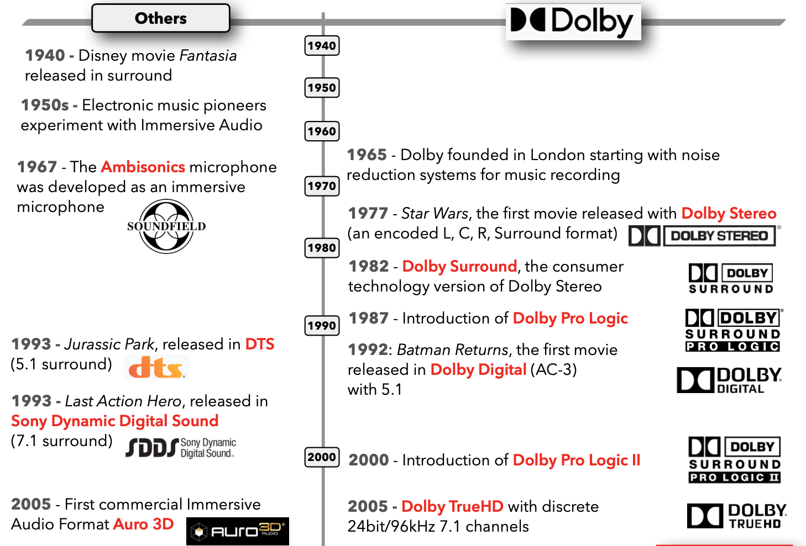

---

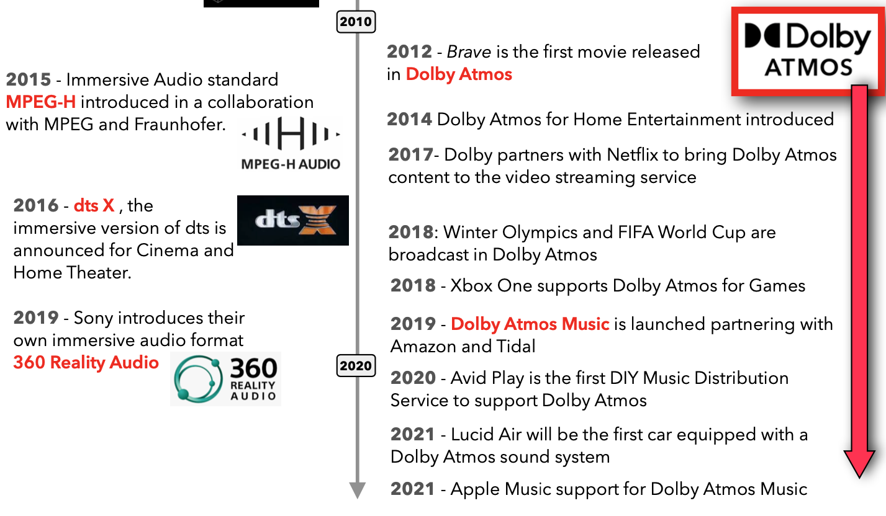

---

## Key aspects of Dolby Atmos

- Workflow
- Immersive Sound
- Object-based Format
- Speaker Rendering
- Speaker Virtualization
- Binaural Rendering
- Sing Format Serves It All
- Dolby Atmos Everywhere

---

**Workflow**

- Your DAW: 
- Dolby Atmos Renderer: 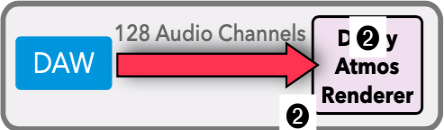
- 3D Panner: 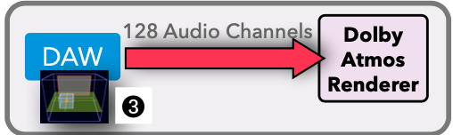
- Separate Pan Data Transmission: 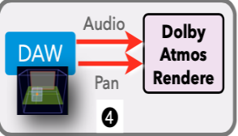

{}
Your DAW: The good news is that you create your Atmos Mix in your favorite
DAW ➊, doing the same editing and signal processing as before.

The Dolby Atmos Renderer: Instead of routing to a 2-channel or multichannel output bus in your DAW, you route up to 128 audio Dolby ➋ channels to a new software application called the Dolby Atmos
Atmos Renderer ➋.

3D Panner: On each Track of your DAW you use the built-in 3D Panner ➌ (if available) or the Dolby Atmos Music Panner Plugin that you insert on each Track on your DAW to position the Track in the 3D space.

Separate Pan Data Transmission: The panner information is sent as separate metadata (like GPS coordinates) along with the audio signal that is routed to the Dolby Atmos Renderer.

{}

---

- Object Audio Renderer (OAR): 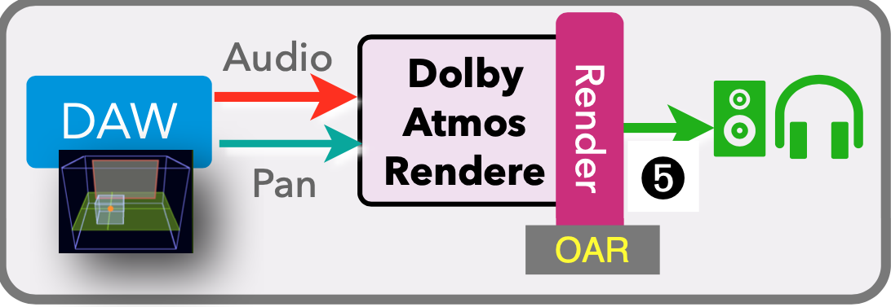
- Dolby Atmos Master File: 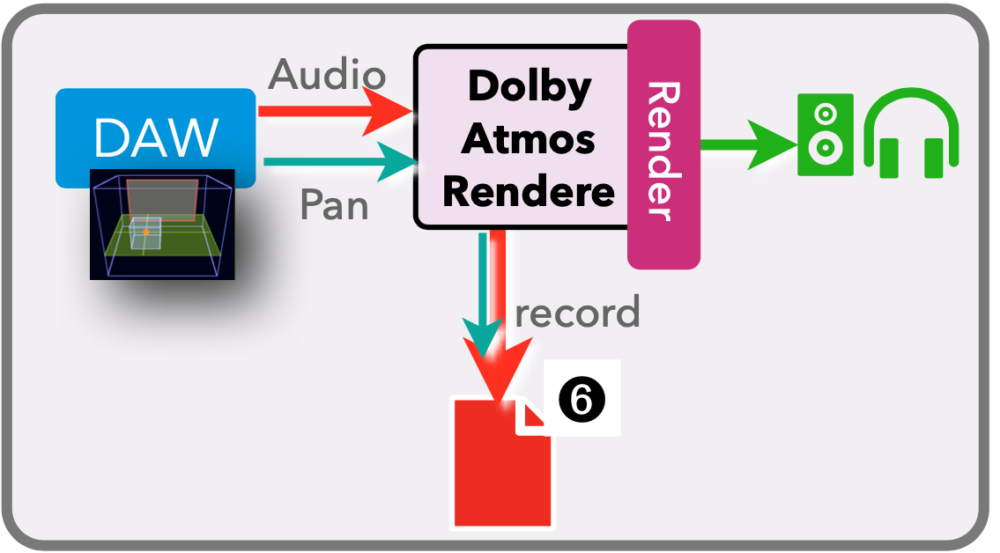

{}
Dolby Atmos Object Audio Renderer (OAR): Your studio speakers (surround with height speakers) are connected to the output of the Dolby Atmos
Renderer BUT the big magic trick is that the Dolby Atmos Renderer software processes ➎ the 128 audio signals and their separate pan information in real-time to play them back as a proper 3D sound field over the speakers or via a 2-channel headphone mix using Binaural Rendering.

Dolby Atmos Master File: Instead of "bouncing" the Dolby Atmos mix to a WAV file, you "record" the Atmos Mix to a special Dolby Atmos Master File ➏ that still keeps the 128 audio signals and their panning information separate. You can record "over" it (a section of the file, or extend it).

{}

---

- Open Master File: 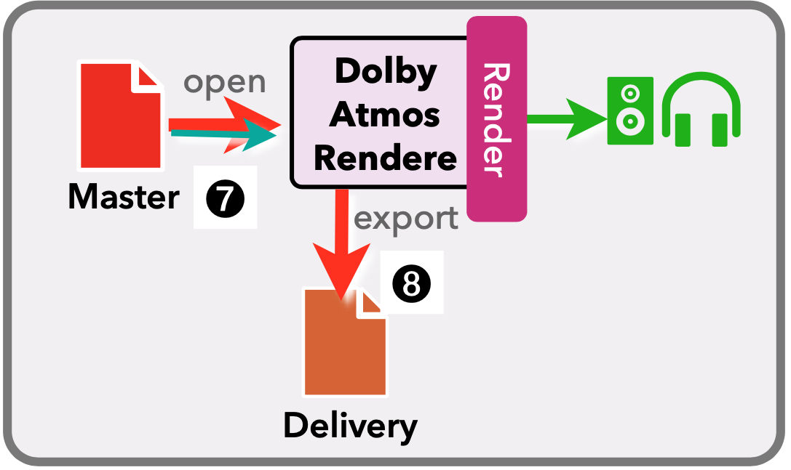
- Delivery files

{}
Master file: you can open these master files to listen and edit the metadata or export to various formats for delivery
{}

---

- Encoded Bitstream Files
- Consumer Playback
  

{}
Delivery file is a special bitstream format to distribute via streaming services. This includes the panning and audio information separate. The playback device does the rendering for the available speaker setup or headphones.
{}

---

## Three tasks of the Dolby Atmos Renderer

- Mixing
- Recording
- Exporting

---

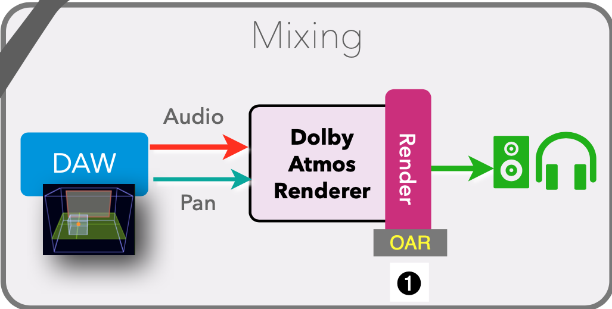

{}
When mixing the Renderer is doing live monitoring to play back your atmos mix.
{}

---

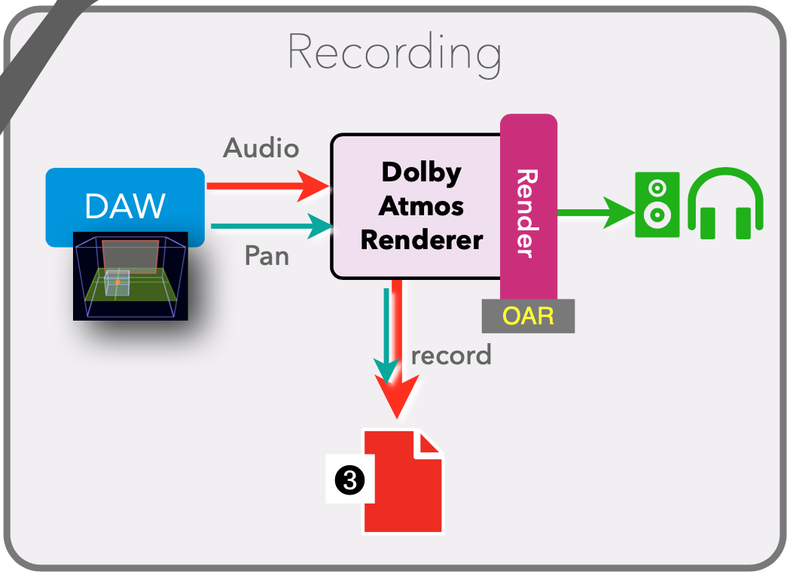

{}
Once you're done with your mix you "record" the Dolby Atmos Master File.
{}

---

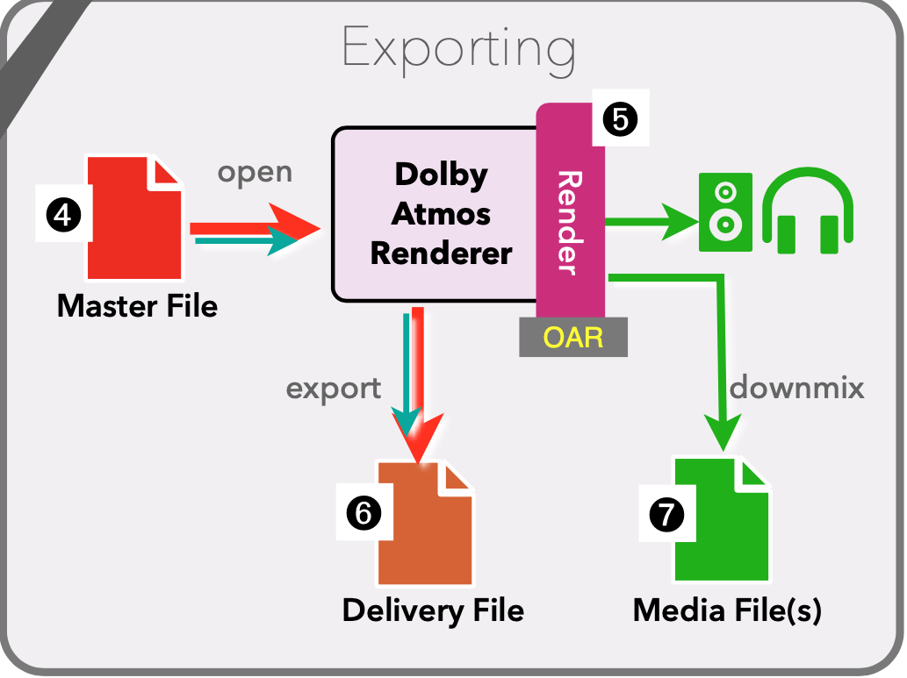

{}
You then use this master file to create deliverable files.
{}

---

## Immersive Sound

{}
Dolby Atmos is an Immersive Sound format.
That is the most important aspect. Instead of just being surrounded by
speakers in the 2-dimensional space like a typical 5.1 or 7.1 setup,
Dolby Atmos can also emit sound from above. That means the listeners
are not only surrounded ➊ by sound, they are immersed ➋ in it.
{}

---

## Height Speakers

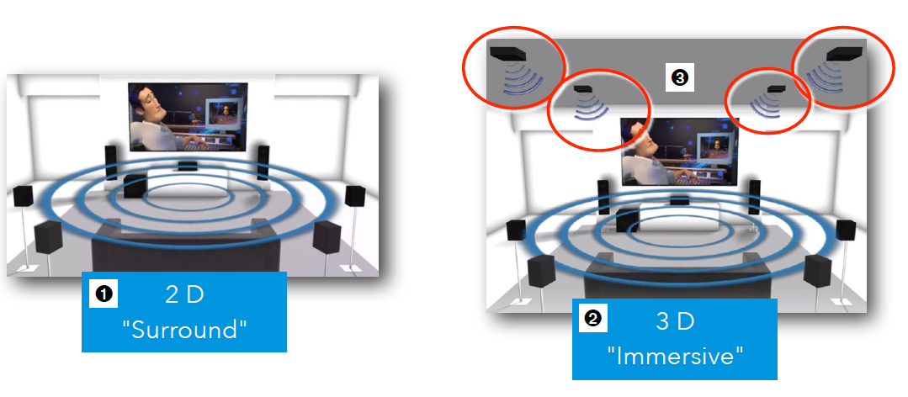

---

## How many speakers?

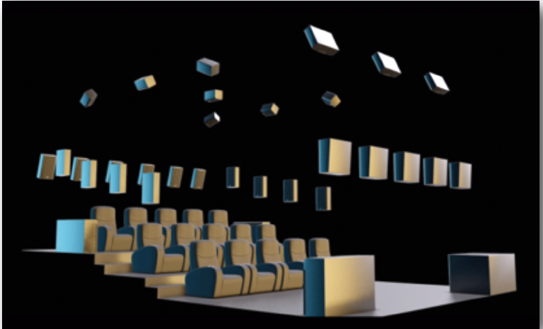

{}
Of course, to be "immersed in sound", you need to be "immersed in speakers" to get the immersive sound experience. While traditional surround formats use about up to six or ten speakers, Dolby Atmos supports up to 64 separate speaker channels that are mounted in front, on the sides, in the back, and on the ceiling. But there are other more manageable configurations and "technological tricks" for those who cannot afford 64 speakers.
{}

---

# Object-based Format

---

## Channel-based mixing

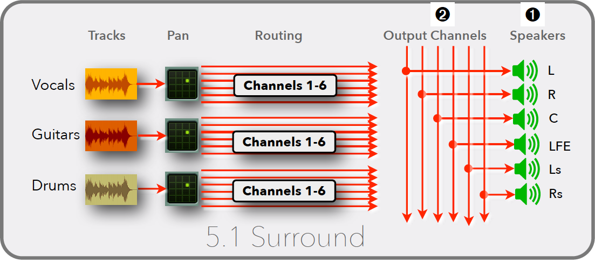

{}
What we used in the previous month:

With stereo or any surround formats, every speaker ➊ is represented by a channel, represented by your output busses ➋. That means you route, pan, and mix your tracks to specific speakers. This is not scalable, not adaptable, and not very flexible. Adding more speakers would add more surround resolution, but also adds more complexity and it still would not be scalable and adjustable to other formats.
{}

---

## Object-based mixing

- Tracks in a DAW are assigned to _Objects_
- Position the signal in 3D space
- This positional data is stored as metadata (_Object Audio Metadata_) with the file
- Playback device uses the XYZ information to reproduce the mix on a given set of speakers. AKA _Rendering_ with the _Object Audio Renderer_

{}
With the Dolby Atmos format you don't mix (pan) to a specific speaker ➌, you mix to a specific location ➍ in the 3-dimensional space.
{}

---

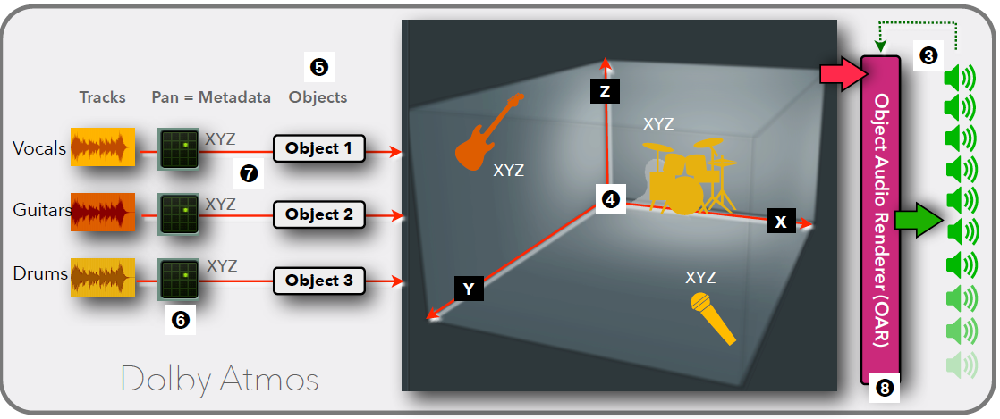

---

# Speaker Rendering

{}
Existing surround formats like 5.1 and 7.1 only work when you playback with the same speaker setup (amount and configuration) it was mixed for. That is the reason that those formats are limited to movie theaters that have that format installed and also home theater enthusiasts that have the space and money to install those elaborate systems at home. If Dolby would have added just more speakers to their immersive sound format, then it would still be limited to movie theaters and would be even less suitable for home theaters. But that is where one of the magic ingredients of Dolby Atmos comes into place, the so-called Speaker Rendering.
{}

---

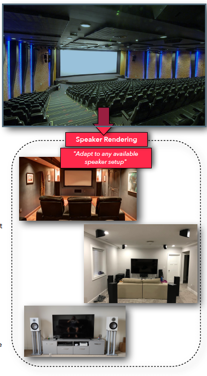

{}

- Let's assume a movie is mixed on a big dubbing stage with a big Dolby Atmos configuration using its maximum of 64 speaker channels.
- Playing back the mix in a big theater with the same 64 big speaker setup would play back that mix perfectly fine. If that mix is played back in a smaller multiplex theater with only 20 speakers, then the Dolby Atmos systems "renders" the 64 speakers to 20 speaker to get the same immersive experience. Let's say a signal that played in the front height speakers and then the back height speakers now plays in the single height speaker if there is only one height speaker instead of front/back.
- If that mix is played on an even smaller speaker setup, then Dolby Atmos "renders" that mix so the immersive sound experience is replicated as close as possible on the available speakers.
- That "Speaker Rendering" capability is built into any home Dolby Atmos playback device. This could be an expensive home theater system, an AVR (Audio Video Receiver) in your living room, or a computer, tablet, and even smart phone.

**Not a Downmix!**

This Speaker Rendering process is kind of an "adaptive" downmix procedure, but much more intelligent and more capable because Dolby Atmos is Object-based and not Channel-based like conventional surround formats.

{}

---

## Speaker Virtualization

- Speaker Rendering: Using the panning data to route the audio signal to the speaker layout of the given room.
- Speaker Virtualization: Alternative to multi-speaker setups
  - Soundbars - [Samsung HW-Q90R](https://www.dolby.com/experience/sound-bars/hw-q90r/)
  - Smart Speakers - [Amazon Echo Studio](https://www.amazon.com/Echo-Studio/dp/B07G9Y3ZMC)
  - Computers
  - Tablets and smart phones
  - Binaural Rendering

---

#### Single format

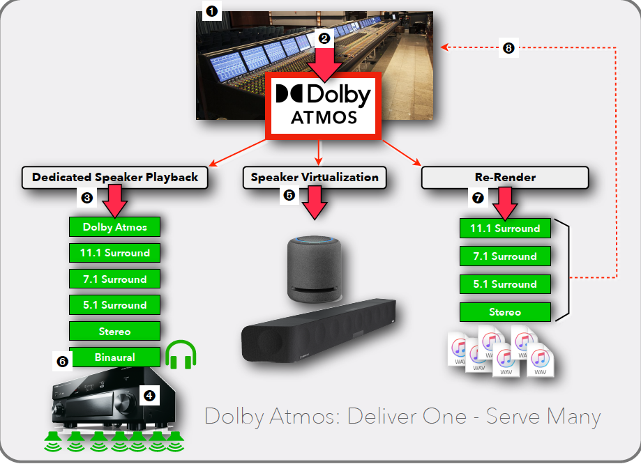

{}
The mix is done in Atmos a native immersive format. Surround formats are created during playback by the Dolby Atmos playback device.

You can even bring a mix back into a protools session.
{}

---

### Atmos Everywhere?

- Cinema
- Home Theater
- Broadcast - sports events etc.
- Games - binaural rendering, could use head-tracking. competes with Ambisonics
- Cars - [Lucid Air](https://www.lucidmotors.com/air/connectivity)
- Music
- [Live Events](https://www.dolby.com/dolby-live-mgm/)

---

## DAW support

- Pro tools - the standard, tightest integration with the Dolby Atmos Renderer app.
- Nuendo - the first DAW with Dolby Atmos Renderer built-into the DAW.
- Logic Pro - limited support see Next Week
- DaVinci, Pyramix
- Other DAWs - can mix in Dolby Atmos using the Dolby Atmos Music Panner together with the Dolby Atmos Production Suite.

---

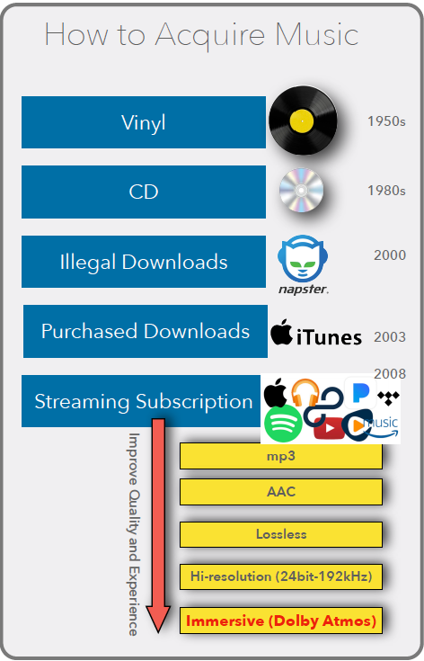

{}
Immersive Audio: This is the latest battleground that started in 2019 when the streaming service Tidal and Amazon Music offered music mixed in Dolby Atmos on their streaming service. In June 2021, Apple Music raised the bar when they entered the Immersive Audio game with "Spatial Audio with support for Dolby Atmos". Unlike the other services that charge for a premium for Dolby Atmos, Apple made it available to all their 72 million subscribers at no extra cost.
{}

---

## Choices for streaming Atmos music

- Tidal
- Amazon Music HD
- Apple Music
- Spotify
- Deezer - ["Sony 360 Reality Audio"](https://electronics.sony.com/360-reality-audio)
