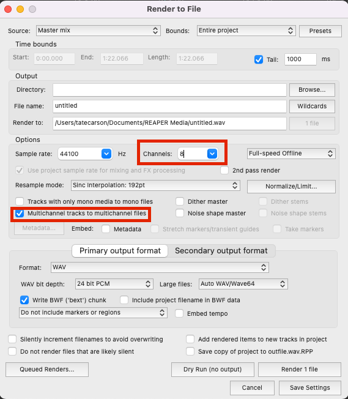

## Project Overview

For this assignment, you have two options to choose from, both involving ambisonic techniques:

### Project A: Original Ambisonic Work

Create an original ambisonic music, sound design, or narrative fiction piece that utilizes ambisonic, stereo, and mono recording techniques. The final piece should be at least one minute in length and can either accompany a visual component or stand alone.

* Ambisonic Recording: Use the Zoom H3-VR in Ambisonic mode for one of your recordings.
* Stereo Recording: Incorporate one stereo recording technique, such as XY, ORTF, or MS.
* Mono Sources: All other sounds can be mono sources. Thoughtfully spatialize these sounds within the ambisonic field, considering aspects such as front-to-back depth, height, and overall immersion.

Include at least two panning automation moves. Plan these automation moves to support the narrative or emotional arc of your piece. Explore the 3D space by considering the depth, height, and rotation aspects unique to ambisonics.

Use the [Ambisonic Toolkit for Reaper](https://www.ambisonictoolkit.net/download/reaper/) plugins to mix your project.

### Project B: Multitrack Ambisonic Mixing

Alternatively, mix a session from [Mike Senior's multitrack library](https://www.cambridge-mt.com/ms/mtk/) that includes at least 20 tracks. The focus will be on creatively applying ambisonic mixing techniques to preexisting multitrack recordings.

* Ambisonic Mix: Take the preexisting stereo or mono tracks from the multitrack session and spatialize them within an ambisonic field.
* Automation: Include at least two automation moves related to panning or spatial positioning that enhance the narrative or immersive quality of the mix.

Use the Ambisonic Toolkit plugins to mix the project and document how each tool impacted your creative process.

## Spatialization Expectations

“Thoughtful spatialization” means:

* Panning and movement choices are purposeful, not random or distracting.
* Spatial decisions contribute to immersion, narrative clarity, or creative intent.
* Depth, height, and rotation are used to enhance rather than overwhelm the listening experience.

## Project Setup

For both projects, remember to encode all of your sources to first-order ambisonics B-format. See the documentation for the appropriate plugins for mono, stereo, or ambisonic sources. After encoding, spatialize or pan the sources with an ambisonics transform. Finally, send your sources to a track with a decoder plugin that works for your current listening environment, whether it's binaural, stereo UHJ, or the 7.1 studio.

## Rendering

Refer to the image below for proper rendering settings:

## Submission Requirements

Submit the following:

1. Rendered File: An audio or video file of your final piece.
2. Reaper Project File: A consolidated Reaper project file with all associated WAV files included.
3. Written Reflection: Write two paragraphs addressing some or all of the following questions that relate to your chosen project:

   * Stereo Recording Technique: Describe the stereo microphone technique you used and provide details about your sound source. Include a picture of your stereo microphone setup.
   * Zoom H3-VR Recording: What did you record with the Zoom H3-VR?
   * Panning Automation: What parameters did you automate for panning, and why?
   * Plugin Usage: How did you use the Ambisonic Toolkit plugins in your project? Provide specific details.
   * Challenges & Solutions: Did you face any difficulties while creating your work? How did you overcome them?
   * Creative Process: Share any other interesting aspects of your creative process.

