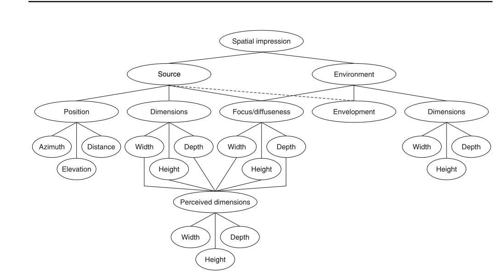

**Task**:  
Listen to a selection of binaural soundscapes from the NPR archives on SoundCloud and reflect on your favorite soundscape, using the diagram on spatial impression to guide your analysis.

**Instructions**:
1. Visit the [NPR Soundscapes playlist on SoundCloud](https://soundcloud.com/npr/sets/soundscapes).
2. Listen to the playlist and pick your **favorite** recording.
3. Explain why this recording stood out to you, using the **spatial impression diagram** below as a reference. Consider the following aspects from the diagram in your explanation:
   - **Source Position**: How did the sound's azimuth, distance, or elevation affect your perception of the recording? Was it possible to tell where the sound was coming from or how far away it was?
   - **Source Dimensions**: How did the width, depth, or height of the sound source influence the experience?
   - **Focus/Diffuseness**: Did the sound feel focused or diffuse, and how did that impact your sense of space?
   - **Environment**: How did the recording's environment affect your perception of envelopment, depth, or width?

**Diagram: Spatial Impression Framework**

**Submission**:
- Submit a **one-paragraph reflection** (150-200 words) on D2L by **Friday, Sept 20rd**.

